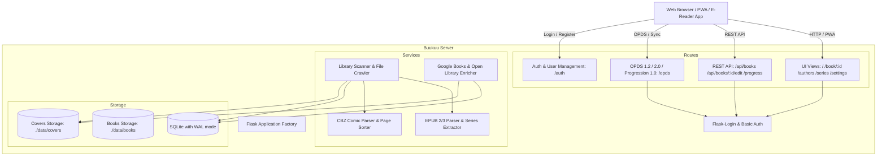

# 🤖 AGENT.md - AI Coding Assistant & Developer Guide

This document is the architectural blueprint, codebase map, and developer guidelines for AI agents and human contributors working on the **Buukuu** repository.

---

## 🏛️ System Overview

**Buukuu** is a lightweight, self-hosted book and comic server.



---

## 📂 Directory Map & Module Responsibilities

```text
buukuu/
├── src/buukuu/
│   ├── __init__.py           # Flask app factory (create_app), CLI commands (scan, enrich, create-user, list-users)
│   ├── config.py             # Config dataclass, defaults, and BUUKUU_* environment variables
│   ├── extensions.py         # SQLAlchemy (db), Flask-Login (login_manager) instances
│   ├── models/
│   │   ├── __init__.py       # Model exports
│   │   ├── book.py           # Book, Author, Series, Tag, and association tables
│   │   ├── user.py           # User model (password hashing, admin role, relationships)
│   │   └── progress.py       # UserProgress (OPDS Progression 1.0 metadata) and Bookmark models
│   ├── routes/
│   │   ├── __init__.py
│   │   ├── auth.py           # Login, logout, register, profile, user management endpoints (@admin_required)
│   │   ├── ui.py             # Server-rendered HTML templates (Library, Authors, Series, Tags, Settings, Readers)
│   │   ├── api.py            # REST endpoints: list, book detail, download, cover, progress, edit metadata, scan
│   │   └── opds.py           # OPDS 1.2 (Atom), OPDS 2.0 (JSON), OPDS Authentication, OPDS Progression 1.0 sync
│   ├── services/
│   │   ├── __init__.py
│   │   ├── scanner.py        # Recursive directory crawler, SHA-256 hash deduction, cover caching (.webp)
│   │   ├── enricher.py       # Google Books & Open Library metadata enrichment client
│   │   └── parsers/
│   │       ├── base.py       # ParsedBookMetadata dataclass
│   │       ├── epub.py       # EPUB 2/3 XML & OPF metadata, cover extractor, collection/series parser
│   │       └── cbz.py        # CBZ archive extractor, natural image sorting, ComicInfo.xml parser
│   ├── static/
│   │   ├── css/
│   │   │   ├── app.css       # Core design system, top navbar, user dropdown, mobile bottom nav, themes
│   │   │   ├── reader-epub.css
│   │   │   └── reader-cbz.css
│   │   ├── js/
│   │   │   ├── app.js        # ServiceWorker registration, theme switcher, avatar dropdown menu
│   │   │   ├── reader-epub.js# In-memory ArrayBuffer EPUB rendering with ePub.js + JSZip
│   │   │   ├── reader-cbz.js # CBZ continuous / single-page canvas comic reader
│   │   │   └── vendor/       # Offline vendor bundles (jszip.min.js, epub.min.js)
│   │   ├── icons/            # App icons & SVGs
│   │   ├── manifest.webmanifest # PWA Web App Manifest
│   │   └── sw.js             # Service Worker with network-first static caching (v2)
│   └── templates/
│       ├── base.html         # Base template with top navbar, avatar menu, mobile nav, flash alerts
│       ├── library.html      # Main bookshelf with search, filters (format, sort), scan trigger
│       ├── book_detail.html  # Book detail page, progress bar, download, online enrich, "Edit Book & Series" modal
│       ├── authors.html      # Authors grid & volume count
│       ├── series.html       # Series grid & volume count
│       ├── tags.html         # Categories & genre tags
│       ├── settings.html     # Consolidated OPDS info, storage stats, metadata tools, admin user management
│       ├── reader_epub.html  # Dedicated EPUB web reader interface
│       ├── reader_cbz.html   # Dedicated CBZ comic web reader interface
│       ├── login.html        # Authentication login view
│       ├── register.html     # User registration view
│       ├── profile.html      # User profile, reading statistics, password change
│       ├── users.html        # Admin user management view
│       └── opds/             # Jinja XML templates for OPDS 1.2 catalog feeds
├── tests/
│   ├── conftest.py           # Pytest fixtures (sample EPUB & CBZ generator, test client, app)
│   ├── test_api.py           # REST API & book edit tests
│   ├── test_auth.py          # Authentication, roles, registration, user isolation tests
│   ├── test_enricher.py      # Google Books & Open Library parsing tests
│   ├── test_models.py        # Database models & relationships tests
│   ├── test_opds.py          # OPDS 1.2, OPDS 2.0, Authentication, Progression 1.0 tests
│   ├── test_parsers.py       # EPUB and CBZ parser tests
│   └── test_ui.py            # UI routes & authentication redirection tests
├── pyproject.toml            # Project metadata, dependencies, and ruff/pytest configurations
├── Dockerfile                # Multi-stage production container build
├── docker-compose.yml        # Docker Compose deployment definition
└── README.md                 # Public documentation
```

---

## 🔑 Core Invariants & Architectural Rules

1. **Authentication Enforcement (`BUUKUU_AUTH_REQUIRED`)**:
   * Default is `BUUKUU_AUTH_REQUIRED=true`.
   * Unauthenticated web visitors are redirected to `/auth/login?next=<url>` (or `/auth/register` if no users exist in the system).
   * API endpoints (`/api/*`) return `401 Unauthorized` for unauthorized requests, but accept HTTP Basic Auth from e-readers and API clients.
   * OPDS endpoints (`/opds/*`) return `401 Unauthorized` with `WWW-Authenticate: Basic realm="Buukuu OPDS"` and an `application/opds-authentication+json` document.

2. **Reading Progression & Syncing**:
   * `UserProgress.percentage` is stored as a float between `0.0` and `100.0`.
   * **OPDS Progression 1.0**: The specification requires progression as a float between `0.0` and `1.0`. `opds.py` translates between internal percentage (`0-100`) and OPDS standard (`0.0-1.0`).
   * When updating progression via `PUT /opds/books/<id>/progression`, if the incoming payload has an older `modified` timestamp than existing server state, return `409 Conflict` with `application/problem+json` and type `https://registry.opds.io/error#progression-date`.

3. **EPUB Web Reader (ePub.js) In-Memory Architecture**:
   * To prevent ePub.js from attempting to fetch unpacked directory contents (`/api/books/<id>/file/META-INF/container.xml`), `reader-epub.js` fetches binary bytes (`ArrayBuffer`) and initializes `ePub(arrayBuffer)` via in-memory `JSZip`.

4. **Series Metadata Extraction**:
   * Extracted from:
     1. Calibre meta tags (`calibre:series`, `calibre:series_index`).
     2. EPUB 3 `<meta property="belongs-to-collection">` and `<meta property="group-position">`.
     3. CBZ `ComicInfo.xml` (`<Series>`, `<Number>`).
     4. Regex heuristic on filename/title (`extract_series_from_title`).
     5. Manual editing via `POST /api/books/<id>/edit`.

5. **Database WAL Mode**:
   * SQLite is configured in WAL (Write-Ahead Logging) mode via SQLAlchemy engine connect event listener in `src/buukuu/__init__.py`. Always preserve this for concurrency.

---

## 🛠️ Developer & Agent Commands

```bash
# Install dependencies
uv sync

# Run server in development mode
uv run buukuu

# Execute all tests (must always pass 100%)
uv run pytest

# Check and fix code formatting/linting
uv run ruff check --fix .
uv run ruff format .

# Re-scan local book directory
uv run buukuu scan --enrich

# Manage users from CLI
uv run buukuu create-user --username admin --password pass --admin
uv run buukuu list-users
```

---

## 💡 Guidelines for AI Agents Making Changes

1. **Preserve Documentation Integrity**: Do not remove existing comments, docstrings, or tests unless refactoring.
2. **Never Break Test Suite**: Before concluding any task, always execute:
   ```bash
   uv run ruff check --fix . && uv run ruff format . && uv run pytest
   ```
   Ensure all tests exit with status `0`.
3. **PWA & Cache Awareness**: Whenever updating static assets (`app.css`, `app.js`), ensure version query strings in `base.html` (`?v=...`) or cache names in `sw.js` are incremented to avoid stale browser caching.
