# 🤖 AGENT.md - AI Coding Assistant & Developer Guide

This document is the architectural blueprint, codebase map, and developer guidelines for AI agents and human contributors working on the **Aarkib** repository.

---

## 🏛️ System Overview

**Aarkib** is a lightweight, self-hosted media server built for books, comics, and expanding to audio and video.

```mermaid
graph TD
    Client[Web Browser / PWA / E-Reader App / Media Player]
    
    subgraph Aarkib Server
        App[Flask Application Factory]
        Auth[Flask-Login & Basic Auth]
        
        subgraph Routes
            UIRoutes[UI Views: / /media/:id /authors /series /settings]
            APIRoutes[REST API: /api/media /api/libraries /progress]
            OPDSRoutes[OPDS 1.2 / 2.0 / Progression 1.0: /opds]
            ReaderRoutes[Web Readers & Players: /reader/epub /reader/cbz /reader/video /reader/audio]
            AuthRoutes[Auth & User Management: /auth]
        end
        
        subgraph Plugins & Services
            JobManager[Background Job Manager]
            PluginRegistry[Media Plugin Registry]
            BookPlugin[BookMediaPlugin: EPUB, CBZ, CBR, ZIP]
            AudioPlugin[AudioMediaPlugin: MP3, M4B, FLAC, AAC, WAV]
            VideoPlugin[VideoMediaPlugin: MP4, MKV, WEBM, AVI, MOV, M4V]
            Scanner[Library Scanner & File Crawler]
            Optimizer[E-Ink Device EPUB Optimizer]
            Enricher[Metadata Providers: Google Books, Open Library, TMDB, MusicBrainz]
        end
        
        subgraph Storage
            DB[(SQLite with WAL mode: aarkib.db)]
            BooksDir[(Media Storage: ./data/media + Multi-Dir Scan)]
            CoversDir[(Covers Storage: ./data/covers)]
            OptimizedDir[(Optimized E-Ink Cache: ./data/optimized)]
        end
    end

    Client -->|HTTP / PWA| UIRoutes
    Client -->|REST API| APIRoutes
    Client -->|OPDS / Sync| OPDSRoutes
    Client -->|Web Readers & Players| ReaderRoutes
    Client -->|Login / Register| AuthRoutes
    
    UIRoutes --> Auth
    APIRoutes --> Auth
    OPDSRoutes --> Auth
    ReaderRoutes --> Auth
    
    Scanner --> PluginRegistry
    PluginRegistry --> BookPlugin
    PluginRegistry --> AudioPlugin
    PluginRegistry --> VideoPlugin
    Scanner --> DB
    Scanner --> CoversDir
    
    OPDSRoutes --> Optimizer
    Optimizer --> OptimizedDir
    
    Enricher --> DB
    Enricher --> CoversDir
```



---

## 📂 Directory Map & Module Responsibilities

```text
aarkib/
├── src/aarkib/
│   ├── __init__.py           # Flask app factory (create_app), DB auto-migrations, server runner
│   ├── config.py             # Config dataclass, defaults, and AARKIB_MEDIA_DIR* multi-folder discovery
│   ├── extensions.py         # SQLAlchemy (db), Flask-Login (login_manager) instances
│   ├── models/
│   │   ├── __init__.py       # Model exports and aliases (MediaItem, Creator, Collection, Tag, User, Library, SystemSetting)
│   │   ├── media_item.py     # Canonical MediaItem model (media_items table) unifying books, comics, video, and audio
│   │   ├── creator.py        # Creator model (creators table) and media_creators association table
│   │   ├── collection.py     # Collection model (collections table) for series, shows, albums
│   │   ├── tag.py            # Tag model (tags table) and media_tags association table
│   │   ├── library.py        # Library model (libraries table)
│   │   ├── setting.py        # SystemSetting model (settings table) for persistent WebUI preferences
│   │   ├── playlist.py       # Playlist and PlaylistItem models
│   │   ├── job.py            # BackgroundJob persistent model for asynchronous tasks
│   │   ├── metadata_cache.py # Online metadata response cache
│   │   ├── media.py          # MediaItemMixin, PlayableItemMixin, AudioTrackMixin, VideoItemMixin, MediaType enum
│   │   ├── user.py           # User and UserFavorite models
│   │   └── progress.py       # UserProgress (user_progress table) and Bookmark (bookmarks table)
│   ├── plugins/
│   │   ├── __init__.py       # Plugin registry initialization and exports
│   │   ├── base.py           # MediaPlugin abstract base class and PluginRegistry
│   │   ├── book.py           # BookMediaPlugin (EPUB, CBZ, CBR, ZIP metadata, covers, player URLs)
│   │   ├── video.py          # VideoMediaPlugin (MP4, MKV, WEBM, AVI, MOV, M4V metadata, covers, player URLs)
│   │   ├── audio.py          # AudioMediaPlugin (MP3, M4A, FLAC, OGG, OPUS, WAV, AAC metadata, covers, player URLs)
│   │   └── podcast.py        # PodcastMediaPlugin for RSS audio podcast feeds
│   ├── routes/
│   │   ├── __init__.py
│   │   ├── auth.py           # Login, logout, setup, profile, user management endpoints (@admin_required)
│   │   ├── ui.py             # Server-rendered HTML templates (Library, Authors, Series, Tags, Settings categories)
│   │   ├── api.py            # Unified REST endpoints: media CRUD, streams, progress, favorites, playlists, settings, /health
│   │   ├── reader.py         # In-browser reader/player views for EPUB, CBZ, Video, Audio, and Podcasts
│   │   ├── opds.py           # OPDS 1.2 (Atom), OPDS 2.0 (JSON), OPDS Authentication, OPDS Progression 1.0 sync
│   │   └── subsonic.py       # Subsonic OpenSubsonic API compatibility layer for music/audio streaming
│   ├── services/
│   │   ├── __init__.py
│   │   ├── settings_service.py # Dynamic settings management, DB-to-app.config sync, watcher hot-toggling
│   │   ├── job_manager.py    # Asynchronous background job manager and task queue
│   │   ├── scanner.py        # Recursive multi-dir crawler, watchdog watcher, SHA-256 hash deduction, cover caching (.webp)
│   │   ├── search.py         # SQLite FTS5 full-text search engine and query builder
│   │   ├── transcoder.py     # On-demand video/audio remuxing and HLS adaptive streaming supervisor
│   │   ├── optimizer.py      # E-ink EPUB optimization engine (font stripping, CSS clean, image dithering)
│   │   ├── enricher.py       # Multi-source metadata enrichment client
│   │   ├── thumbnail.py      # WebP thumbnail and cover generator
│   │   ├── opml.py           # OPML podcast feed import and parser
│   │   ├── media_service.py  # Canonical multi-media service: edit metadata, resolve creators/collections/tags, slugs
│   │   ├── metadata/         # Pluggable metadata client, rate limiter, cache, and provider implementations
│   │   └── parsers/
│   │       ├── base.py       # BaseParsedMetadata and media-specific metadata dataclasses
│   │       ├── epub.py       # EPUB 2/3 XML & OPF metadata, cover extractor, collection/series parser
│   │       ├── cbz.py        # CBZ archive extractor, natural image sorting, ComicInfo.xml parser
│   │       ├── video.py      # Video container metadata (duration, dimensions) and technical inspection
│   │       ├── audio.py      # Pure-Python ID3v2 (MP3), FLAC, and WAV audio metadata and cover extractor
│   │       └── podcast.py    # RSS podcast feed XML parser
│   ├── static/
│   │   ├── css/
│   │   │   ├── app.css       # Core design system, top navbar, user dropdown, mobile bottom nav, themes
│   │   │   ├── reader-epub.css
│   │   │   └── reader-cbz.css
│   │   ├── js/
│   │   │   ├── app.js        # ServiceWorker registration, theme switcher, avatar dropdown menu
│   │   │   ├── reader-epub.js# In-memory ArrayBuffer EPUB rendering with ePub.js + JSZip
│   │   │   ├── reader-cbz.js # CBZ continuous / single-page canvas comic reader
│   │   │   └── vendor/       # Offline vendor bundles (jszip.min.js, epub.min.js)
│   │   ├── icons/            # App icons & SVGs
│   │   ├── manifest.webmanifest # PWA Web App Manifest
│   │   └── sw.js             # Service Worker with network-first static caching (v1)
│   └── templates/
│       ├── base.html         # Base template with top navbar, avatar menu, mobile nav, flash alerts
│       ├── library.html      # Main bookshelf with search, filters (type, format, sort), scan trigger
│       ├── media_detail.html # Media detail page, progress bar, download, online enrich, "Edit Media" modal
│       ├── authors.html      # Creators / Authors grid & volume count
│       ├── series.html       # Collections / Series grid & volume count
│       ├── tags.html         # Categories & genre tags
│       ├── settings/         # Dedicated category settings templates
│       │   ├── system.html   # System preferences (scan, watcher, enrich, page size)
│       │   ├── libraries.html# Storage folders and media type classification
│       │   ├── users.html    # User management dashboard
│       │   ├── plugins.html  # Plugin & protocol details (OPDS, Subsonic, E-Ink)
│       │   └── jobs.html     # Background jobs and indexing tools
│       ├── reader_epub.html  # Dedicated EPUB web reader interface
│       ├── reader_cbz.html   # Dedicated CBZ comic web reader interface
│       ├── reader_video.html # Dedicated HTML5 video player interface
│       ├── player_audio.html # Dedicated HTML5 audio player interface with album art and scrubber
│       ├── player_audiobook.html # Audiobook player with chapter navigation
│       ├── player_podcast.html # Podcast player with episode playlist
│       ├── login.html        # Authentication login view
│       ├── setup.html        # First-run admin setup wizard view
│       ├── profile.html      # User profile, reading/listening statistics, password change
│       └── opds/             # Jinja XML templates for OPDS 1.2 catalog feeds
├── tests/
│   ├── conftest.py           # Pytest fixtures (sample media generator, test client, app)
│   ├── test_api.py           # Unified REST endpoints testing
│   ├── test_audio.py         # Audio parsing, audio plugin, and web audio player testing
│   ├── test_auth.py          # Authentication, roles, registration, user isolation tests
│   ├── test_enricher.py      # Metadata parsing tests
│   ├── test_job_manager.py   # Asynchronous background jobs and task runner tests
│   ├── test_main.py          # App creation and server launcher tests
│   ├── test_metadata.py      # Pluggable metadata providers, cache, and rate limiter tests
│   ├── test_models.py        # Database models & relationships tests
│   ├── test_opds.py          # OPDS 1.2, OPDS 2.0, Authentication, Progression 1.0 tests
│   ├── test_opml.py          # OPML import and podcast feed parsing tests
│   ├── test_optimizer.py     # E-ink EPUB optimization tests
│   ├── test_parsers.py       # EPUB, CBZ, Audio, and Video parser tests
│   ├── test_playlists.py     # Playlist CRUD and queue manipulation tests
│   ├── test_plugins.py       # MediaPlugin & PluginRegistry tests
│   ├── test_podcast.py       # Podcast playback and feed parsing tests
│   ├── test_podcast_metadata.py # Podcast online enrichment tests
│   ├── test_scanner.py       # Scanner & multi-directory environment tests
│   ├── test_search.py        # FTS5 full-text search indexing and query tests
│   ├── test_settings.py      # Dynamic system settings, validation, and REST API tests
│   ├── test_subsonic.py      # Subsonic API endpoint compatibility tests
│   ├── test_transcoder.py    # FFmpeg remuxing and HLS stream generation tests
│   ├── test_ui.py            # UI routes & authentication redirection tests
│   └── test_video.py         # Video plugin, seeking, and playback tests
├── pyproject.toml            # Project metadata, dependencies, and ruff/pytest configurations
├── Dockerfile                # Multi-stage production container build
├── docker-compose.yml        # Docker Compose deployment definition
└── README.md                 # Public documentation
```

---

## 🔑 Core Invariants & Architectural Rules

1. **Mandatory Authentication Enforcement & Passwordless Users**:
   * Authentication is always mandatory across all interfaces (WebUI, REST API, OPDS feeds, Subsonic).
   * **Admin Accounts**: Passwords are strictly compulsory (minimum 4 characters) for administrators. Enforced in first-time setup, user creation, password resets, role promotion (must set password first), and profile edits.
   * **Normal Users**: Passwordless reader accounts are supported (`has_password = False`, `password_hash = None`). Passwordless users authenticate with an empty/blank password.
   * On fresh boot with 0 users in the database, unauthenticated web visitors are redirected to `/auth/setup` to bootstrap the primary administrator account (compulsory password). Once >=1 users exist, `/auth/setup` is permanently locked out.
   * Unauthenticated visitors are redirected to `/auth/login?next=<url>`.
   * Public registration (`/auth/register`) is completely removed. New accounts can only be created by administrators via `/settings/users`.
   * API endpoints (`/api/*`) return `401 Unauthorized` for unauthorized requests, but accept HTTP Basic Auth (supporting passwordless users with empty password). `/api/health` and media covers are publicly accessible without authentication.
   * OPDS endpoints (`/opds/*`) return `401 Unauthorized` with `WWW-Authenticate: Basic realm="Aarkib OPDS"` and an `application/opds-authentication+json` document.

2. **Multi-Media Plugin Architecture & Video/Audio Support**:
   * All media items share [`MediaItemMixin`](file:///home/syafiq/code/aarkib/src/aarkib/models/media.py#L19) containing core attributes (`title`, `media_type`, `original_file_path`, `file_format`, `file_size`, `file_hash`, `cover_image_path`).
   * **Video Media (Implemented)**: Handled by [`VideoMediaPlugin`](file:///home/syafiq/code/aarkib/src/aarkib/plugins/video.py) with MP4 metadata parsing, HTTP 206 byte-range seeking, smart `S01E02` TV detection, and in-browser HTML5 video player with resume positions.
   * **Audio Media (Implemented & Expanding)**: Defined via [`AudioTrackMixin`](file:///home/syafiq/code/aarkib/src/aarkib/models/media.py#L98) with `duration`, `bitrate`, `album`, `track_number`, `disc_number`, and dedicated in-browser audio player (`/reader/audio/<id>`). Planned: M4B chapter mark extraction and narrator metadata.
   * **Background Job Execution**: Library scanning and bulk enrichment are moving to non-blocking background workers via `JobManager` (`concurrent.futures.ThreadPoolExecutor`).
   * Custom media handlers inherit from [`MediaPlugin`](file:///home/syafiq/code/aarkib/src/aarkib/plugins/base.py#L15) and register with [`plugin_registry`](file:///home/syafiq/code/aarkib/src/aarkib/plugins/base.py#L55).

3. **Reading & Playback Progression & Syncing**:
   * `UserProgress.percentage` is stored as a float between `0.0` and `100.0`.
   * **OPDS Progression 1.0**: The specification requires progression as a float between `0.0` and `1.0`. `opds.py` translates between internal percentage (`0-100`) and OPDS standard (`0.0-1.0`).
   * When updating progression via `PUT /opds/media/<id>/progression`, if the incoming payload has an older `modified` timestamp than existing server state, return `409 Conflict` with `application/problem+json` and type `https://registry.opds.io/error#progression-date`.

4. **EPUB Web Reader (ePub.js) In-Memory Architecture**:
   * To prevent ePub.js from attempting to fetch unpacked directory contents (`/api/media/<id>/file/META-INF/container.xml`), `reader-epub.js` fetches binary bytes (`ArrayBuffer`) and initializes `ePub(arrayBuffer)` via in-memory `JSZip`.

5. **Series Metadata Extraction**:
   * Extracted from:
     1. Calibre meta tags (`calibre:series`, `calibre:series_index`).
     2. EPUB 3 `<meta property="belongs-to-collection">` and `<meta property="group-position">`.
     3. CBZ `ComicInfo.xml` (`<Series>`, `<Number>`).
     4. Regex heuristic on filename/title (`extract_series_from_title`).
     5. Manual editing via `PATCH /api/media/<id>` or `POST /api/media/<id>/edit`.

6. **Database WAL Mode & Auto-Migrations**:
   * SQLite is configured in WAL (Write-Ahead Logging) mode via SQLAlchemy engine connect event listener in `src/aarkib/__init__.py`. Always preserve this for concurrency.
   * Startup database migration automatically detects new model columns and tables without requiring Alembic migration scripts.

7. **Generic Media Folders & WebUI Configuration**:
   * Media libraries are stored in SQLite `libraries` table ([`Library`](file:///home/syafiq/code/aarkib/src/aarkib/models/library.py) model).
   * Configured folders can have their `media_type` set to `all` (auto-detect by format), `book` (books only), `comic` (comics & manga), or `video` (movies & TV shows).
   * When a folder's `media_type` is changed via WebUI or `PUT /api/libraries/<id>`, all catalog entries under that folder are automatically reclassified.
   * Folders can be added via `POST /api/libraries` or removed via `DELETE /api/libraries/<id>`.

8. **Folder-Based File Drops (No Upload UI)**:
   * Users manage media by placing files into mounted storage folders (`./data/media`, `./data/books`, NAS mounts).
   * Filesystem watcher and scanner service automatically detect additions, modifications, and deletions without a manual upload web form.

9. **Dynamic System Preferences & Settings Service**:
   * Runtime options (`AUTO_SCAN_ON_START`, `WATCH_LIBRARY`, `AUTO_ENRICH`, `METADATA_PROVIDER`, `PAGE_SIZE`) are WebUI-first and managed via `settings_service.py` backed by the `SystemSetting` table.
   * Precedence: `Database (WebUI)` > `Built-in System Defaults`.
   * Modifying settings via `PATCH /api/settings` immediately updates in-memory `current_app.config` without restarting the server, and dynamically starts/stops the library watcher thread if `WATCH_LIBRARY` was toggled.
   * `POST /api/settings/reset` clears database overrides and restores default settings.

---

## 🛠️ Developer & Agent Commands

```bash
# Install dependencies
uv sync

# Run server in development mode
uv run aarkib

# Execute all tests (must always pass 100%)
uv run pytest

# Check and fix code formatting/linting
uv run ruff check --fix .
uv run ruff format .

# Check code formatting without modifying
uv run ruff check .
uv run ruff format --check .
```

---

## 💡 Guidelines for AI Agents Making Changes

1. **Preserve Documentation Integrity**: Do not remove existing comments, docstrings, or tests unless refactoring.
2. **Never Break Test Suite**: Before concluding any task, always execute:
   ```bash
   uv run ruff check --fix . && uv run ruff format . && uv run pytest
   ```
   Ensure all tests exit with status `0`.
3. **PWA & Cache Awareness**: Whenever updating static assets (`app.css`, `app.js`), ensure version query strings in `base.html` (`?v=...`) or cache names in `sw.js` are incremented to avoid stale browser caching.
