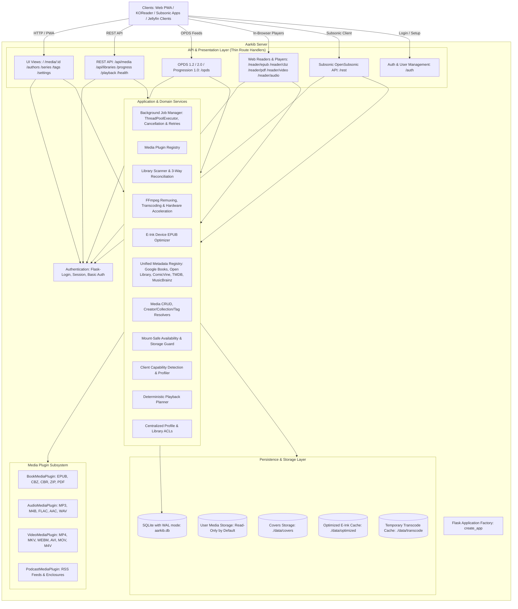

# 🤖 AGENTS.md - AI Coding Assistant & Developer Guide

This document is the canonical architectural blueprint, codebase map, engineering standards, safety invariants, and developer guidelines for AI agents and human contributors working on the **Aarkib** repository.

---

## 🏛️ System Overview & Philosophy

**Aarkib** is a lightweight, reliable, self-hosted media server written in Python, inspired by Plex, Jellyfin, and Calibre, designed for books, comics, audiobooks, music, podcasts, and video.

**Core Philosophy**: Reliability, data safety, maintainability, and predictable behavior are paramount—more important than raw feature count.



---

## 🎯 Technology Stack & Strict Invariants

| Layer | Canonical Technology | Strict Rule |
| :--- | :--- | :--- |
| **Language & Runtime** | Python (>= 3.14) | Clear, explicit Python over clever metaprogramming. Comprehensive type annotations. |
| **Package Manager** | `uv` exclusively | Never use `pip`, `poetry`, `pipenv`, or `conda`. Declared via `pyproject.toml` and resolved via `uv.lock`. Never commit `.venv`. |
| **Backend & API** | Flask 3.1 + Blueprints | Thin route handlers (`Request -> Validation -> Service -> Domain -> Persistence -> Response`). Never embed heavy business logic in routes. |
| **Frontend & UI** | Jinja2 + Cinematic Obsidian CSS + Vanilla JS PWA | Decoupled from database queries. Specialized in-browser canvas readers (`ePub.js`, `CBZ canvas`, `PDF reader`). UI is never a security boundary. |
| **Database** | SQLite with WAL mode (`sqlite3` / SQLAlchemy) | SQLite is persistent user data. Never drop or recreate automatically. Non-destructive migrations. Short write transactions. Never hold locks during external I/O. |
| **Media Probing & Transcoding** | FFmpeg & FFprobe | Safe subprocess execution via argument lists. Never `shell=True`. Configurable binary paths (`AARKIB_FFMPEG_PATH`, `AARKIB_FFPROBE_PATH`). |
| **Code Formatting & Linting** | Ruff | Canonical linter and formatter. Run `uv run ruff check` and `uv run ruff format` before declaring work complete. Narrowest suppression if genuinely needed. |
| **Testing** | Pytest | Deterministic synthetic fixtures. Never depend on personal media files. 100% test pass rate required. |
| **Deployment** | Docker & Direct `uv` | Production WSGI via `waitress` (`threads=8`), development via Werkzeug. Must support both Linux `x86_64` (amd64) and `ARM64` (aarch64). Non-root unprivileged execution. |

---

## 🌍 Supported Platforms & Portability

The application must run natively on:
1. **Linux x86_64 / amd64**
2. **Linux ARM64 / aarch64** (Raspberry Pi 4/5, Apple Silicon via Docker, ARM cloud instances)

**Strict Portability Rules**:
- **No x86-specific CPU instructions**: Code must never assume AVX, SSE, or x86-specific assembly.
- **No machine-specific paths**: Never hardcode `/home/<user>`, `/opt`, `/srv`, or distribution-specific directory layouts. Paths must always derive from `Config`, environment variables, or configured `Library` records.
- **Native Dependency Audit**: Any added dependency must be pure-Python or distribute pre-compiled binary wheels for both `x86_64` and `aarch64` on Linux.
- **Multi-Platform Docker**: Container images must build and run cleanly on both `linux/amd64` and `linux/arm64`.

---

## 📂 Directory Map & Module Responsibilities

```text
aarkib/
├── src/aarkib/
│   ├── __init__.py           # Flask app factory (create_app), DB auto-migrations, server runner
│   ├── config.py             # Config dataclass, defaults, binary resolvers (ffmpeg/ffprobe), and directory discovery
│   ├── extensions.py         # SQLAlchemy (db), Flask-Login (login_manager) instances
│   ├── models/
│   │   ├── __init__.py       # Model exports (MediaItem, Creator, Collection, Tag, User, Profile, Library, SystemSetting, DeviceToken)
│   │   ├── capabilities.py   # ClientCapabilities domain models (video, audio, subtitle, streaming, device)
│   │   ├── collection.py     # Collection model for series, shows, albums
│   │   ├── creator.py        # Creator model and media_creators association table
│   │   ├── job.py            # BackgroundJob persistent model (explicit states, cancel_requested, retry_count)
│   │   ├── library.py        # Library model with per-folder JSON settings overrides (auto_enrich, metadata_provider)
│   │   ├── media.py          # MediaItemMixin, PlayableItemMixin, AudioTrackMixin, VideoItemMixin, MediaType enum
│   │   ├── media_item.py     # Canonical MediaItem model unifying books, comics, video, and audio
│   │   ├── metadata_cache.py # Online metadata response cache
│   │   ├── playback.py       # PlaybackPlan immutable domain model and PlaybackMode enum (direct, remux, transcode, optimize)
│   │   ├── playlist.py       # Playlist and PlaylistItem models
│   │   ├── profile.py        # Profile and ProfileLibraryAccess models for multi-profile accounts and library ACLs
│   │   ├── progress.py       # UserProgress (enriched time + location, profile_id) and Bookmark
│   │   ├── setting.py        # SystemSetting model for persistent dynamic WebUI preferences
│   │   ├── tag.py            # Tag model and media_tags association table
│   │   ├── token.py          # DeviceToken model for hardware e-readers and API Bearer tokens
│   │   └── user.py           # User and UserFavorite models
│   ├── plugins/
│   │   ├── __init__.py       # Plugin registry initialization and exports
│   │   ├── audio.py          # AudioMediaPlugin (Music, Audiobook): MP3, M4B, FLAC, AAC, WAV descriptors
│   │   ├── base.py           # MediaPlugin abstract base class, PluginRegistry, get_playback_info interface
│   │   ├── book.py           # BookMediaPlugin: EPUB, CBZ, CBR, ZIP, PDF metadata, covers, player URLs
│   │   ├── jellyfin.py       # Jellyfin protocol plugin with dynamic PlayMethod mapping
│   │   ├── mqtt.py           # MqttPlugin: Home Assistant Auto-Discovery, real-time media player, and MQTT commands
│   │   ├── notifier.py       # NotificationPlugin: Apprise push notification integration and event hooks
│   │   ├── opds.py           # OPDS 1.2 (Atom), OPDS 2.0 (JSON), OPDS Authentication, OPDS Progression 1.0 sync
│   │   ├── optimizer.py      # EInkOptimizerPlugin: E-ink EPUB optimization engine (font stripping, CSS clean, image dithering)
│   │   ├── podcast.py        # PodcastMediaPlugin for RSS audio podcast feeds
│   │   ├── subsonic.py       # Subsonic OpenSubsonic API compatibility layer for music/audio streaming
│   │   └── video.py          # VideoMediaPlugin: MP4, MKV, WEBM, AVI, MOV, M4V metadata, remux/transcode strategies
│   ├── routes/
│   │   ├── __init__.py
│   │   ├── api.py            # Legacy unified REST endpoints: media CRUD, playback descriptors, streams, progress
│   │   ├── api_v1.py         # Versioned REST API v1: media CRUD, playback-plan, jobs, profiles, ACLs, reconciliation
│   │   ├── auth.py           # Login, logout, setup, profile, user management endpoints
│   │   ├── reader.py         # In-browser reader/player views (EPUB, CBZ, PDF, Video, Audio, Podcasts)
│   │   └── ui.py             # Server-rendered HTML templates (Library, Authors, Series, Tags, Settings categories)
│   ├── services/
│   │   ├── __init__.py
│   │   ├── authorization.py  # Centralized authorization service (can: library.read, library.download, media.stream, admin)
│   │   ├── backup.py         # Hot SQLite snapshot, ZIP packaging, validation, atomic database restore
│   │   ├── capability_service.py # Client capability detection (Chromium, Firefox, Safari, KOReader, Jellyfin, Subsonic)
│   │   ├── device_auth_service.py # TV and 10-foot device code flow (RFC 8628) pairing token management
│   │   ├── enricher.py       # Metadata enrichment workflow using the unified metadata_registry
│   │   ├── events.py         # Internal thread-safe EventDispatcher publish-subscribe bus
│   │   ├── indexer.py        # Media file indexing, 1MB buffered hashing, and fast header/footer fingerprinting
│   │   ├── job_manager.py    # Asynchronous background job manager (ThreadPoolExecutor, cancellation, retries)
│   │   ├── library_service.py # Mount-safe library availability verification and safe reconciliation coordination
│   │   ├── media_service.py  # Canonical multi-media service: edit metadata, resolve creators/collections/tags
│   │   ├── metadata/         # Pluggable metadata subsystem (providers, matcher.py Levenshtein distance scoring)
│   │   ├── notifier.py       # Apprise notification worker queue, debounced media batching, and test dispatch
│   │   ├── opml.py           # OPML podcast feed import and parser
│   │   ├── parsers/          # Metadata format parsers (pdf, epub, cbz, video, audio, podcast)
│   │   ├── playback_service.py # Deterministic playback decision planner evaluating media streams against client capabilities
│   │   ├── playlist_service.py # Playlist and collection management service
│   │   ├── progress_service.py # Profile-aware reading and playback progress synchronization service
│   │   ├── scanner.py        # Three-way crawler reconciliation, watchdog watcher, SHA-256 deduplication
│   │   ├── scheduler.py      # Background maintenance scheduler (automated backups, library rescans, cache reaping)
│   │   ├── search.py         # SQLite FTS5 full-text search engine, query builder, and field-qualified filters
│   │   ├── security.py       # Authentication rate limiting and security guards
│   │   ├── settings_service.py # Dynamic settings management, DB-to-app.config sync, watcher hot-toggling
│   │   ├── thumbnail.py      # WebP thumbnail and cover generator
│   │   ├── transcoder.py     # Hardware-accelerated (VA-API/QSV/CPU) remuxing and HLS adaptive streaming supervisor
│   │   └── watcher.py        # Filesystem watcher with debounced event handling for library directories
│   ├── static/               # Obsidian design tokens, modern CSS, gamepad engine (gamepad.js), PWA SW
│   └── templates/            # Jinja2 templates (bookshelf, media detail, readers, settings, OPDS XML)
├── tests/                    # Deterministic Pytest suite (388 tests covering all features)
├── pyproject.toml            # Project dependencies, build configuration, ruff & pytest options
├── Dockerfile                # Multi-stage multi-arch production container build
├── docker-compose.yml        # Docker Compose deployment definition
├── ARCHITECTURE.md           # Canonical system architecture, data models, and subsystems
├── DESIGN.md                 # Visual identity tokens and Cinematic Obsidian design system (Google DESIGN.md spec)
└── README.md                 # Documentation
```

---

## 🛡️ Core Domain Model & Engineering Rules

### 1. Separation of Media Identity from Physical Files
- **Media Identity is NOT a File Path**: A file path is merely a storage location. A `MediaItem` has its own persistent identity, primary key, title, creators, collections, and watch/reading history.
- **Do Not Treat Filenames as Absolute Truth**: Filename parsing, directory structure, embedded tags, and external APIs are *signals*. When confidence is low, preserve user data and flag for review rather than making destructive corrections.
- **Physical Files are Read-Only**: User media belongs to the user. Aarkib must never move, rename, re-encode in-place, or delete media files unless the user has explicitly triggered and opted into that specific action.

### 2. Filesystem Safety & Path Containment
- **Guarded Path Resolution**: All file access and media streaming (`/api/media/<id>/file`, `/api/media/<id>/stream`, `/api/media/<id>/download`) must pass `is_safe_media_path()`.
- **Prevent Path Traversal & Symlink Escapes**: The application must verify that any target file resolves strictly within at least one configured `Library.path`, `Config.MEDIA_DIRS`, `Config.COVERS_DIR`, or `Config.TRANSCODE_DIR`. Any path escaping these roots must immediately return `403 Forbidden`.
- **Never Blindly Concatenate Paths**: Use `Path` objects with `.resolve()` and `.is_relative_to()`. Never construct filesystem paths by concatenating raw user input strings.
- **Mount-Safe Storage Validation**: Before reconciling or pruning libraries, the scanner and library service MUST call `validate_library_availability()`. If a library root path does not exist, is not a directory, is unreadable, or was populated previously but now appears as an empty mountpoint (e.g. unmounted NAS or external storage), the operation MUST immediately abort pruning to retain 100% of existing database records and prevent catastrophic data loss.

### 3. Database Integrity & SQLite Concurrency
- **Persistent Data Protection**:
  - NEVER drop tables or recreate existing databases automatically.
  - Non-destructive database migrations: schema changes use `migrate_database()` with safe `ALTER TABLE ADD COLUMN` queries.
- **SQLite Concurrency Rules**:
  - Always operate SQLite in WAL mode (`PRAGMA journal_mode=WAL`) with `PRAGMA synchronous = NORMAL`.
  - Keep database write transactions short.
  - **CRITICAL**: Never hold database transactions open while performing network requests, FFmpeg operations, filesystem scans, or artwork downloads. Always commit or close sessions before starting long-running I/O.
  - SQLite is not a heavy concurrent queue; all background scheduling must use `JobManager` threads.

### 4. Media Playback & Deterministic Decisions
- **Decoupled Playback Planner**: Media playback decisions are evaluated by `PlaybackService.plan(item, capabilities)` which takes a `MediaItem` and `ClientCapabilities` (detected via `CapabilityService`) and returns an immutable `PlaybackPlan`. The planner decides the mode (`DIRECT`, `REMUX`, `TRANSCODE`, `OPTIMIZE`), container, target codecs, resolution, and subtitles deterministically without invoking FFmpeg directly.
- **Decision Matrix**:
  - **Direct Play**: Container and codecs are natively supported by the client browser/player. Served via HTTP 206 byte-range seeking.
  - **Direct Remux**: Video and audio codecs are supported, but container is incompatible (e.g. MKV to fragmented MP4). Remuxed on-the-fly without re-encoding video.
  - **Audio Transcode**: Video stream copied directly; incompatible audio stream (e.g. AC3/DTS/TrueHD) transcoded to AAC.
  - **Full Transcode / HLS**: Incompatible video codec, 10-bit unsupported, or target bitrate scaling. Streamed via segmented HLS (`.m3u8`).
- **Unified Playback Descriptor & Diagnostics**: Exposed via `GET /api/v1/media/<id>/playback-plan`, `GET /api/media/<id>/playback`, and the in-browser **Playback Diagnostics HUD** (`reader_video.html`, hotkey `D`). Shields web, mobile, and third-party clients from transcoding internals while providing live visibility into client engine, hardware acceleration, target codecs, and planner decision reasons.
- **Hardware Acceleration Abstraction**: Hardware acceleration capabilities (`TranscodeCapabilities`) for Intel VA-API, AMD VA-API, and Intel QuickSync (QSV) are detected via safe argument-list probes. The administrator can dynamically configure `TRANSCODE_BACKEND` (`auto`, `vaapi`, `qsv`, `software`). If hardware transcode initialization fails, `TranscodeSupervisor` automatically falls back to CPU software encoding (`libx264`).
- **High-Fidelity Subtitle Engine**: Embedded ASS/SSA subtitles render via the JASSUB WebAssembly (`libass`) canvas overlay, preserving 100% typesetting fidelity without server-side video burning and enabling Direct Remuxing.

### 5. FFmpeg Subprocess Execution
- **Command Construction**: Generate commands using argument lists (`["ffmpeg", "-i", ...]`). Never use `shell=True`.
- **No Arbitrary Arguments via API**: Clients select predefined presets (`original`, `1080p`, `720p`, `480p`); raw FFmpeg parameters must never be accepted from HTTP requests.
- **Process Management**:
  - Handle exit codes, timeouts, and stderr logging gracefully.
  - Assign process group IDs (`os.setsid`) to guarantee child process cleanup on abort or server shutdown.
  - Configurable binary paths: Resolve via `get_ffmpeg_binary()` and `get_ffprobe_binary()`, supporting `AARKIB_FFMPEG_PATH` and `AARKIB_FFPROBE_PATH`.

### 6. Background Jobs & Non-Blocking Event Loop
- **Non-Blocking Architecture**: Library crawls, media file probing, metadata lookups, artwork downloads, and video transcoding must never block the HTTP request/response cycle.
- **Explicit Lifecycle States**: Background jobs track explicit states via `JobStatus` (`QUEUED`, `RUNNING`, `SUCCEEDED`, `FAILED`, `CANCELLED`, `INTERRUPTED`). For legacy compatibility, `"completed"` maps to `SUCCEEDED`.
- **Cooperative Cancellation & Retry**: Long-running background jobs check `job._cancel_event.is_set()` and support cooperative cancellation via `POST /api/v1/jobs/<id>/cancel` or `JobManager.request_cancel()`. Failed or cancelled jobs can be retried via `POST /api/v1/jobs/<id>/retry`.
- **Live Background Jobs Manager**: Visualized in real time under **Settings → System** (`/settings/system`) with 5-second polling during active jobs, progress bars, cancellation, and retry triggers.
- **Job Specifications**: Background operations must register with `JobManager`, tracking:
  - Unique UUID, job type, human-readable status, integer progress (0-100), start/end timestamps, error payloads, and cancellation flags.
  - Prevent duplicate concurrent jobs for the same library or media resource.

### 7. External Metadata Subsystem
- **Provider Abstraction**: Providers inherit from `MetadataProvider` (`search`, `get_details`).
- **Candidate Matching Engine**: External metadata candidates are ranked using normalized Levenshtein distance and composite confidence scoring (`CandidateMatcher`), weighting title similarity, creators, release year, and external identifiers. Candidates falling below confidence thresholds are rejected.
- **Field-Level Provenance Tracking**: Tracks the authoritative source for each attribute (`title`, `description`, `publisher`, `language`, `cover`) in `metadata_provenance`, categorized as `AUTOMATIC` (external APIs), `DERIVED` (embedded tags), or `MANUAL` (user direct edits).
- **Manual Edit Lock Protection**: When an administrator modifies media attributes in the WebUI or API, those fields are permanently locked (`locked_fields`). Automated crawlers and batch enrichment jobs strictly respect these locks to prevent overwriting user-curated metadata.
- **Failure Tolerance**: External metadata is untrusted input. Handle network timeouts, rate limits, schema changes, and missing fields gracefully. A metadata provider failure must never crash the server or block media access.
- **Rate Limiting & Caching**: Enforce token-bucket limits (`limiter.py`) and persist responses in `MetadataCache`.

### 8. Authentication, Authorization & Security
- **Mandatory Authentication**: Enforced across all endpoints (WebUI, REST API v1, OPDS, Subsonic).
- **Versioned Clean REST API v1 (`/api/v1/`)**: Exposes versioned endpoints with standard JSON error envelopes (`{"error": "...", "status": "error", "status_code": ...}`).
- **User Profiles & Unified ACLs**: Multi-profile support per account (`Profile`) allows per-family-member profiles, avatars, and kid-safe restrictions (`is_child`). Per-profile library access control lists (`ProfileLibraryAccess`) restrict browsing and downloading, managed via the interactive Library Access Control modal matrix in `/settings/users`. All access checks route through `AuthorizationService.can(subject, action, resource)`.
- **Scoped Device Tokens**: Mobile, TV, and automation Bearer tokens support granular scope restrictions (`require_token_scope` for `media:read`, `media:write`, `admin`).
- **Password Security**: Passwords hashed using industry-standard cryptography (`werkzeug.security`). Administrators strictly require strong passwords (>= 4 chars).
- **Passwordless Account Boundary**: Passwordless reader accounts are strictly restricted to local and private IP networks (RFC 1918 / loopback). Requests from public WAN addresses attempting to authenticate without a password are automatically rejected with HTTP 401 Unauthorized unless `AARKIB_ALLOW_PASSWORDLESS_REMOTE=true` is set.
- **Authentication Rate Limiting**: All login and Basic Auth verification routes are protected by `AuthRateLimiter` to thwart brute-force and enumeration attacks.
- **No Secrets in Logs**: Never log passwords, API tokens, session IDs, or private keys.
- **API Boundaries**: Validate all incoming parameters (IDs, query params, request bodies). Never construct raw SQL queries via string interpolation.

---

## 🛠️ Developer & Agent Commands

All commands must be executed using `uv run` inside the repository:

```bash
# 1. Sync project dependencies
uv sync

# 2. Run Aarkib development server
uv run aarkib

# 3. Execute Pytest suite (all 388 tests must pass 100%)
uv run pytest

# 4. Run single test file
uv run pytest tests/test_filesystem_safety.py -v

# 5. Check code formatting and linting
uv run ruff check .
uv run ruff format --check .

# 6. Automatically fix linting and formatting issues
uv run ruff check --fix .
uv run ruff format .
```

---

## 🤖 Agent Behavior Guidelines

When implementing changes in this repository, follow these rules:

1. **Inspect Before Modifying**: Thoroughly inspect existing services, models, and utility functions before introducing new abstractions. Reuse established patterns.
2. **Preserve Architectural Boundaries**: Keep route handlers thin. Never put database transactions or domain logic directly inside route functions.
3. **Protect Persistent User Data**: Never delete, drop, or overwrite user databases or media files. Write migrations when adding database columns.
4. **Preserve Documentation Integrity**: Do not remove existing docstrings, explanatory comments, or tests unless refactoring.
5. **No Blind Dependency Additions**: Justify any added package. Ensure pure-Python or multi-arch binary wheel availability (x86_64 and ARM64).
6. **PWA & Static Cache Awareness**: When updating static assets (`app.css`, `app.js`), update cache query parameters in `base.html` or cache versions in `sw.js`.

---

## ✅ 19-Point Definition of Done

A feature, fix, or enhancement is **NOT complete** merely because the happy path works. Before concluding work, verify every applicable item:

- [ ] **1. Architectural Consistency**: The change adheres to established layered separation (Request -> Validation -> Service -> Domain -> Persistence).
- [ ] **2. Thin Route Boundaries**: Route functions remain thin envelopes; business logic lives in domain/service modules.
- [ ] **3. UI Decoupling**: UI templates and frontend components do not execute raw database queries or duplicate backend domain logic.
- [ ] **4. Non-Destructive Migrations**: Any SQLite schema changes include safe, non-destructive auto-migrations.
- [ ] **5. Persistent Data Safety**: Production SQLite database and user settings are protected against corruption or reset.
- [ ] **6. Filesystem Path Validation**: All filesystem access is validated against configured library roots using `is_safe_media_path()`.
- [ ] **7. Safe Subprocess Execution**: Any FFmpeg or external command is executed via argument lists without `shell=True`.
- [ ] **8. Non-Blocking Execution**: Long-running scans, probing, transcoding, or enrichment tasks execute asynchronously via `JobManager`.
- [ ] **9. Explicit Typing**: Type hints are present on all newly introduced function signatures and model attributes.
- [ ] **10. Comprehensive Test Coverage**: Unit and integration tests cover both happy path and edge/failure cases.
- [ ] **11. Ruff Linter Clean**: `uv run ruff check .` passes with 0 errors.
- [ ] **12. Ruff Formatter Clean**: `uv run ruff format --check .` passes without formatting changes.
- [ ] **13. Zero Test Regressions**: The entire Pytest suite (`uv run pytest`) passes with 100% success.
- [ ] **14. Zero Secret Exposure**: No passwords, tokens, API keys, or personal file paths are introduced or logged.
- [ ] **15. Filesystem Safety**: User media files are treated as read-only; no destructive filesystem actions occur without explicit user opt-in.
- [ ] **16. API & Protocol Compatibility**: Changes maintain backward compatibility for REST, OPDS 1.2/2.0, and Subsonic clients.
- [ ] **17. Docker Viability**: Container configuration and Dockerfile run cleanly as non-root user.
- [ ] **18. Multi-Arch Portability**: Code works identically on Linux `x86_64` (amd64) and `ARM64` (aarch64).
- [ ] **19. Documentation Updated**: `AGENTS.md` and relevant design artifacts reflect any new patterns or configurations.
