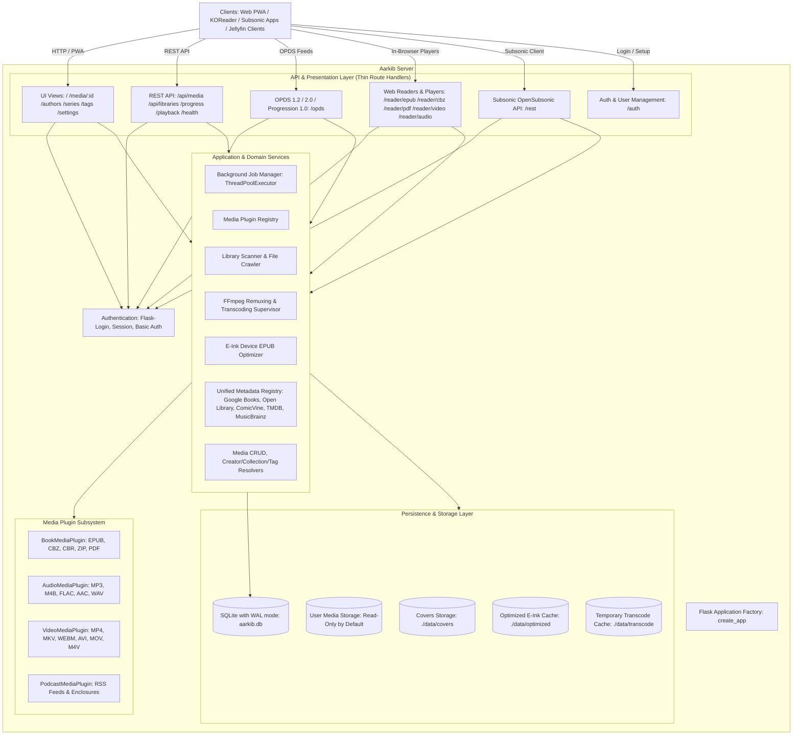
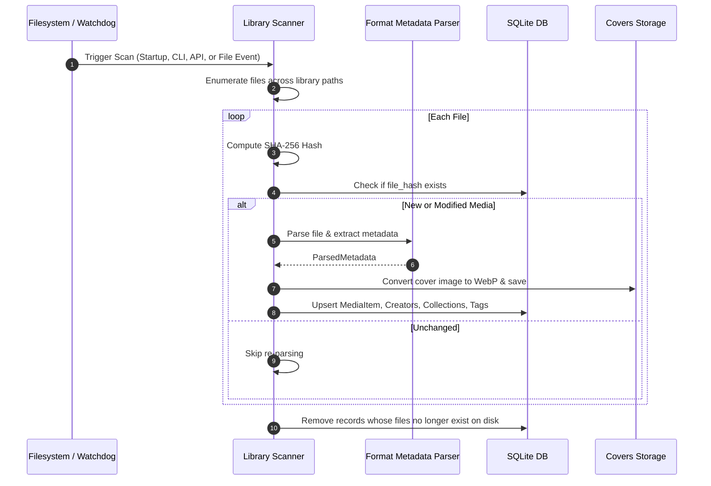
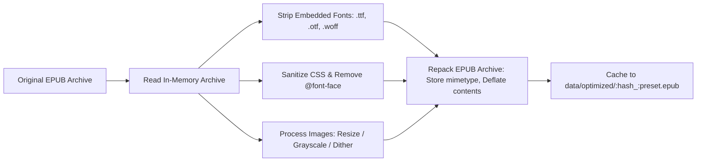
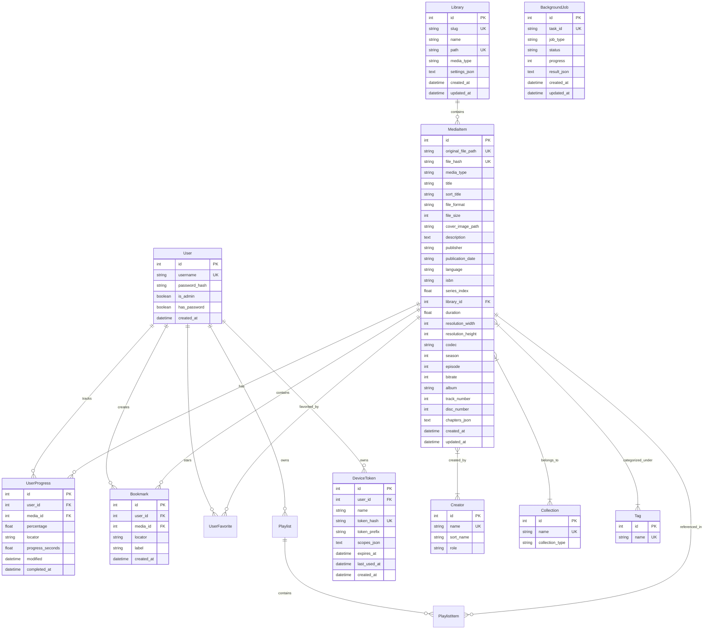

# 🏛️ Aarkib System Architecture & Technical Design

**Aarkib** is a modern, lightweight, self-hosted media server engineered with Python 3.14, Flask, and SQLite. It provides catalog management, in-browser reading, on-demand e-ink device optimization, OPDS catalog feeds, multi-client reading and playback progress synchronization, Subsonic streaming APIs, Jellyfin client integration, and an extensible plugin system with native support for books, comics, video, audio, and podcasts.

---

## 1. Architectural Principles & Goals

1. **Lightweight & Self-Contained**: Minimal runtime dependencies (`Flask`, `SQLAlchemy`, `Pillow`, `defusedxml`, `watchdog`). Operates seamlessly on low-powered hardware such as Raspberry Pi, home servers, or NAS appliances without requiring heavy external services (such as Redis or Celery).
2. **Standard-First Interoperability**: Implements established open standards:
   - **OPDS 1.2** (Atom XML) & **OPDS 2.0** (JSON-LD) for universal e-reader compatibility (KOReader, Moon+ Reader, Thorium, Panels, Cantook).
   - **OPDS Progression 1.0** for reading position synchronization with strict conflict resolution.
   - **OPDS Authentication Specification** (`application/opds-authentication+json`) alongside HTTP Basic Auth.
   - **Subsonic OpenSubsonic API** (v1.16.1) for native mobile audio streaming (Symfonium, DSub, Ultrasonic, Plappa).
   - **Jellyfin Client Compatibility** for native streaming in Android TV, Swiftfin, Findroid, and Jellyfin Media Player.
   - **HTTP 206 Partial Content** for native video/audio range streaming and seeking.
3. **E-Ink Native Experience**: Hardware-tailored processing pipeline that optimizes EPUB files on-demand (font stripping, CSS sanitization, image resizing/dithering) specifically for e-paper devices (Xteink, Kindle, Kobo).
4. **Non-Destructive Storage**: Original media archives (`.epub`, `.cbz`, `.mp3`, `.mp4`, `.pdf`) are strictly read-only and never modified. Extracted covers, thumbnails, and optimized device variants are cached separately.
5. **Zero-Friction Web Reading & Media Access**: Built-in, responsive web readers for EPUB, PDF, and CBZ, an HTML5 video player with client-side progress tracking, and a persistent audio player for audiobooks and music with offline asset caching via PWA Service Workers.
6. **Extensible Multi-Media Plugin Architecture**: Core data models and scanner pipeline decoupled from file types through abstract `MediaPlugin` handlers, protocol providers, and declarative mixins.

---

## 2. High-Level System Architecture

---

## 3. Core Subsystems & Components

### 3.1 Data Ingestion & Library Scanner (`services/scanner.py`)

The scanner discovers, validates, extracts metadata from, and tracks digital media across one or more library folders.

- **Generic Media Folder Architecture & WebUI Configuration**:
  - Media directories are managed in SQLite via the `Library` model (`libraries` table).
  - Each library defines a distinct `media_type`:
    - `all`: Mixed / Auto-detect by extension (`.epub` → `book`, `.cbz`/`.cbr`/`.zip` → `comic`, `.mp4`/`.mkv`/etc. → `video`, `.mp3`/`.m4b`/etc. → `audio`).
    - `book`: Enforces `book` categorization for all documents in that folder.
    - `comic`: Enforces `comic` categorization for all archives/manga in that folder.
    - `video`: Enforces `video` categorization for movies and television series.
    - `audio`: Enforces `audio` categorization for music and audiobooks.
    - `podcast`: Enforces `podcast` categorization for syndicated audio series.
  - **Dynamic WebUI & API Control**: Users can configure, inspect item counts, change media types, rescan, or add/delete folders via the WebUI Settings page or REST API (`/api/libraries`). Changing a folder's `media_type` automatically re-classifies all existing items in the database.
- **Direct Folder Drops (No Upload UI)**:
  - Users add media simply by copying or mounting files into storage folders (`./data/media`, external mounts). The scanner and filesystem watcher handle indexing automatically without requiring web upload forms.
- **Multi-Directory Discovery**:
  - Canonical: `AARKIB_MEDIA_DIR` (single folder path).
  - Numbered environment variables: `AARKIB_MEDIA_DIR1`, `AARKIB_MEDIA_DIR2`, etc.
  - Interactive WebUI Selection: Administrators can browse the server filesystem via `GET /api/fs/directories` and configure folders, library names, and media types directly from the WebUI.
- **Deduplication & Integrity**: Every media item is indexed by its SHA-256 hash. If a file is moved within the library, its record is updated without losing reading/playback history or metadata customizations.
- **Background Filesystem Watching**: A `watchdog.observers.Observer` monitors all active library directories for file additions, modifications, or deletions when `WATCH_LIBRARY` is enabled.

---

### 3.2 Metadata Parsers (`services/parsers/`)

- **EPUB Parser (`parsers/epub.py`)**:
  - Unpacks EPUB container metadata (`META-INF/container.xml`) using secure XML parsing via `defusedxml`.
  - Extracts Dublin Core tags (title, creator, description, publisher, language, identifiers).
  - **Series Extraction**:
    1. Calibre meta tags: `<meta name="calibre:series" content="..." />` and `<meta name="calibre:series_index" content="..." />`.
    2. EPUB 3 Collection properties: `<meta property="belongs-to-collection" id="...">` and `<meta refines="#..." property="group-position">`.
    3. Filename/Title regex heuristic fallback: Extracts series names and volume numbers from conventions like `Series Name - Vol. 01 - Title` or `Series Name #01`.
  - **Cover Extraction**: Locates `<meta name="cover">` or items flagged with `properties="cover-image"`. Falls back to scanning root-level images matching cover naming conventions.
- **CBZ Parser (`parsers/cbz.py`)**:
  - Parses Comic book archive zip files.
  - Inspects embedded `ComicInfo.xml` (Anansi / ComicRack standard) for `<Series>`, `<Number>`, `<Writer>`, `<Penciller>`, and `<Genre>`.
  - Sorts archive image entries naturally (`page1.jpg`, `page2.jpg`, `page10.jpg`) and uses the first image page as the volume cover.
- **PDF Parser (`parsers/pdf.py`)**:
  - Extracts standard PDF document info dictionary and renders page-0 thumbnail using `pypdf` and `Pillow`.
- **Audio Parser (`parsers/audio.py`)**:
  - Pure-Python ID3v2, FLAC, and WAV tag extractor for title, artist, album, track number, disc number, and embedded APIC cover art.
- **Video Parser (`parsers/video.py`)**:
  - Inspects MP4 atoms and utilizes `ffprobe` argument lists to resolve container duration, video/audio codecs, and dimensions.
- **Podcast Parser (`parsers/podcast.py`)**:
  - RSS 2.0 and Atom XML enclosure feed parser extracting episodic audio enclosures, channel artwork, and episode descriptions via `defusedxml`.

---

### 3.3 E-Ink On-Demand Optimization Engine (`plugins/optimizer.py`)

Dedicated e-paper devices suffer from limited CPU processing power, small RAM envelopes, and fixed e-ink display refresh modes. Modern EPUBs often contain embedded web fonts (multi-megabyte WOFF/OTF files), complex CSS resets, and high-resolution 24-bit color illustrations that cause sluggish page turns or rendering artifacts on e-ink hardware.

#### Optimization Pipeline

- **Device Presets**:
  - **Xteink X3**: 528×792, 16-level grayscale with Floyd-Steinberg dithering, fonts stripped.
  - **Xteink X4**: 480×800, 16-level grayscale with Floyd-Steinberg dithering, fonts stripped.
  - **Kindle Paperwhite / Oasis**: 1072×1448, grayscale, fonts stripped, CSS cleaned.
  - **Kobo Clara / Libra**: 1264×1680, grayscale, fonts stripped, CSS cleaned.
  - **Generic E-Ink**: 1200×1600, grayscale, fonts stripped.
- **Caching Mechanism**: Generated optimized files are stored in `data/optimized/{book_hash}_{preset}.epub`. If the source book changes (updated hash), caches are invalidated automatically.
- **Non-Destructive**: The source library file is never overwritten or mutated.

---

### 3.4 OPDS Catalog & Sync Protocols (`plugins/opds.py`)

Aarkib exposes a complete suite of OPDS endpoints tailored for modern e-readers and synchronization clients:

| Protocol / Standard | Endpoint | MIME Type / Format | Purpose |
| :--- | :--- | :--- | :--- |
| **OPDS 1.2 Catalog** | `/opds` | `application/atom+xml` | Main Atom navigation feed (Recent, Authors, Series, Tags). |
| **OPDS 1.2 Search** | `/opds/search?q={query}` | `application/atom+xml` | OpenSearch feed for querying titles and creators. |
| **OPDS 2.0 Catalog** | `/opds/v2/catalog.json` | `application/opds+json` | Modern JSON-LD publication and navigation feeds. |
| **OPDS Authentication** | `/opds/authentication.json` | `application/opds-authentication+json` | Informs clients of HTTP Basic Auth challenge requirements. |
| **OPDS Progression 1.0** | `/opds/media/<id>/progression` | `application/vnd.opds.progression+json` | Read/write reading progression (percentage, locator, timestamp). |
| **Device OPDS Feeds** | `/opds/<preset>` | `application/atom+xml` | Atom feeds offering pre-routed links to optimized EPUB downloads. |

#### Reading Progression & Conflict Handling

In adherence to the [OPDS Progression 1.0 Specification](https://github.com/opds-community/drafts/blob/main/opds-progression-1.0.md):
- Progression values sent/received over the wire are expressed as floats in `[0.0, 1.0]`, translated internally to percentages `[0.0, 100.0]`.
- Every progress update includes a UTC `modified` ISO timestamp.
- **Conflict Resolution**: If a client attempts to `PUT` a progression payload whose `modified` timestamp is older than the server's recorded timestamp, the server responds with:
  - HTTP status: `409 Conflict`
  - Header: `Content-Type: application/problem+json`
  - Body: `{"type": "https://registry.opds.io/error#progression-date", "title": "Conflict", "detail": "Server has newer progression"}`

---

### 3.5 In-Browser Web Readers & Players (`routes/reader.py` & `static/js/`)

Aarkib provides rich in-browser environments without external server plugins:

1. **EPUB Web Reader (`reader_epub.html`, `reader-epub.js`)**:
   - Built on `ePub.js` and `JSZip`.
   - **In-Memory Streaming**: Rather than serving unpacked files or individual XML resources through custom routing (which risks directory traversal vulnerabilities), the web client downloads the book as an `ArrayBuffer` via `/api/media/<id>/file` and opens it directly in browser memory.
   - **UI Controls**: Font size adjustments, margins, font family selection, full-text navigation, and color themes (Light, Dark, Sepia, OLED).
   - **Position Sync**: Continuously pushes reading CFI locators and calculated percentage to `/api/media/<id>/progress`.
2. **CBZ Comic Reader (`reader_cbz.html`, `reader-cbz.js`)**:
   - Custom, responsive HTML5 canvas and image viewer.
   - Dual viewing modes: **Continuous Vertical Webtoon Scroll** and **Single-Page Flip**.
   - Features: Fit-to-width, fit-to-height, fullscreen toggle, keyboard navigation (arrow keys, space), and automatic page-progress reporting.
3. **PDF Document Reader (`reader_pdf.html`, `reader-pdf.js`)**:
   - Canvas-based PDF viewer rendering vector pages with zooming, page thumbnails, and saved reading positions.
4. **HTML5 Video Player (`player_video.html`, `player-video.js`)**:
   - Custom video controls with keyboard shortcuts (Space, Arrow keys, `F` for fullscreen), audio track and subtitle switching, resume playback, and auto-next episode queuing.
5. **Persistent Audio Player (`player_audio.html`, `audio-player.js`)**:
   - Bottom-docked global audio player supporting continuous playback across page navigation, speed adjustments ($0.75\times$–$2.0\times$), chapter markers, and scrub bar seeking.

---

### 3.6 Generalized Plugin Architecture (`plugins/`, `plugins/base.py`)

Aarkib features a decoupled, extensible plugin architecture designed to manage diverse personal media libraries, external protocols, and device optimization pipelines under a unified lifecycle:

1. **Foundational Plugin Hierarchy (`BasePlugin`)**:
   - Every plugin inherits from `BasePlugin` (`plugins/base.py`), exposing:
     - Identification & Metadata: `name`, `display_name`, `plugin_type`, `description`.
     - Lifecycle & Routing: `register_routes(app)`, `init_app(app)`, `check_health()`.
     - Configuration & Security: `enabled`, `csrf_exempt`, `blueprint_options`.
   - Archetypes derived from `BasePlugin`:
     - **`MediaPlugin`**: Format-specific file parsing (`parse_metadata`), artwork extraction (`extract_cover`), player URLs (`get_player_url`), and file extensions (`supported_extensions`).
     - **`ProtocolPlugin`**: Server-side protocol feeds and client streaming APIs (`protocol_version`, `url_prefix`, `csrf_exempt=True`).
     - **`OptimizerPlugin`**: Media transformation and hardware-targeted optimization pipelines (`get_presets`, `optimize`, `supported_formats`).

2. **Central Registry (`PluginRegistry`)**:
   - Singleton `plugin_registry` initialized at application startup in `aarkib/__init__.py`.
   - Dynamically maps file extensions, media types, protocol names, and optimizer handlers.
   - Automatically registers blueprints and handles CSRF exemptions on startup without hardcoding route wiring in core application files.
   - Supports feature toggling via environment configuration (`AARKIB_ENABLE_SUBSONIC`, `AARKIB_ENABLE_OPDS`, `AARKIB_ENABLE_EINK_OPTIMIZER`, `AARKIB_ENABLE_JELLYFIN`).

3. **Protocol Plugins**:
   - **OPDS Protocol Plugin (`OPDSProtocolPlugin`)**: Implements OPDS 1.2 (Atom XML), OPDS 2.0 (JSON-LD), OPDS Authentication, and OPDS Progression 1.0 reading synchronization under `/opds`.
   - **Subsonic Protocol Plugin (`SubsonicProtocolPlugin`)**: Implements Subsonic v1.16.1 REST API endpoints under `/rest` for native streaming and cataloging in third-party mobile apps (Symfonium, DSub, Ultrasonic, Plappa).
   - **Jellyfin Protocol Plugin (`JellyfinProtocolPlugin`)**: Implements Jellyfin REST endpoints under `/System`, `/Users`, `/Items`, `/PlaybackInfo`, `/Videos` for native Jellyfin client streaming.

4. **Optimizer Plugins**:
   - **E-Ink Device Optimizer (`EInkOptimizerPlugin`)**: Hardware-specific EPUB transformation pipeline with font stripping, CSS sanitization, and 16-level grayscale Floyd-Steinberg dithering.

5. **Media Plugins**:
   - **Books & Comics (`BookMediaPlugin`)**: `.epub`, `.pdf`, `.cbz`, `.cbr`, `.zip` with web readers and ComicInfo.xml support.
   - **Video (`VideoMediaPlugin`)**: `.mp4`, `.mkv`, `.webm`, `.avi`, `.mov`, `.m4v` with MP4 atom parsing, HTTP 206 chunk seeking, and HTML5 video player.
   - **Audio (`AudioMediaPlugin`)**: Generic `.mp3`, `.m4a`, `.flac`, `.ogg`, `.opus`, `.wav`, `.aac` playback with album artwork.
   - **Audiobooks & Music**: Dedicated album tracks, disc numbering, and chaptered listening.
   - **Podcasts (`PodcastMediaPlugin`)**: RSS enclosure feeds, episodic seasons, and episode tracking.

---

### 3.7 Background Job Manager & Concurrency (`services/job_manager.py`)

Aarkib isolates heavy operations from the Flask HTTP request/response cycle using an in-process asynchronous task queue:

- **Architecture**:
  - `JobManager` wraps a Python `concurrent.futures.ThreadPoolExecutor`.
  - Persists job records to the SQLite `background_jobs` table via the `BackgroundJob` model (`task_id`, `job_type`, `status`, `progress`, `result_json`, timestamps).
  - Web clients poll status or receive real-time updates via `GET /api/jobs/<task_id>`.
- **Deduplication**: Prevents overlapping scans or enrichment jobs from executing concurrently on the same library.
- **Graceful Shutdown**: On process termination, `JobManager.shutdown()` safely awaits running worker tasks and cancels pending queue items.
- **Architectural Rationale: Why In-Process ThreadPoolExecutor?**:
  - **Zero Broker Footprint**: Aarkib intentionally avoids external distributed message brokers (such as Celery, Redis, RabbitMQ, or PostgreSQL). This keeps server startup instant and total RAM consumption under 50 MB at idle, making Aarkib ideal for single-node homelabs, Raspberry Pis, and NAS appliances.
  - **SQLite Job Persistence**: Completed and running jobs are persisted directly to the SQLite `background_jobs` table, ensuring auditability and history across server restarts.
  - **Explicit Scaling Boundary**: The single-node in-process queue is a deliberate architectural choice. In homelab and personal cloud contexts, compute and disk I/O reside on a single machine; external queuing distributed across multiple worker nodes would add operational complexity with zero performance benefit.

---

### 3.8 Dynamic System Preferences & Settings Service (`services/settings_service.py`)

Aarkib decouples runtime application preferences from static environment configuration. Key operational controls are managed via a database-backed settings architecture:

1. **Managed Runtime Settings**:
   - `AUTO_SCAN_ON_START` (bool): Automatically trigger a full library scan at server startup.
   - `WATCH_LIBRARY` (bool): Enable or disable the real-time background `watchdog` observer.
   - `AUTO_ENRICH` (bool): Automatically fetch online metadata during library scans.
   - `METADATA_PROVIDER` (str): Online provider selector (`all`, `googlebooks`, `openlibrary`, `comicvine`, `tmdb`, `musicbrainz`).
   - `PAGE_SIZE` (int): Catalog items per page.

2. **Precedence Hierarchy**:
   `WebUI Settings (Database)` $\to$ `Built-in System Defaults`.
   If a setting has been modified via the Web UI, its persisted value in the `settings` SQLite table overrides the default value. Unconfigured settings seamlessly fall back to built-in system defaults.

3. **Hot-Reloading & Live Synchronization**:
   - At startup, `load_settings_into_config(app)` injects all database overrides into Flask's `app.config`.
   - Modifying settings via `PATCH /api/settings` immediately commits to SQLite and updates `app.config` in-memory without restarting the server.
   - Toggling `WATCH_LIBRARY` dynamically starts or stops the background `watchdog.Observer` thread on the fly.
   - Admins can revert all customizations to system defaults at any time via `POST /api/settings/reset`.

---

### 3.9 Transcoding & On-Demand Remuxing Subsystem (`services/transcoder.py`)

Aarkib features an automated streaming and transcoding supervisor inspired by Plex and Jellyfin, shielding frontend clients from raw video/audio container incompatibilities while minimizing CPU load:

1. **Deterministic Playback Decision Matrix**:
   Exposed via `GET /api/media/<id>/playback`, the engine analyzes client capabilities and media stream descriptors:
   - **Direct Play**: Codecs (`h264`, `aac`, etc.) and container are natively supported by the web browser or client application. Media is served directly with HTTP 206 byte-range seeking.
   - **Direct Remux**: Codecs are compatible, but container is incompatible (e.g. `.mkv` or `.avi` containing H.264/AAC). Transmuxed on-the-fly to fragmented MP4 (`fmp4`) without re-encoding video.
   - **Audio Transcode**: Video stream is copied directly; incompatible multi-channel or lossless audio (e.g. AC3, DTS, TrueHD) is transcoded on-the-fly to stereo AAC.
   - **Full Transcode / HLS**: Incompatible video codec (e.g. HEVC/H.265 on older devices, MPEG-2) or explicit quality downscaling (1080p, 720p, 480p). Transcoded into fragmented HLS playlists (`.m3u8` with `.ts`/`.m4s` segments).

2. **Hardware Acceleration (VA-API)**:
   - Automated device detection probes `/dev/dri/renderD128` (or configured device nodes) using lightweight FFmpeg test probes (`-hwaccel vaapi -c:v h264_vaapi`) with safe argument lists.
   - Enables hardware-accelerated decoding and scaling for Intel QuickSync and AMD Radeon GPUs (`-hwaccel vaapi -vaapi_device ...`), drastically reducing CPU consumption in Docker and bare-metal environments.

3. **Transcode Supervisor & Session Lifecycle**:
   - `TranscodeSupervisor` tracks active HLS and remuxing sessions with unique session tokens.
   - All FFmpeg processes run inside dedicated process groups (`os.setsid`) to guarantee cleanup of subprocess trees upon client disconnect or abort.
   - An asynchronous background reaper thread periodically audits active sessions, cleaning expired HLS segments and terminating idle processes after the inactivity threshold (`idle_timeout`).

4. **Subtitle Extraction**:
   - Embedded SRT, ASS, or SSA subtitles are extracted on-the-fly and converted to standard WebVTT (`.vtt`) format for seamless in-browser overlay rendering.

---

### 3.10 Backup & Disaster Recovery Subsystem (`services/backup.py`)

Aarkib includes a zero-downtime, crash-consistent backup and restore pipeline:

1. **Hot SQLite Snapshotting**:
   - Uses SQLite's native `sqlite3.Connection.backup()` API (`driver_connection.backup()`) to capture a point-in-time snapshot of the database while in WAL mode without acquiring exclusive writer locks or interrupting active readers/writers.
2. **Deterministic Archive Packaging**:
   - Archives are compressed ZIP files (`aarkib-backup-YYYYMMDD-HHMMSS.zip`) stored in `BACKUP_DIR` (`./data/backups`).
   - Each archive contains:
     - `database.sqlite3`: The hot-snapshotted database file.
     - `covers/`: Extracted WebP cover images and thumbnails.
     - `manifest.json`: Metadata including backup format version, server timestamp, Aarkib version, item counts, and SHA-256 integrity hash of the database snapshot.
3. **Archive Validation & Atomic Restore**:
   - `validate_backup()` inspects the archive structure, validates `manifest.json`, and verifies the database SHA-256 hash.
   - `restore_backup()` implements transactional safety: before restoring, it takes a pre-restore rollback backup of current state. Database and cover assets are atomically replaced.
4. **Automated Retention Management (`prune_backups`)**:
   - Automatically maintains a configurable retention quota (`BACKUP_RETENTION_COUNT`, default: 7). Oldest snapshot archives beyond the quota are pruned automatically after every backup creation.

---

### 3.11 Full-Text Search & Fast Indexing (`services/search.py`, `services/indexer.py`)

1. **Field-Qualified SQLite FTS5 Search**:
   - Aarkib integrates SQLite FTS5 with column-qualified search prefixes: `author:`, `creator:`, `series:`, `collection:`, `tag:`, `genre:`, `title:`, `desc:`, and `type:`.
   - The query parser (`parse_fts_query_with_filters()`) extracts field qualifiers and formats targeted column queries (`creators : "..."`, `collections : "..."`, `tags : ("..."*)`), combined with generic un-prefixed terms via `AND` conjunctions.
2. **Fast Large-File Fingerprinting**:
   - To avoid excessive disk I/O when crawling multi-gigabyte video or audiobook files (e.g. 10GB+ MKVs), Aarkib utilizes a fast partial fingerprint (`compute_fast_fingerprint()`) for files over 32 MB.
   - Computes SHA-256 over: `file_size (8 bytes) + first 64 KB + last 64 KB`.
   - Streaming hash computations (`compute_sha256()`) utilize an optimized 1 MB buffer chunk size.

---

### 3.12 Scheduled Maintenance & Automation Subsystem (`services/scheduler.py`)

Aarkib features a non-blocking, lightweight background scheduler daemon running alongside the Flask application:
1. **Automated Database & Asset Backups**: Runs daily or weekly hot crash-consistent SQLite and cover art snapshots based on `BACKUP_SCHEDULE` (`disabled`, `daily`, `weekly`).
2. **Periodic Library Rescan**: Triggers full directory rescans at configurable intervals (`PERIODIC_RESCAN_HOURS`, 0 to disable) to detect new media on network mounts (NFS/SMB) that do not support inotify/FSEvents filesystem watcher notifications.
3. **Stale Cache Reaper**: Periodically cleans up orphaned or expired HLS transcode segments and temporary files older than 24 hours (`CACHE_REAP_HOURS`).
4. **Dynamic Reconfiguration**: Integrates with `settings_service.py` to hot-reload intervals and active policies without requiring server restarts. Automatically disabled when `TESTING=True` to guarantee unit test isolation.

---

## 4. Data Models & Entity Relationship

### Multi-Media Schema Mixins & Models (`models/`)
- **`Library` (`models/library.py`)**: Persistent media library directory configuration (`slug`, `name`, `path`, `media_type`, `settings_json`).
- **`SystemSetting` (`models/setting.py`)**: Key-value application configuration store (`key`, `value`, `updated_at`) supporting runtime WebUI overrides with dynamic in-memory hot-reloading into Flask's `app.config`.
- **`DeviceToken` (`models/token.py`)**: Hardware device and automation Bearer token store (`name`, `token_hash`, `token_prefix`, `scopes_json`, `expires_at`, `last_used_at`) linked to `User`.
- **`MediaItemMixin` (`models/media.py`)**: Standardized base columns across all media (`title`, `sort_title`, `media_type`, `original_file_path`, `file_format`, `file_size`, `file_hash`, `cover_image_path`, `description`, `publisher`, `language`, `publication_date`, timestamps), plus relational `library_id` FK.
- **`VideoItemMixin` (`models/media.py`)**: Schema extension columns for video media (`duration`, `resolution_width`, `resolution_height`, `codec`, `season`, `episode`).
- **`AudioTrackMixin` (`models/media.py`)**: Schema extension columns for audio media: `duration` (seconds), `bitrate` (kbps), `album`, `track_number`, `disc_number`, and `chapters_json`.
- **`BackgroundJob` (`models/job.py`)**: Persistent background task tracking (`task_id`, `job_type`, `status`, `progress`, `result_json`, timestamps).
- **Curation Models**: `UserFavorite` (`models/user.py`) for starring media items and `Playlist` / `PlaylistItem` (`models/playlist.py`) for custom media collections.

### Database Pragmas & Concurrency
- Configured with SQLite Write-Ahead Logging (`PRAGMA journal_mode=WAL`).
- `PRAGMA synchronous=NORMAL` to maximize transaction throughput while maintaining durability.
- `PRAGMA busy_timeout=10000` (10-second wait) to eliminate immediate lock errors under concurrent reader/writer workloads.
- `PRAGMA foreign_keys=ON` to enforce relational constraints.
- **Short Write Transactions & Session Detachment**: Database sessions are strictly detached (`db.session.close()`) prior to external HTTP requests (enrichment, artwork fetching), progressive FFmpeg pipe streaming, and `send_file` downloads. This guarantees SQLite connections are never held open during client network latency or subprocess execution.
- Automatic schema migration (`migrate_database()`) checks `db.metadata.tables` against runtime SQLite columns and executes non-destructive `ALTER TABLE ADD COLUMN` operations on startup.

---

## 5. Security & Authentication Architecture

1. **Mandatory Authentication & Passwordless Users**:
   - Authentication is always required across all interfaces (WebUI, REST API, OPDS feeds, Subsonic, Jellyfin).
   - **Compulsory Admin Passwords**: Passwords (minimum 4 characters) are strictly mandatory for all administrator accounts across first-time setup, user creation, password reset, role promotion, and profile editing.
   - **Passwordless Normal Users**: Passwordless reader accounts are supported (`has_password = False`, `password_hash = None`). Passwordless users authenticate by submitting an empty/blank password.
   - If the database contains zero users, the application automatically redirects visitors to `/auth/setup` to bootstrap the initial Administrator account (with a compulsory password). Once >=1 users exist, `/auth/setup` is permanently locked out.
   - Unauthenticated web visitors are redirected to `/auth/login`.
   - Public registration (`/auth/register`) is disabled; accounts can only be created by administrators in **Settings → Users** (`/settings/users`).
2. **Dual-Credential Interceptor & Passwordless LAN Gating**:
   - Web sessions are secured with signed HTTP-only cookies (`Lax` SameSite policy).
   - API and OPDS requests inspect the `Authorization: Basic <credentials>` header. When present, Flask-Login's `request_loader` validates credentials against the `User` model.
   - **Passwordless Security Boundary**: Reader accounts configured without passwords (`password_hash = None`) are strictly restricted to local and private IP networks (RFC 1918: `10.0.0.0/8`, `172.16.0.0/12`, `192.168.0.0/16`, `127.0.0.1`, `::1`). Public internet requests attempting to authenticate as passwordless users over Web UI or Basic Auth are rejected with HTTP 401 Unauthorized unless `AARKIB_ALLOW_PASSWORDLESS_REMOTE=true` is explicitly enabled.
3. **Security Headers**:
   - Injected on all outgoing responses: `X-Content-Type-Options: nosniff`, `X-Frame-Options: SAMEORIGIN`, `Referrer-Policy: strict-origin-when-cross-origin`.
4. **Data Isolation**:
   - All reading positions, progress markers, and bookmarks are strictly partitioned by `user_id`. One user cannot read or alter another user's progress.
5. **Administrative Boundaries**:
   - Modifying media metadata, triggering full-library scans, creating users, and changing user permissions are protected by `@admin_required`.
6. **Defensive Parsing & SSRF Protection**:
   - All external XML processing (`parsers/epub.py`, `parsers/cbz.py`, `parsers/podcast.py`, and `plugins/optimizer.py`) utilizes `defusedxml` to defend against XML entity expansion (Billion Laughs) and XXE vulnerabilities.
   - The metadata enricher verifies URL schemes (`http`, `https`) before issuing outbound requests to prevent SSRF or arbitrary local file disclosure (`file://`).
7. **Filesystem Traversal Prevention**:
   - All file downloads, streams, and page reads validate paths using `is_safe_media_path()` to ensure files strictly resolve inside registered `Library.path` roots or configured system cache directories.
8. **Authentication Rate Limiting**:
   - An in-memory, thread-safe sliding-window rate limiter (`AuthRateLimiter`) guards `/auth/login`, API, and Basic Auth endpoints against brute-force and credential stuffing attacks. Repeated authentication failures trigger HTTP 429 Too Many Requests with standard `Retry-After` headers.
9. **Device & API Bearer Tokens (`models/token.py`, `enforce_api_auth`)**:
   - Hardware e-readers (KOReader), mobile streaming apps, and third-party automations authenticate via persistent Bearer tokens (`Authorization: Bearer ark_...`).
   - Tokens are cryptographically hashed using SHA-256 with optional expiration dates and access scopes.
   - Raw tokens are only visible once upon initial generation. Revocation is instantaneous via REST API or the Web UI.
10. **TV & 10-Foot Device Code Flow (RFC 8628, `services/device_auth_service.py`)**:
   - Tailored for input-constrained devices (Apple TV, Android TV, Fire TV, game consoles).
   - TV clients call `POST /api/auth/device-code` to generate an unambiguous, visually clean 6-character user code (`ABC-123`, excluding ambiguous characters like `0`, `O`, `1`, `I`, `L`) with a 300-second TTL.
   - Users authorize the TV by entering the code at `/pair` on their smartphone or PC browser.
   - The TV client polls `POST /api/auth/device-code/token` at the prescribed interval; once approved, a permanent Bearer token is issued and the pairing session is securely consumed.
11. **Native Mobile & TV Dashboard Rails (`services/media_service.py`, `/api/docs`)**:
   - `GET /api/home` aggregates personalized dashboard rails in a single query: *Continue Watching* (video <90%), *Continue Reading* (books/comics <100%), *Continue Listening* (audio <95%), *Next Up* (candidate next episodes for TV series in progress), *Recently Added*, and *Favorites*.
   - First-class taxonomy navigation endpoints: `/api/creators` (with media type filtering), `/api/collections` (with ordered item series indexing), and `/api/tags` (with media counts).
   - Canonical OpenAPI 3.1 specification (`/api/openapi.json`) and zero-dependency interactive documentation explorer (`/api/docs`) powered by Scalar.

---

## 6. Deployment & Runtime Operations

### Packaging & Environment
- **Python Version & Runtime Rationale (`>=3.14`)**:
  - **Container-First Strategy**: Official production distribution is container-first via multi-arch Docker images, isolating end-users from host Linux distribution package managers.
  - **Hermetic Host Installs**: Outside Docker, `uv` enables hermetic local runtime management via `uv python install 3.14` and `uv sync` without altering system packages.
  - **Modern Language Features**: Leveraging PEP 649 (deferred evaluation of annotations) for accelerated import times and cleaner typing, enhanced standard library performance, and forward readiness for free-threading / per-interpreter GIL concurrency.
- **Dependency Management**: `uv` using pinned `uv.lock`.
- **Container Strategy**: Hardened multi-stage `Dockerfile` using `ghcr.io/astral-sh/uv:python3.14-bookworm-slim` for the builder stage (with BuildKit cache mounts and non-editable wheel installation) and `python:3.14-slim-bookworm` for the minimal runtime stage, completely excluding `uv` and compilers from production. Runs as an unprivileged user (`USER aarkib`), keeps application virtual environment immutable (root-owned), mounts host GPU devices with dynamic GID supplemental groups (`${VIDEO_GID}`, `${RENDER_GID}`), and runs a native container `HEALTHCHECK` querying `/api/health`.
- **Persistent Volumes**:
  - `/app/data`: Houses `aarkib.db`, `covers/`, `optimized/`, and runtime caches.
  - `/media` (or individual category mounts like `/media/books`, `/media/comics`, `/media/videos`): Primary external media storage.

### Server Launcher & Production WSGI Architecture
- `uv run aarkib`: Start the media server (or container startup via `aarkib`).
- **Production WSGI Server (Waitress)**:
  - When running in production mode, Aarkib launches the multi-threaded Waitress WSGI server (`threads=8`).
  - Waitress is pure-Python, zero-dependency, works across both `x86_64` and `aarch64` architectures without compilation, and buffers slow clients.
  - Running a single multi-threaded process preserves Aarkib's in-process singleton guarantees (`JobManager`, `watchdog.Observer`, in-memory transcode session locks, SQLite WAL writer), preventing race conditions that occur with multi-worker process models.
  - When `FLASK_DEBUG=1` or `AARKIB_DEBUG=1` is set, Aarkib automatically falls back to Werkzeug's development server for live reloading.
- **Administrative Operations**: Managed exclusively via the modern Web UI:
  - Account setup & user management: First-run setup wizard (`/auth/setup`) and `/settings/users` (including API token issuance).
  - Content discovery: Background filesystem watchers and on-demand rescan via `/settings/libraries`.
  - Full-Text Search: Automatic startup synchronization and manual reindexing via `/settings/jobs`.
  - Metadata enrichment: Background enricher jobs triggered via `/settings/jobs` or per-media detail views.
  - Backup & Disaster Recovery: Hot SQLite snapshots, archive downloads, and safe rollback restores via `/settings/backup`.
  - System Health Diagnostics: Deep SQLite, WAL, FTS5, Watchdog, FFmpeg, and disk metrics via `/settings/system`.

### Schema Evolution & Migration Architecture
- **Current Additive Auto-Migrations**:
  - Aarkib employs a non-destructive auto-migration routine (`migrate_database()`) at server startup. Using SQLAlchemy reflection and SQLite `PRAGMA table_info`, it introspects the current schema and executes safe `ALTER TABLE ... ADD COLUMN` statements for missing fields without downtime or manual migration files.
- **Acknowledged Tech Debt & Migration Boundary**:
  - This zero-overhead approach is optimal for single-file self-hosted SQLite databases during active feature development.
  - If future schema changes require destructive alterations (such as column renames, column drops, table decomposition, or non-nullable columns without defaults on existing tables), Aarkib will transition to an Alembic migration tree (`alembic.ini`).

---

## 7. Related Guidelines & Specifications

- **[DESIGN.md](DESIGN.md)**: Visual identity, design tokens (YAML frontmatter), and UI/UX design system specification adhering to Google's `DESIGN.md` format.
- **[AGENTS.md](AGENTS.md)**: AI agent instructions, engineering invariants, codebase map, and the 19-point Definition of Done.
