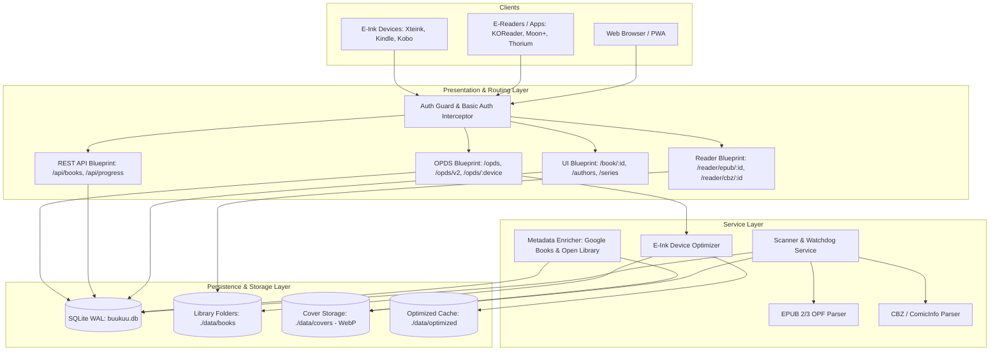
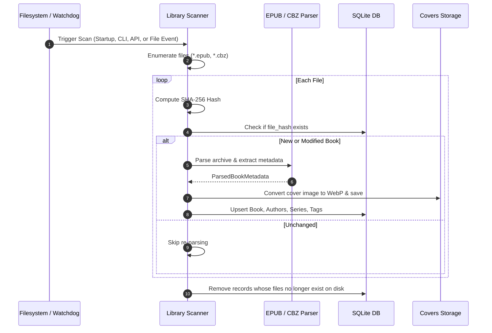
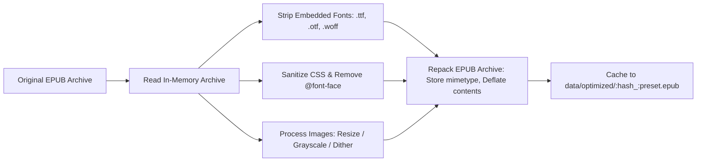
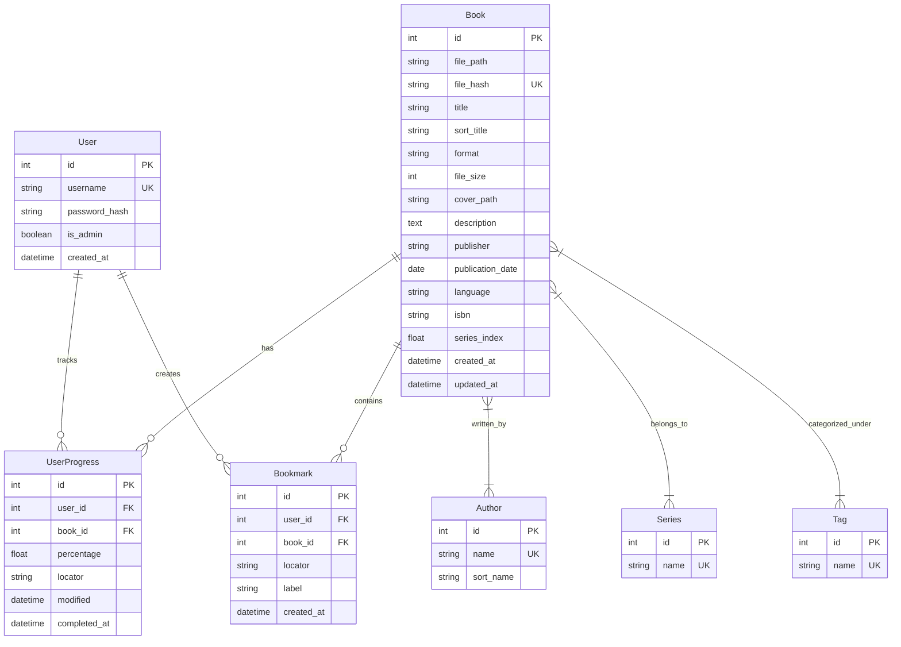

# 🏛️ Buukuu System Architecture & Technical Design

**Buukuu** is a modern, lightweight, self-hosted book and comic server engineered with Python 3.14, Flask, and SQLite. It provides catalog management, in-browser reading, on-demand e-ink device optimization, OPDS catalog feeds, and multi-client reading progress synchronization.

---

## 1. Architectural Principles & Goals

1. **Lightweight & Self-Contained**: Minimal runtime dependencies (`Flask`, `SQLAlchemy`, `Pillow`, `defusedxml`, `watchdog`). Operates seamlessly on low-powered hardware such as Raspberry Pi, home servers, or NAS appliances without requiring heavy services (like Redis or Celery).
2. **Standard-First Interoperability**: Implements established open standards:
   - **OPDS 1.2** (Atom XML) & **OPDS 2.0** (JSON-LD) for universal e-reader compatibility (KOReader, Moon+ Reader, Thorium, Cantook).
   - **OPDS Progression 1.0** for reading position synchronization with strict conflict resolution.
   - **OPDS Authentication Specification** (`application/opds-authentication+json`) alongside HTTP Basic Auth.
3. **E-Ink Native Experience**: Hardware-tailored processing pipeline that optimizes EPUB files on-demand (font stripping, CSS sanitization, image resizing/dithering) specifically for e-paper devices (Xteink, Kindle, Kobo).
4. **Non-Destructive Storage**: Original book archives (`.epub`, `.cbz`) are strictly read-only and never modified. Extracted covers, thumbnails, and optimized device variants are cached separately.
5. **Zero-Friction Web Reading**: Built-in, responsive web readers for EPUB and CBZ with client-side progress tracking and offline asset caching via PWA Service Workers.

---

## 2. High-Level System Architecture

---

## 3. Core Subsystems & Components

### 3.1 Data Ingestion & Library Scanner (`services/scanner.py`)

The scanner discovers, validates, extracts metadata from, and tracks digital books across one or more library folders.

- **Multi-Directory Discovery**: Supported via multiple environment conventions:
  - `BUUKUU_LIBRARY_DIR` or `BUUKUU_BOOKS_DIR` (supports colon, semicolon, comma, or newline delimiters).
  - Numbered environment variables: `BUUKUU_LIBRARY_DIR1`, `BUUKUU_LIBRARY_DIR2`, `DIR1`, `DIR2`.
  - Named variables: `BUUKUU_LIBRARY_DIR_MANGA`, `BUUKUU_DIR_COMICS`.
- **Deduplication & Integrity**: Every book is indexed by its SHA-256 hash. If a file is moved within the library, its record is updated without losing reading history or metadata customizations.
- **Background Filesystem Watching**: A `watchdog.observers.Observer` monitors all active library directories for file additions, modifications, or deletions when `BUUKUU_WATCH_LIBRARY=true`.

---

### 3.2 Metadata Parsers (`services/parsers/`)

- **EPUB Parser (`parsers/epub.py`)**:
  - Unpacks EPUB container metadata (`META-INF/container.xml`) using secure XML parsing via `defusedxml`.
  - Extracts Dublin Core tags (title, creator, description, publisher, language, identifiers).
  - **Series Extraction**:
    1. Calibre meta tags: `<meta name="calibre:series" content="..." />` and `<meta name="calibre:series_index" content="..." />`.
    2. EPUB 3 Collection properties: `<meta property="belongs-to-collection" id="...">` and `<meta refines="#..." property="group-position">`.
    3. Filename/Title regex heuristic fallback: Extracts series names and volume numbers from conventions like `Series Name - Vol. 01 - Title` or `Series Name #01`.
  - **Cover Extraction**: Locates `<meta name="cover">` or items flagged with `properties="cover-image"`. Falls back to scanning root-level images matching cover naming conventions.
- **CBZ Parser (`parsers/cbz.py`)**:
  - Parses Comic book archive zip files.
  - Inspects embedded `ComicInfo.xml` (Anansi / ComicRack standard) for `<Series>`, `<Number>`, `<Writer>`, `<Penciller>`, and `<Genre>`.
  - Sorts archive image entries naturally (`page1.jpg`, `page2.jpg`, `page10.jpg`) and uses the first image page as the volume cover.

---

### 3.3 E-Ink On-Demand Optimization Engine (`services/optimizer.py`)

Dedicated e-paper devices suffer from limited CPU processing power, small RAM envelopes, and fixed e-ink display refresh modes. Modern EPUBs often contain embedded web fonts (multi-megabyte WOFF/OTF files), complex CSS resets, and high-resolution 24-bit color illustrations that cause sluggish page turns or rendering artifacts on e-ink hardware.

#### Optimization Pipeline

- **Device Presets**:
  - **Xteink X3**: 528×792, 16-level grayscale with Floyd-Steinberg dithering, fonts stripped.
  - **Xteink X4**: 480×800, 16-level grayscale with Floyd-Steinberg dithering, fonts stripped.
  - **Kindle Paperwhite / Oasis**: 1072×1448, grayscale, fonts stripped, CSS cleaned.
  - **Kobo Clara / Libra**: 1264×1680, grayscale, fonts stripped, CSS cleaned.
  - **Generic E-Ink**: 1200×1600, grayscale, fonts stripped.
- **Caching Mechanism**: Generated optimized files are stored in `data/optimized/{book_hash}_{preset}.epub`. If the source book changes (updated hash), caches are invalidated automatically.
- **Non-Destructive**: The source library file is never overwritten or mutated.

---

### 3.4 OPDS Catalog & Sync Protocols (`routes/opds.py`)

Buukuu exposes a complete suite of OPDS endpoints tailored for modern e-readers and synchronization clients:

| Protocol / Standard | Endpoint | MIME Type / Format | Purpose |
| :--- | :--- | :--- | :--- |
| **OPDS 1.2 Catalog** | `/opds` | `application/atom+xml` | Main Atom navigation feed (Recent, Authors, Series, Tags). |
| **OPDS 1.2 Search** | `/opds/search?q={query}` | `application/atom+xml` | OpenSearch feed for querying titles and creators. |
| **OPDS 2.0 Catalog** | `/opds/v2/catalog.json` | `application/opds+json` | Modern JSON-LD publication and navigation feeds. |
| **OPDS Authentication** | `/opds/authentication.json` | `application/opds-authentication+json` | Informs clients of HTTP Basic Auth challenge requirements. |
| **OPDS Progression 1.0** | `/opds/books/<id>/progression` | `application/vnd.opds.progression+json` | Read/write reading progression (percentage, locator, timestamp). |
| **Device OPDS Feeds** | `/opds/<preset>` | `application/atom+xml` | Atom feeds offering pre-routed links to optimized EPUB downloads. |

#### Reading Progression & Conflict Handling

In adherence to the [OPDS Progression 1.0 Specification](https://github.com/opds-community/drafts/blob/main/opds-progression-1.0.md):
- Progression values sent/received over the wire are expressed as floats in `[0.0, 1.0]`, translated internally to percentages `[0.0, 100.0]`.
- Every progress update includes a UTC `modified` ISO timestamp.
- **Conflict Resolution**: If a client attempts to `PUT` a progression payload whose `modified` timestamp is older than the server's recorded timestamp, the server responds with:
  - HTTP status: `409 Conflict`
  - Header: `Content-Type: application/problem+json`
  - Body: `{"type": "https://registry.opds.io/error#progression-date", "title": "Conflict", "detail": "Server has newer progression"}`

---

### 3.5 In-Browser Web Readers (`routes/reader.py` & `static/js/`)

Buukuu provides rich in-browser reading environments without external server plugins:

1. **EPUB Web Reader (`reader_epub.html`, `reader-epub.js`)**:
   - Built on `ePub.js` and `JSZip`.
   - **In-Memory Streaming**: Rather than serving unpacked files or individual XML resources through custom routing (which risks directory traversal vulnerabilities), the web client downloads the book as an `ArrayBuffer` via `/api/books/<id>/file` and opens it directly in browser memory.
   - **UI Controls**: Font size adjustments, margins, font family selection, full-text navigation, and color themes (Light, Dark, Sepia, OLED).
   - **Position Sync**: Continuously pushes reading CFI locators and calculated percentage to `/api/books/<id>/progress`.
2. **CBZ Comic Reader (`reader_cbz.html`, `reader-cbz.js`)**:
   - Custom, responsive HTML5 canvas and image viewer.
   - Dual viewing modes: **Continuous Vertical Webtoon Scroll** and **Single-Page Flip**.
   - Features: Fit-to-width, fit-to-height, fullscreen toggle, keyboard navigation (arrow keys, space), and automatic page-progress reporting.

---

## 4. Data Models & Entity Relationship

### Database Pragmas & Concurrency
- Configured with SQLite Write-Ahead Logging (`PRAGMA journal_mode=WAL`).
- `PRAGMA synchronous=NORMAL` to maximize transaction throughput while maintaining durability.
- `PRAGMA foreign_keys=ON` to enforce relational constraints.
- Automatic schema migration (`migrate_database()`) checks `db.metadata.tables` against runtime SQLite columns and executes non-destructive `ALTER TABLE ADD COLUMN` operations on startup.

---

## 5. Security & Authentication Architecture

1. **Authentication Enforcement (`BUUKUU_AUTH_REQUIRED`)**:
   - When enabled (default), all web routes redirect unauthenticated users to `/auth/login`.
   - If the database contains zero users, the application automatically redirects visitors to `/auth/register` to establish the initial Administrator account.
2. **Dual-Credential Interceptor**:
   - Web sessions are secured with signed HTTP-only cookies (`Lax` SameSite policy).
   - API and OPDS requests inspect the `Authorization: Basic <credentials>` header. If present, credentials are authenticated directly against the `User` model, allowing headless readers to connect seamlessly without browser session cookies.
3. **Security Headers**:
   - Injected on all outgoing responses: `X-Content-Type-Options: nosniff`, `X-Frame-Options: SAMEORIGIN`.
4. **Data Isolation**:
   - All reading positions, progress markers, and bookmarks are strictly partitioned by `user_id`. One user cannot read or alter another user's progress.
5. **Administrative Boundaries**:
   - Modifying book metadata, triggering full-library scans, creating users, and changing user permissions are protected by `@admin_required`.

---

## 6. Deployment & Runtime Operations

### Packaging & Environment
- **Python Version**: `>=3.14`
- **Dependency Management**: `uv` using pinned `uv.lock`.
- **Container Strategy**: Multi-stage `Dockerfile` using `python:3.14-slim` and `uv` for minimal attack surface and lightweight image footprints.
- **Persistent Volumes**:
  - `/app/data`: Houses `buukuu.db`, `covers/`, and `optimized/`.
  - `/app/data/books` (or external mount): Primary read-only book library.

### Key Operational CLI Commands
- `uv run buukuu`: Start web application server.
- `uv run buukuu scan [--enrich]`: Trigger indexing scan and optional online metadata enrichment.
- `uv run buukuu create-admin <username>`: Bootstrap or update administrator account.
- `uv run buukuu create-user <username> [--admin]`: Create a reader or admin account.
- `uv run buukuu list-users`: Display registered user credentials and roles.
