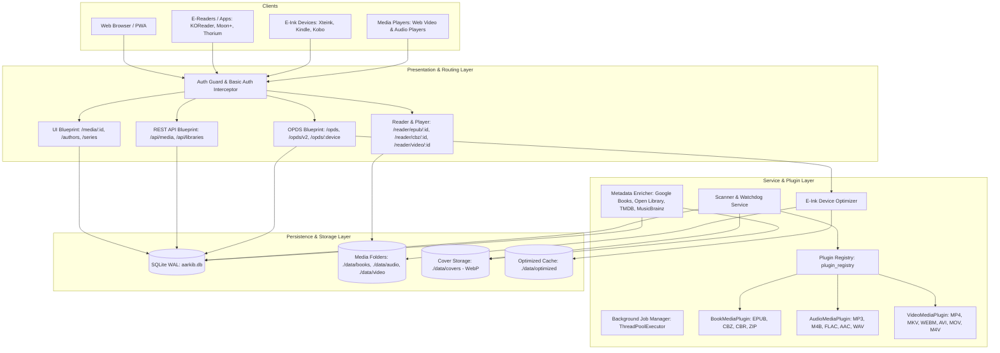
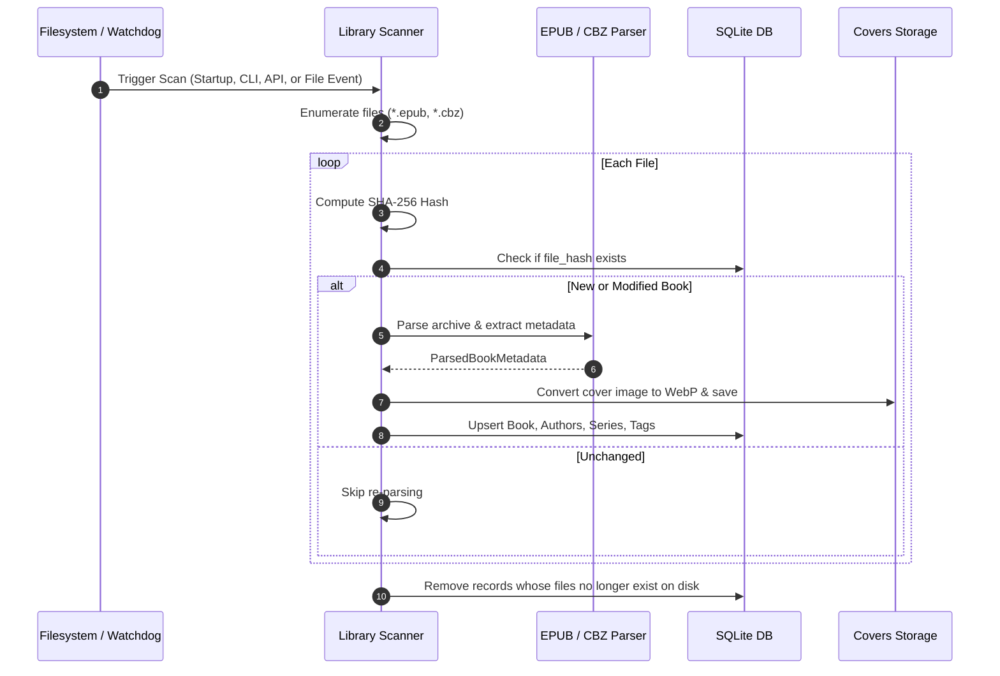
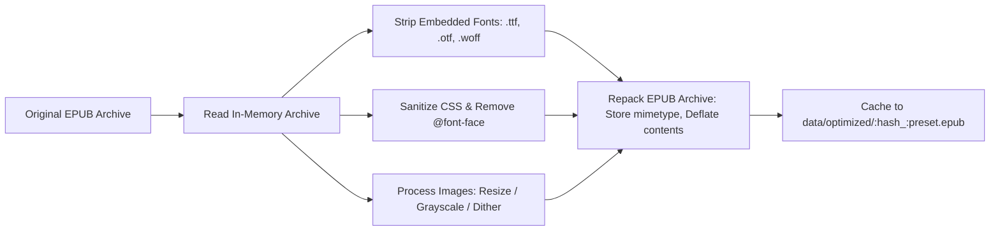
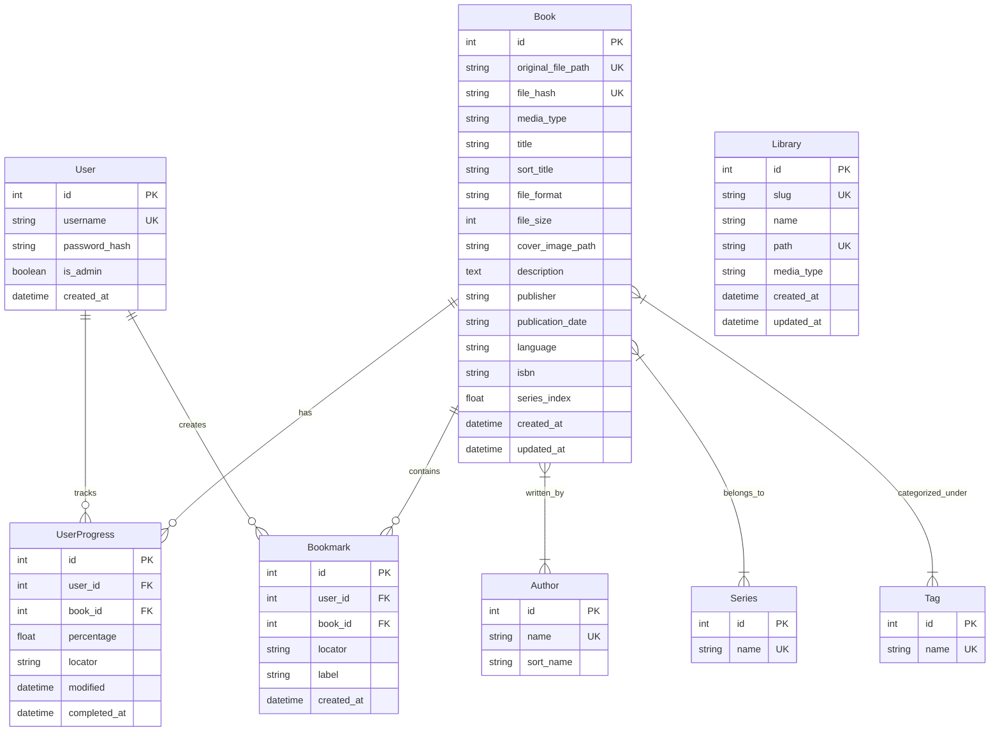

# 🏛️ Aarkib System Architecture & Technical Design

**Aarkib** is a modern, lightweight, self-hosted media server engineered with Python 3.14, Flask, and SQLite. It provides catalog management, in-browser reading, on-demand e-ink device optimization, OPDS catalog feeds, multi-client reading and playback progress synchronization, and an extensible plugin system with native support for books, comics, and video, alongside in-progress audio media capabilities.

---

## 1. Architectural Principles & Goals

1. **Lightweight & Self-Contained**: Minimal runtime dependencies (`Flask`, `SQLAlchemy`, `Pillow`, `defusedxml`, `watchdog`). Operates seamlessly on low-powered hardware such as Raspberry Pi, home servers, or NAS appliances without requiring heavy services (like Redis or Celery).
2. **Standard-First Interoperability**: Implements established open standards:
   - **OPDS 1.2** (Atom XML) & **OPDS 2.0** (JSON-LD) for universal e-reader compatibility (KOReader, Moon+ Reader, Thorium, Cantook).
   - **OPDS Progression 1.0** for reading position synchronization with strict conflict resolution.
   - **OPDS Authentication Specification** (`application/opds-authentication+json`) alongside HTTP Basic Auth.
   - **HTTP 206 Partial Content** for native video/audio range streaming and seeking.
3. **E-Ink Native Experience**: Hardware-tailored processing pipeline that optimizes EPUB files on-demand (font stripping, CSS sanitization, image resizing/dithering) specifically for e-paper devices (Xteink, Kindle, Kobo).
4. **Non-Destructive Storage**: Original media archives (`.epub`, `.cbz`, `.mp3`, `.mp4`) are strictly read-only and never modified. Extracted covers, thumbnails, and optimized device variants are cached separately.
5. **Zero-Friction Web Reading & Media Access**: Built-in, responsive web readers for EPUB and CBZ, and an HTML5 video player with client-side progress tracking and offline asset caching via PWA Service Workers, with persistent audio player in progress for audiobooks and music.
6. **Extensible Multi-Media Plugin Architecture**: Core data models and scanner pipeline decoupled from file types through abstract `MediaPlugin` handlers and declarative mixins.

---

## 2. High-Level System Architecture

---

## 3. Core Subsystems & Components

### 3.1 Data Ingestion & Library Scanner (`services/scanner.py`)

The scanner discovers, validates, extracts metadata from, and tracks digital books across one or more library folders.

- **Generic Media Folder Architecture & WebUI Configuration**:
  - Media directories are managed in SQLite via the `Library` model (`libraries` table).
  - Each library defines a distinct `media_type`:
    - `all`: Mixed / Auto-detect by extension (`.epub` → `book`, `.cbz`/`.cbr`/`.zip` → `comic`, `.mp4`/`.mkv`/etc. → `video`).
    - `book`: Enforces `book` categorization for all documents in that folder.
    - `comic`: Enforces `comic` categorization for all archives/manga in that folder.
    - `video`: Enforces `video` categorization for movies and television series.
  - **Dynamic WebUI & API Control**: Users can configure, inspect item counts, change media types, rescan, or add/delete folders via the WebUI Settings page or REST API (`/api/libraries`). Changing a folder's `media_type` automatically re-classifies all existing items in the database.
- **Direct Folder Drops (No Upload UI)**:
  - Users add media simply by copying or mounting files into storage folders (`./data/media`, `./data/books`, external drives). The scanner and filesystem watcher handle indexing automatically without requiring web upload forms.
- **Multi-Directory Discovery & WebUI Management**:
  - Canonical: `AARKIB_MEDIA_DIR` (single folder path).
  - Numbered environment variables: `AARKIB_MEDIA_DIR1`, `AARKIB_MEDIA_DIR2`, etc.
  - Interactive WebUI Selection: Administrators can browse the server filesystem via `GET /api/fs/directories` and configure folders, library names, and media types directly from the WebUI.
- **Deduplication & Integrity**: Every media item is indexed by its SHA-256 hash. If a file is moved within the library, its record is updated without losing reading/playback history or metadata customizations.
- **Background Filesystem Watching**: A `watchdog.observers.Observer` monitors all active library directories for file additions, modifications, or deletions when `WATCH_LIBRARY` is enabled.

---

### 3.2 Metadata Parsers (`services/parsers/`)

- **EPUB Parser (`parsers/epub.py`)**:
  - Unpacks EPUB container metadata (`META-INF/container.xml`) using secure XML parsing via `defusedxml`.
  - Extracts Dublin Core tags (title, creator, description, publisher, language, identifiers).
  - **Series Extraction**:
    1. Calibre meta tags: `<meta name="calibre:series" content="..." />` and `<meta name="calibre:series_index" content="..." />`.
    2. EPUB 3 Collection properties: `<meta property="belongs-to-collection" id="...">` and `<meta refines="#..." property="group-position">`.
    3. Filename/Title regex heuristic fallback: Extracts series names and volume numbers from conventions like `Series Name - Vol. 01 - Title` or `Series Name #01`.
  - **Cover Extraction**: Locates `<meta name="cover">` or items flagged with `properties="cover-image"`. Falls back to scanning root-level images matching cover naming conventions.
- **CBZ Parser (`parsers/cbz.py`)**:
  - Parses Comic book archive zip files.
  - Inspects embedded `ComicInfo.xml` (Anansi / ComicRack standard) for `<Series>`, `<Number>`, `<Writer>`, `<Penciller>`, and `<Genre>`.
  - Sorts archive image entries naturally (`page1.jpg`, `page2.jpg`, `page10.jpg`) and uses the first image page as the volume cover.

---

### 3.3 E-Ink On-Demand Optimization Engine (`services/optimizer.py`)

Dedicated e-paper devices suffer from limited CPU processing power, small RAM envelopes, and fixed e-ink display refresh modes. Modern EPUBs often contain embedded web fonts (multi-megabyte WOFF/OTF files), complex CSS resets, and high-resolution 24-bit color illustrations that cause sluggish page turns or rendering artifacts on e-ink hardware.

#### Optimization Pipeline

- **Device Presets**:
  - **Xteink X3**: 528×792, 16-level grayscale with Floyd-Steinberg dithering, fonts stripped.
  - **Xteink X4**: 480×800, 16-level grayscale with Floyd-Steinberg dithering, fonts stripped.
  - **Kindle Paperwhite / Oasis**: 1072×1448, grayscale, fonts stripped, CSS cleaned.
  - **Kobo Clara / Libra**: 1264×1680, grayscale, fonts stripped, CSS cleaned.
  - **Generic E-Ink**: 1200×1600, grayscale, fonts stripped.
- **Caching Mechanism**: Generated optimized files are stored in `data/optimized/{book_hash}_{preset}.epub`. If the source book changes (updated hash), caches are invalidated automatically.
- **Non-Destructive**: The source library file is never overwritten or mutated.

---

### 3.4 OPDS Catalog & Sync Protocols (`routes/opds.py`)

Aarkib exposes a complete suite of OPDS endpoints tailored for modern e-readers and synchronization clients:

| Protocol / Standard | Endpoint | MIME Type / Format | Purpose |
| :--- | :--- | :--- | :--- |
| **OPDS 1.2 Catalog** | `/opds` | `application/atom+xml` | Main Atom navigation feed (Recent, Authors, Series, Tags). |
| **OPDS 1.2 Search** | `/opds/search?q={query}` | `application/atom+xml` | OpenSearch feed for querying titles and creators. |
| **OPDS 2.0 Catalog** | `/opds/v2/catalog.json` | `application/opds+json` | Modern JSON-LD publication and navigation feeds. |
| **OPDS Authentication** | `/opds/authentication.json` | `application/opds-authentication+json` | Informs clients of HTTP Basic Auth challenge requirements. |
| **OPDS Progression 1.0** | `/opds/media/<id>/progression` | `application/vnd.opds.progression+json` | Read/write reading progression (percentage, locator, timestamp). |
| **Device OPDS Feeds** | `/opds/<preset>` | `application/atom+xml` | Atom feeds offering pre-routed links to optimized EPUB downloads. |

#### Reading Progression & Conflict Handling

In adherence to the [OPDS Progression 1.0 Specification](https://github.com/opds-community/drafts/blob/main/opds-progression-1.0.md):
- Progression values sent/received over the wire are expressed as floats in `[0.0, 1.0]`, translated internally to percentages `[0.0, 100.0]`.
- Every progress update includes a UTC `modified` ISO timestamp.
- **Conflict Resolution**: If a client attempts to `PUT` a progression payload whose `modified` timestamp is older than the server's recorded timestamp, the server responds with:
  - HTTP status: `409 Conflict`
  - Header: `Content-Type: application/problem+json`
  - Body: `{"type": "https://registry.opds.io/error#progression-date", "title": "Conflict", "detail": "Server has newer progression"}`

---

### 3.5 In-Browser Web Readers (`routes/reader.py` & `static/js/`)

Aarkib provides rich in-browser reading environments without external server plugins:

1. **EPUB Web Reader (`reader_epub.html`, `reader-epub.js`)**:
   - Built on `ePub.js` and `JSZip`.
   - **In-Memory Streaming**: Rather than serving unpacked files or individual XML resources through custom routing (which risks directory traversal vulnerabilities), the web client downloads the book as an `ArrayBuffer` via `/api/media/<id>/file` and opens it directly in browser memory.
   - **UI Controls**: Font size adjustments, margins, font family selection, full-text navigation, and color themes (Light, Dark, Sepia, OLED).
   - **Position Sync**: Continuously pushes reading CFI locators and calculated percentage to `/api/media/<id>/progress`.
2. **CBZ Comic Reader (`reader_cbz.html`, `reader-cbz.js`)**:
   - Custom, responsive HTML5 canvas and image viewer.
   - Dual viewing modes: **Continuous Vertical Webtoon Scroll** and **Single-Page Flip**.
   - Features: Fit-to-width, fit-to-height, fullscreen toggle, keyboard navigation (arrow keys, space), and automatic page-progress reporting.

---

### 3.6 Generalized Plugin Architecture (`plugins/`, `plugins/base.py`)

Aarkib features a decoupled, extensible plugin architecture designed to manage diverse personal media libraries, external protocols, and device optimization pipelines under a unified lifecycle:

1. **Foundational Plugin Hierarchy (`BasePlugin`)**:
   - Every plugin inherits from `BasePlugin` (`plugins/base.py`), exposing:
     - Identification & Metadata: `name`, `display_name`, `plugin_type`, `description`.
     - Lifecycle & Routing: `register_routes(app)`, `init_app(app)`, `check_health()`.
     - Configuration & Security: `enabled`, `csrf_exempt`, `blueprint_options`.
   - Archetypes derived from `BasePlugin`:
     - **`MediaPlugin`**: Format-specific file parsing (`parse_metadata`), artwork extraction (`extract_cover`), player URLs (`get_player_url`), and file extensions (`supported_extensions`).
     - **`ProtocolPlugin`**: Server-side protocol feeds and client streaming APIs (`protocol_version`, `url_prefix`, `csrf_exempt=True`).
     - **`OptimizerPlugin`**: Media transformation and hardware-targeted optimization pipelines (`get_presets`, `optimize`, `supported_formats`).

2. **Central Registry (`PluginRegistry`)**:
   - Singleton `plugin_registry` initialized at application startup in `aarkib/__init__.py`.
   - Dynamically maps file extensions, media types, protocol names, and optimizer handlers.
   - Automatically registers blueprints and handles CSRF exemptions on startup without hardcoding route wiring in core application files.
   - Supports feature toggling via environment configuration (`AARKIB_ENABLE_SUBSONIC`, `AARKIB_ENABLE_OPDS`, `AARKIB_ENABLE_EINK_OPTIMIZER`).

3. **Protocol Plugins**:
   - **OPDS Protocol Plugin (`OPDSProtocolPlugin`)**: Implements OPDS 1.2 (Atom XML), OPDS 2.0 (JSON-LD), OPDS Authentication, and OPDS Progression 1.0 reading synchronization under `/opds`.
   - **Subsonic Protocol Plugin (`SubsonicProtocolPlugin`)**: Implements Subsonic v1.16.1 REST API endpoints under `/rest` for native streaming and cataloging in third-party mobile apps (Symfonium, DSub, Ultrasonic).

4. **Optimizer Plugins**:
   - **E-Ink Device Optimizer (`EInkOptimizerPlugin`)**: Hardware-specific EPUB transformation pipeline with font stripping, CSS sanitization, and 16-level grayscale Floyd-Steinberg dithering.

5. **Media Plugins**:
   - **Books & Comics (`BookMediaPlugin`)**: `.epub`, `.cbz`, `.cbr`, `.zip` with web readers and ComicInfo.xml support.
   - **Video (`VideoMediaPlugin`)**: `.mp4`, `.mkv`, `.webm`, `.avi`, `.mov`, `.m4v` with MP4 box parsing, HTTP 206 chunk seeking, and HTML5 video player.
   - **Audio (`AudioMediaPlugin`)**: Generic `.mp3`, `.m4a`, `.flac`, `.ogg`, `.opus`, `.wav`, `.aac` playback.
   - **Audiobooks (`AudiobookMediaPlugin`)**: Dedicated `.m4b` chapter markers and audiobook player.
   - **Music (`MusicMediaPlugin`)**: Dedicated albums, tracks, and disc numbering.
   - **Podcasts (`PodcastMediaPlugin`)**: Episodic seasons, episode numbers, and podcast player.

### 3.8 Dynamic System Preferences & Settings Service (`services/settings_service.py`)

Aarkib decouples runtime application preferences from static environment configuration. Key operational controls are managed via a database-backed settings architecture:

1. **Managed Runtime Settings**:
   - `AUTO_SCAN_ON_START` (bool): Automatically trigger a full library scan at server startup.
   - `WATCH_LIBRARY` (bool): Enable or disable the real-time background `watchdog` observer.
   - `AUTO_ENRICH` (bool): Automatically fetch online metadata during library scans.
   - `METADATA_PROVIDER` (str): Online provider selector (`all`, `googlebooks`, `openlibrary`).
   - `PAGE_SIZE` (int): Catalog items per page.

2. **Precedence Hierarchy**:
   `WebUI Settings (Database)` $\to$ `Built-in System Defaults`.
   If a setting has been modified via the Web UI, its persisted value in the `settings` SQLite table overrides the default value. Unconfigured settings seamlessly fall back to built-in system defaults.

3. **Hot-Reloading & Live Synchronization**:
   - At startup, `load_settings_into_config(app)` injects all database overrides into Flask's `app.config`.
   - Modifying settings via `PATCH /api/settings` immediately commits to SQLite and updates `app.config` in-memory without restarting the server.
   - Toggling `WATCH_LIBRARY` dynamically starts or stops the background `watchdog.Observer` thread on the fly.
   - Admins can revert all customizations to system defaults at any time via `POST /api/settings/reset`.

---

## 4. Data Models & Entity Relationship

### Multi-Media Schema Mixins & Models (`models/`)
- **`Library` (`models/library.py`)**: Persistent media library directory configuration (`slug`, `name`, `path`, `media_type`).
- **`SystemSetting` (`models/setting.py`)**: Key-value application configuration store (`key`, `value`, `updated_at`) supporting runtime WebUI overrides with dynamic in-memory hot-reloading into Flask's `app.config`.
- **`MediaItemMixin` (`models/media.py`)**: Standardized base columns across all media (`title`, `sort_title`, `media_type`, `original_file_path`, `file_format`, `file_size`, `file_hash`, `cover_image_path`, `description`, `publisher`, `language`, `publication_date`, timestamps), plus relational `library_id` FK.
- **`VideoItemMixin` (`models/media.py`)**: Schema extension columns for video media (`duration`, `resolution_width`, `resolution_height`, `codec`, `season`, `episode`).
- **`AudioTrackMixin` (`models/media.py`)**: Schema extension columns for audio media: `duration` (seconds), `bitrate` (kbps), `album`, `track_number`, `disc_number`, and `chapters_json`.
- **`BackgroundJob` (`models/job.py`)**: Persistent background task tracking (`task_id`, `job_type`, `status`, `progress`, `result_json`, timestamps).
- **Curation Models**: `UserFavorite` (`models/user.py`) for starring media items and `Playlist` / `PlaylistItem` (`models/playlist.py`) for custom media collections.

### Database Pragmas & Concurrency
- Configured with SQLite Write-Ahead Logging (`PRAGMA journal_mode=WAL`).
- `PRAGMA synchronous=NORMAL` to maximize transaction throughput while maintaining durability.
- `PRAGMA foreign_keys=ON` to enforce relational constraints.
- Automatic schema migration (`migrate_database()`) checks `db.metadata.tables` against runtime SQLite columns and executes non-destructive `ALTER TABLE ADD COLUMN` operations on startup.

---

## 5. Security & Authentication Architecture

1. **Mandatory Authentication & Passwordless Users**:
   - Authentication is always required across all interfaces (WebUI, REST API, OPDS feeds, Subsonic).
   - **Compulsory Admin Passwords**: Passwords (minimum 4 characters) are strictly mandatory for all administrator accounts across first-time setup, user creation, password reset, role promotion, and profile editing.
   - **Passwordless Normal Users**: Passwordless reader accounts are supported (`has_password = False`, `password_hash = None`). Passwordless users authenticate by submitting an empty/blank password.
   - If the database contains zero users, the application automatically redirects visitors to `/auth/setup` to bootstrap the initial Administrator account (with a compulsory password). Once >=1 users exist, `/auth/setup` is permanently locked out.
   - Unauthenticated web visitors are redirected to `/auth/login`.
   - Public registration (`/auth/register`) is disabled; accounts can only be created by administrators in **Settings → Users** (`/settings/users`).
2. **Dual-Credential Interceptor**:
   - Web sessions are secured with signed HTTP-only cookies (`Lax` SameSite policy).
   - API and OPDS requests inspect the `Authorization: Basic <credentials>` header. When present, Flask-Login's `request_loader` validates credentials against the `User` model (including blank password for passwordless users) and populates `current_user`, allowing headless readers to sync progress and access collections seamlessly without browser cookies.
3. **Security Headers**:
   - Injected on all outgoing responses: `X-Content-Type-Options: nosniff`, `X-Frame-Options: SAMEORIGIN`, `Referrer-Policy: strict-origin-when-cross-origin`.
4. **Data Isolation**:
   - All reading positions, progress markers, and bookmarks are strictly partitioned by `user_id`. One user cannot read or alter another user's progress.
5. **Administrative Boundaries**:
   - Modifying book metadata, triggering full-library scans, creating users, and changing user permissions are protected by `@admin_required`.
6. **Defensive Parsing & SSRF Protection**:
   - All external XML processing (`parsers/epub.py`, `parsers/cbz.py`, and `services/optimizer.py`) utilizes `defusedxml` to defend against XML entity expansion (Billion Laughs) and XXE vulnerabilities.
   - The metadata enricher verifies URL schemes (`http`, `https`) before issuing outbound requests to prevent SSRF or arbitrary local file disclosure (`file://`).

---

## 6. Deployment & Runtime Operations

### Packaging & Environment
- **Python Version**: `>=3.14`
- **Dependency Management**: `uv` using pinned `uv.lock`.
- **Container Strategy**: Multi-stage `Dockerfile` using `python:3.14-slim` and `uv` for minimal attack surface and lightweight image footprints. Runs as an unprivileged user (`USER aarkib`) with a standard container `HEALTHCHECK` querying `/api/health`.
- **Persistent Volumes**:
  - `/app/data`: Houses `aarkib.db`, `covers/`, `optimized/`, and runtime caches.
  - `/media` (or individual category mounts like `/media/books`, `/media/comics`, `/media/videos`): Primary external media storage.

### Server Launcher & Web Administration
- `uv run aarkib`: Start the web application server (or container startup via `aarkib`).
- **Administrative Operations**: Managed exclusively via the modern Web UI:
  - Account setup & user management: First-run setup wizard (`/auth/setup`) and `/settings/users`.
  - Content discovery: Background filesystem watchers and on-demand rescan via `/settings/libraries`.
  - Full-Text Search: Automatic startup synchronization and manual reindexing via `/settings/jobs`.
  - Metadata enrichment: Background enricher jobs triggered via `/settings/jobs` or per-media detail views.

---

## 7. UI/UX Design System: Cinematic Obsidian

## Brand & Style

This design system serves a modern home media server platform engineered for high-fidelity personal streaming, library curation, and home theater control. The core emotional tone is cinematic, immersive, and premium—evoking the sensory presence of a darkened screening room paired with precision engineering.

The visual style blends **Dark Minimalism** with **Atmospheric Glassmorphism**:
- **Immersion First:** The interface recedes into an obsidian background, allowing cover art, video backdrops, and dynamic metadata to lead the experience.
- **Electric Accents:** Luminescent cyan and rich indigo provide instant focal clarity for playback controls, active focus states, and discovery carousels without visual fatigue.
- **Glass & Depth:** Floating translucent bars and ambient radial highlights simulate hardware-level luminescence and tactile elevation.
- **Refined Media Utility:** Metadata badges, stream bitrate monitors, and audio codecs are presented as sharp, high-contrast badges resembling studio equipment indicators.

## Colors

The palette is anchored in an ultra-deep charcoal-obsidian continuum engineered specifically for OLED displays and ambient-lit home theater setups:

- **Canvas & Base (`#0B0E14`):** Canvas bedrock. Reduces light spill in darkened rooms while keeping true black clipping to a minimum.
- **Elevated Canvas (`#121721`):** Structural panels, side navigation rails, and backdrop scrims.
- **Surfaces (`#181F2E`, `#1F293D`):** Media cards, overlay sheets, dialog boxes, and drawer panels.
- **Primary Accent (`#00D2FF`):** Electric Cyan, used for playback progress tracks, primary interactive triggers, active tabs, and focus halos.
- **Secondary Accent (`#6366F1`):** Vibrant Violet/Indigo, used for secondary action badges, user library profile accents, and multi-user room indicators.
- **Tertiary Accent (`#00B4D8`):** Deep Cerulean, supporting subtle hover fills, scrub bar buffers, and volume slider fills.
- **Typography & Details:** High-contrast crisp white (`#F8FAFC`) for primary titles, cool silver (`#94A3B8`) for secondary cast and technical metadata, and muted slate (`#475569`) for subtle metadata dividers.
- **Functional Badges:** Crisp solid dark charcoal bases (`#0F172A`) framed with semi-translucent borders for formats like 4K HDR, Dolby Vision, Dolby Atmos, and HEVC.

## Typography

The typography hierarchy pairs the structural geometry of **Plus Jakarta Sans** with the neutral clarity of **Inter**:

- **Display & Headlines:** Plus Jakarta Sans provides crisp geometric weight for hero movie titles, carousel section titles, and modal headers. Negative tracking tightens large scale headings for a poster-like presentation.
- **Body & Metadata:** Inter guarantees high legibility across variable viewing distances (from desktop monitors to living-room 10-foot television UIs). Synopsis copy uses relaxed line heights (`1.6x`) against the dark background to prevent reading strain.
- **Codec & Spec Badges:** The `label-badge` token employs bold, tracked uppercase typography (`letterSpacing: 0.08em`) to mimic physical AV equipment labels.

## Layout & Spacing

The layout is built on a responsive fluid grid system optimized for browsing density, aspect ratios (2:3 poster art and 16:9 episodic backdrops), and edge-to-edge media viewing:

- **Desktop (12 Columns):** Margins of `3rem` (48px) with `1.5rem` (24px) gutters. Content expands up to a maximum container width of `1920px`, after which outer margins scale fluidly.
- **Tablet (8 Columns):** Margins of `2rem` (32px) with `1rem` (16px) gutters. Horizontal carousels scroll seamlessly off-canvas with preserved left alignment.
- **Mobile (4 Columns):** Margins of `1rem` (16px) with `0.75rem` (12px) gutters. Poster grids collapse to 2 columns, and episodic feeds prioritize full-width 16:9 cards with bottom sheet drawer controls.
- **Rhythm Rules:** Vertical spacing between content carousels strictly uses `space-xl` (`2.5rem`) to maintain separation between distinct streaming hubs, while item padding within cards utilizes `space-sm` and `space-md`.

## Elevation & Depth

Visual depth combines physical surface layers with translucent glassmorphism and radiant colored halos:

1. **Layer 0 (Canvas Base):** Solid `#0B0E14`. Serves as the backdrop for all full-bleed image scrims and ambient lighting effects.
2. **Layer 1 (Card & Drawer Base):** `#181F2E` with a 1px inner hairline stroke of `rgba(255, 255, 255, 0.06)`. Shadows are soft and tinted: `0 8px 32px -4px rgba(0, 0, 0, 0.6)`.
3. **Layer 2 (Elevated & Active Cards):** `#1F293D` accompanied by an electric cyan glow on hover or TV remote focus: `0 12px 36px -2px rgba(0, 210, 255, 0.15)`.
4. **Glassmorphism (Top Navigation & Player Chrome):** Translucent background `rgba(18, 23, 33, 0.65)` layered with `backdrop-filter: blur(20px) saturate(180%)` and an anchored bottom border of `1px solid rgba(255, 255, 255, 0.08)`.
5. **Backdrop Ambient Scrims:** Full-bleed hero banner images use a dynamic gradient mask transitioning from `transparent 40%` down to `rgba(11, 14, 20, 0.95) 90%` and `#0B0E14 100%`.

## Shapes

The design system employs refined, modern curves with a base rounding of `0.5rem` (8px), scaling upward for media presentation:

- **Buttons, Inputs, & Action Chips:** Built with `0.5rem` (8px) or `0.75rem` (12px) to match standard tactile surface expectations.
- **Media Poster & Episode Cards:** Apply `rounded-xl` (`1rem` / 16px) to maintain a soft, modern screen feel without cropping title art or progress bars.
- **Hero Containers, Floating Modals, & Detail Sheets:** Use `rounded-2xl` (`1.5rem` / 24px) for expansive framing.
- **Pill Elements:** Badge pills, playback scrub heads, and streaming quality tags preserve full circular capsules (`rounded-full`).

## Components

### Buttons
- **Primary Play Action:** Large pill or rounded-xl button with Electric Cyan background (`#00D2FF`), dark obsidian text (`#0B0E14`), bold weight (`label-lg`), and an ambient drop shadow (`0 0 24px rgba(0, 210, 255, 0.35)`). Active state applies a scale transform (`scale(0.97)`).
- **Secondary Actions (Queue, Trailer):** Glass-panel button (`rgba(255, 255, 255, 0.08)`) with white text, crisp 1px border (`rgba(255, 255, 255, 0.12)`), and smooth transition to `#1F293D` on hover.
- **Icon Actions (Like, Bookmark, Cast):** Circular buttons (`40px x 40px`) rendered in semi-transparent dark charcoal with silver icons (`#94A3B8`) shifting to cyan on toggle.

### Media Cards (Poster & 16:9 Backdrops)
- Constructed with `rounded-xl` borders and overflow hidden.
- Includes a subtle 1px border (`rgba(255, 255, 255, 0.06)`).
- On hover/focus: Scales up by `1.04`, elevates border to `#00D2FF`, and triggers a bottom overlay showing metadata, audio format icons, and a quick-play button.
- Embedded progress bar anchored at the bottom edge: 3px thick, `#00D2FF` filled track against a `rgba(255, 255, 255, 0.2)` trough.

### Badges & Technical Indicators
- Small, crisp tags displaying format specifications: `4K HDR`, `DOLBY VISION`, `ATMOS`, `HEVC 10-BIT`.
- Rendered using `label-badge` font specs with solid `#0F172A` background, `rgba(255, 255, 255, 0.15)` border, and high-contrast silver/white typography.
- Status badges (e.g., `DIRECT PLAY`, `TRANSCODING`) use secondary violet `#6366F1` or warning amber accents.

### Input Fields & Search Bars
- Glass-morphic inputs with `#181F2E` fills and subtle inner border (`rgba(255, 255, 255, 0.08)`).
- Focus state reveals a luminous cyan outline glow (`0 0 0 2px #00D2FF`).
- Integrated keyboard shortcuts indicator (e.g., `⌘K`) displayed in muted slate pill.

### Lists & Episode Rows
- Alternating subtle hover states (`rgba(255, 255, 255, 0.03)`).
- Left-aligned episode thumbnail (16:9 with duration badge overlay), middle column displaying episode number, title, and overview, and right-aligned action menu (watched status, download, overflow).

### Checkboxes & Radio Buttons
- Obsidian base (`#121721`) with 1px border (`rgba(255, 255, 255, 0.2)`).
- Checked state transitions directly to `#00D2FF` with sharp white SVG checkmark/dot and electric glow.

### Additional Media-Specific Components
- **Scrubber Timeline:** Custom video scrubber featuring active buffer range (`#00B4D8`), elapsed playback (`#00D2FF`), interactive scrub thumbnail popup, and chapter markers.
- **Transcode / Stream Stats Overlay:** Monospaced and badge-driven HUD displaying frame drop rate, video bitrate (Mbps), audio channels (7.1/5.1), and hardware transcoding engine stats.
