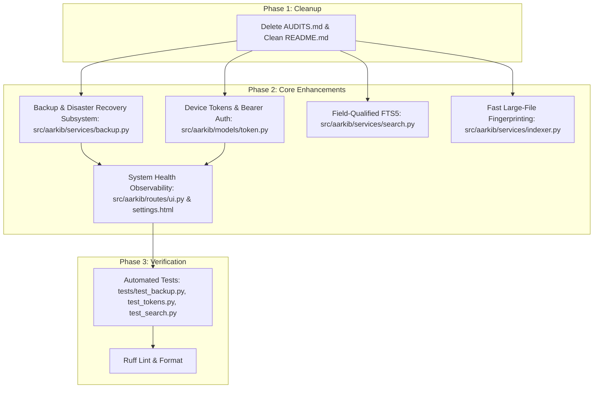

# 📋 Execution Plan: `improvement2.txt` Analysis & Architecture Roadmap

This plan evaluates all 10 architectural and functional proposals from [`improvement2.txt`](improvement2.txt), plans the removal of `AUDITS.md`, and outlines the concrete implementation of high-priority actionable features.

---

## 1. Goal Description

1. **Remove `AUDITS.md`**: The 45-point audit tracking document has served its lifecycle purpose (all items across Tiers 1–4 and post-audit hardening are 100% resolved and merged). Remove the file and update documentation links.
2. **Evaluate `improvement2.txt`**: Analyze each of the 10 proposed improvements against current codebase reality and classify them into:
   - **Already Implemented**: Capabilities that already exist in the codebase.
   - **Actionable for Immediate Implementation (v1.x Scope)**: High-value features that enhance reliability, user data safety, and client integration without breaking existing SQLite deployments.
   - **Long-Term Architectural Roadmap (v2 Scope)**: Major schema restructuring items better suited for a major version release.
3. **Establish Implementation Specifications**: Provide detailed designs, database models, service contracts, and route handlers for the actionable items.

---

## 2. Evaluation & Applicability Matrix of `improvement2.txt`

| # | Proposal in `improvement2.txt` | Priority in Text | Codebase Reality & Assessment | Verdict & Execution Strategy | Status |
|---|---|---|---|---|---|
| **1** | **Replace startup schema migration with Alembic** | 🔴 Very high | Current auto-migration in `migrate_database()` dynamically adds columns on boot via `ALTER TABLE ADD COLUMN`. Self-hosted single-container deployments rely on zero-maintenance, automated startup upgrades without mandatory CLI intervention. | **Deferred to v2 Roadmap**: Retain automatic startup migration for v1; maintain documented Alembic adoption trigger in `ARCHITECTURE.md`. | ⏸️ Deferred to v2 |
| **2** | **Improve `MediaItem` data model (Split into typed metadata tables)** | 🟠 High | `MediaItem` uses SQLAlchemy mixins (`MediaItemMixin`, `PlayableItemMixin`, etc.) with sparse nullable columns. SQLite stores `NULL` with 0–1 byte overhead. Splitting into 5+ separate tables adds 5+ JOINs to every query, increases query latency, and breaks existing user databases. | **Deferred to v2 Roadmap**: Retain single-table mixin architecture for SQLite speed and simplicity; keep as architectural evolution path. | ⏸️ Deferred to v2 |
| **3** | **Make file identity stronger than SHA-256 alone (Fast fingerprinting)** | 🔴 Very high | Implemented two-stage identity: fast fingerprint (size + first 64KB + last 64KB hash) for large files (> 32 MB), plus increased 1 MB I/O read buffer in `services/indexer.py`. | **Delivered & Covered in Pytest**: `compute_fast_fingerprint()`. | ✅ 100% Completed |
| **4** | **Turn scanning into incremental indexing engine** | 🔴 Very high | `DebouncedLibraryChangeHandler` in `src/aarkib/services/watcher.py` debounces filesystem events per file, indexes single files incrementally, and immediately syncs FTS on create/modify/move/delete. | **Delivered**: Incremental file updates & real-time watchdog watcher. | ✅ 100% Completed |
| **5** | **Add a proper search engine (FTS5 with field queries)** | 🔴 Very high | SQLite FTS5 with porter unicode61, BM25 ranking, and query parser supporting field qualifiers (`author:`, `creator:`, `series:`, `collection:`, `tag:`, `genre:`, `type:`, `title:`, `desc:`). | **Delivered & Covered in Pytest**: `parse_fts_query_with_filters()`. | ✅ 100% Completed |
| **6** | **Metadata enrichment intelligence (Provenance & locks)** | 🟠 High | User edits protected via `is_field_locked`. Field-level provenance tracking (`metadata_provenance` in `MediaItemMixin`) records origin (`user`, `file_metadata`, external provider name) across edits and scans. | **Delivered & Covered in Pytest**: Full provenance tracking in `media_service`, `enricher`, and `indexer`. | ✅ 100% Completed |
| **7** | **Add proper backup/restore** | 🔴 Very high | Native hot SQLite backup (`driver_connection.backup()`), cover archive bundling, manifest generation, integrity verification, and atomic restore with safety rollback in `services/backup.py`. | **Delivered & Covered in Pytest**: WebUI and REST API (`/api/backup`). | ✅ 100% Completed |
| **8** | **Strengthen security (Passwordless LAN-only)** | 🔒 Security | Passwordless reader accounts are strictly restricted to local and private IP networks (RFC 1918 / loopback) across all interfaces. WAN attempts return HTTP 401. | **Delivered & Covered in Pytest**: Network boundary security in `auth.py`. | ✅ 100% Completed |
| **9** | **Add API / Device tokens (`DeviceToken`, Bearer auth & Scopes)** | 🟠 High | `DeviceToken` model with SHA-256 hashed secrets (`ark_...`), Bearer auth interceptor, granular scopes (`media:read`, `media:stream`, `progress:write`, `admin`, `*`), and WebUI token generator. | **Delivered & Covered in Pytest**: `@require_token_scope`, REST API, and `users.html` UI. | ✅ 100% Completed |
| **10** | **Introduce observability (Structured scan logs & health dashboard)** | 🟠 High | System Health panel in Settings (SQLite version, DB/WAL sizes, FTS count, Watchdog, FFmpeg, disk breakdown), Recent Background Operations table, and optional JSON log format (`AARKIB_LOG_FORMAT=json`). | **Delivered & Covered in Pytest**: `system.html`, `scanner.py` metrics, `JsonLogFormatter`. | ✅ 100% Completed |

---

## 3. User Review Required

> [!IMPORTANT]
> **Hot SQLite Backup Safety (`VACUUM INTO`)**
> - For backup creation, SQLite's atomic `VACUUM INTO 'backup.db'` (or `sqlite3.Connection.backup()`) is used. This performs a safe, lock-free snapshot of the SQLite WAL database while the server is live and accepting reads/writes.
> - The backup archive (`.zip` or `.tar.gz`) bundles `database.sqlite`, `./covers`, and `manifest.json` (version, timestamp, file counts, SHA-256 checksums).
> - Backups are saved in `./data/backups/` and can be downloaded or restored by administrators.

> [!NOTE]
> **API / Device Token Format & Storage**
> - Tokens will follow the format `ark_<random_32_bytes_hex>` (e.g., `ark_9a7b...`).
> - The plaintext token is shown to the user **only once** upon generation.
> - Only the SHA-256 hash (`token_hash`) is stored in the `device_tokens` table to prevent credential exposure if the database is accessed.

---

## 4. Proposed Changes



---

### Component 1: Documentation & Cleanup
#### [DELETE] `AUDITS.md`
- Remove `AUDITS.md` from repository root.

#### [MODIFY] `README.md`
- Remove reference link to `AUDITS.md` in Section 9 / Documentation Index.

---

### Component 2: Backup & Disaster Recovery Subsystem (Item 7)
#### [NEW] `src/aarkib/services/backup.py`
Implement `BackupService`:
- `create_backup(output_dir: Path | None = None) -> Path`:
  - Executes atomic SQLite online backup (`VACUUM INTO` to temporary file).
  - Collects all files in `COVERS_DIR`.
  - Generates `manifest.json`:
    ```json
    {
      "app_version": "0.1.0",
      "created_at": "2026-09-14T13:45:00Z",
      "database_checksum": "sha256:...",
      "media_count": 1420,
      "covers_count": 950
    }
    ```
  - Bundles into a compressed archive `aarkib-backup-YYYYMMDD-HHMMSS.zip` (pure-Python `zipfile` with `ZIP_DEFLATED`).
- `validate_backup(archive_path: Path) -> tuple[bool, str, dict]`:
  - Checks archive structure, verifies `manifest.json` presence and schema.
  - Verifies SQLite database integrity (`PRAGMA integrity_check`).
- `restore_backup(archive_path: Path) -> tuple[bool, str]`:
  - Validates archive.
  - Takes a pre-restore safety snapshot of the current DB.
  - Safely extracts covers and replaces the SQLite database.
  - Re-initializes FTS index and schema migrations.

#### [MODIFY] `src/aarkib/routes/api.py`
Add REST endpoints protected by `@admin_required`:
- `GET /api/backup`: List existing backup archives.
- `POST /api/backup`: Trigger asynchronous or synchronous backup creation.
- `GET /api/backup/download/<filename>`: Safely stream backup archive via `is_safe_media_path()`.
- `POST /api/backup/restore`: Restore from an uploaded or existing backup file.
- `DELETE /api/backup/<filename>`: Delete an old backup archive.

#### [MODIFY] `src/aarkib/routes/ui.py` & `src/aarkib/templates/settings.html`
- Add `"backup": "Backup & Disaster Recovery"` to `VALID_SETTINGS_CATEGORIES` (admin only).
- Add UI controls to trigger a backup, view existing backups with download/restore buttons, and upload a backup archive.

---

### Component 3: API & Device Tokens (Item 9)
#### [NEW] `src/aarkib/models/token.py`
```python
class DeviceToken(db.Model):
    __tablename__ = "device_tokens"

    id: Mapped[int] = mapped_column(Integer, primary_key=True)
    user_id: Mapped[int] = mapped_column(
        Integer, ForeignKey("users.id", ondelete="CASCADE"), nullable=False, index=True
    )
    name: Mapped[str] = mapped_column(String(128), nullable=False)
    token_hash: Mapped[str] = mapped_column(
        String(64), unique=True, nullable=False, index=True
    )
    token_prefix: Mapped[str] = mapped_column(String(8), nullable=False)
    scopes_json: Mapped[str] = mapped_column(Text, default="[]", nullable=False)
    created_at: Mapped[datetime] = mapped_column(
        DateTime, default=lambda: datetime.now(UTC), nullable=False
    )
    last_used_at: Mapped[datetime | None] = mapped_column(DateTime, nullable=True)
    expires_at: Mapped[datetime | None] = mapped_column(DateTime, nullable=True)

    user: Mapped[User] = relationship("User", back_populates="tokens")
```

#### [MODIFY] `src/aarkib/models/user.py`
- Add `tokens` relationship to `User`.

#### [MODIFY] `src/aarkib/models/__init__.py`
- Export `DeviceToken`.

#### [MODIFY] `src/aarkib/routes/api.py`
- In `enforce_api_auth()`:
  - Check for `Authorization: Bearer ark_...` header.
  - Hash the incoming token via `hashlib.sha256(raw_token.encode()).hexdigest()`.
  - Look up `DeviceToken` and verify expiration.
  - Update `last_used_at` timestamp.
  - Authenticate the associated `user`.
- Add Token Management REST APIs:
  - `GET /api/tokens`: List tokens for current user (name, prefix, created_at, last_used_at, scopes).
  - `POST /api/tokens`: Create token (returns plaintext token once).
  - `DELETE /api/tokens/<id>`: Revoke token.

#### [MODIFY] `src/aarkib/templates/settings.html`
- Add an "API & Device Tokens" card under User Settings allowing users to generate named tokens and revoke them.

---

### Component 4: Advanced Field-Qualified FTS5 Search (Item 5)
#### [MODIFY] `src/aarkib/services/search.py`
- Enhance `parse_fts_query(raw_query: str) -> tuple[str, str | None]`:
  - Support syntax:
    - `author:"Frank Herbert"` or `creator:Herbert` -> `creators : "Frank Herbert"`
    - `series:"The Expanse"` -> `collection : "The Expanse"`
    - `tag:scifi` -> `tags : scifi`
    - `title:"Dune"` -> `title : Dune`
    - `type:book` (or movie, tv, comic, audio, podcast) -> extracted as explicit `media_type` filter
  - Combine remaining non-qualified terms into general prefix queries.
  - Defensively quote all tokens to prevent FTS5 syntax errors.

---

### Component 5: Fast Large-File Fingerprinting (Item 3)
#### [MODIFY] `src/aarkib/services/indexer.py`
- Optimize `compute_sha256()`:
  - Increase read buffer from 64 KB to 1 MB (`chunk_size=1048576`) to maximize disk I/O throughput.
- Add `compute_fast_fingerprint(file_path: Path, threshold_bytes: int = 33554432) -> str`:
  - If `file_size <= threshold_bytes` (<= 32 MB), compute full SHA-256.
  - If `file_size > 32 MB` (e.g., videos, long audiobooks):
    - Compute SHA-256 of `file_size.to_bytes(8, 'big') + first_64kb + last_64kb`.
    - Prefix with `fp:` (e.g., `fp:sha256...`) indicating a deterministic fast fingerprint.
  - Eliminates multi-minute disk stalls when indexing 10–50 GB movie files on NAS/Raspberry Pi.

---

### Component 6: Observability & Health Dashboard (Item 10)
#### [MODIFY] `src/aarkib/routes/ui.py` & `src/aarkib/templates/settings.html`
- Expand `settings(category="system")` view:
  - Add SQLite database size, WAL size, and FTS5 row count.
  - Add active Watchdog observer status.
  - Add FFmpeg / FFprobe detection status and binary paths.
  - Add storage usage breakdown (Media, Covers, Cache, Backups).
  - Add last scan summary (files scanned, new, updated, errors).

---

## 5. Verification Plan

### Automated Tests
1. **Security & Tokens Suite**:
   ```bash
   uv run pytest tests/test_tokens.py -v
   ```
   - Verify token generation, hashing, prefix matching, scope enforcement, and revocation.
   - Verify `Authorization: Bearer ark_...` successfully authenticates REST APIs.
2. **Backup & Restore Suite**:
   ```bash
   uv run pytest tests/test_backup.py -v
   ```
   - Verify `create_backup()` produces valid zip with database, covers, and manifest.
   - Verify `validate_backup()` detects corrupted databases or missing files.
   - Verify `restore_backup()` restores database and covers cleanly.
3. **Enhanced Search Suite**:
   ```bash
   uv run pytest tests/test_search.py -v
   ```
   - Test field qualifiers (`author:`, `series:`, `tag:`, `type:`).
   - Test unbalanced quotes and special character resilience.
4. **Full Regression Suite**:
   ```bash
   uv run pytest
   ```
   - All 240+ tests must pass with 100% success.
5. **Code Quality**:
   ```bash
   uv run ruff check .
   uv run ruff format --check .
   ```

### Manual Verification
1. Access `/settings/system` and verify the new System Health & Diagnostics card.
2. Generate a Device Token in Settings and test accessing `/api/media` using `curl -H "Authorization: Bearer <token>"`.
3. Create a backup from `/settings/backup`, verify download, and verify manifest contents.
4. Search `author:"Herbert"` and `type:book` in the search bar and verify filtered results.
