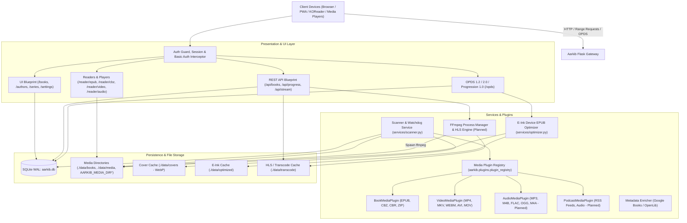
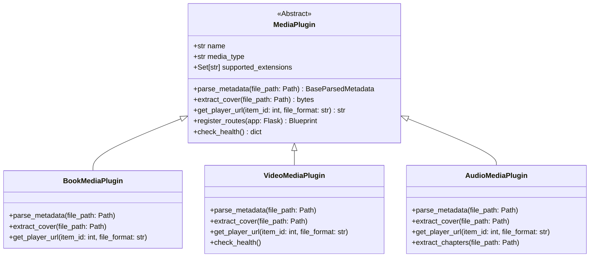
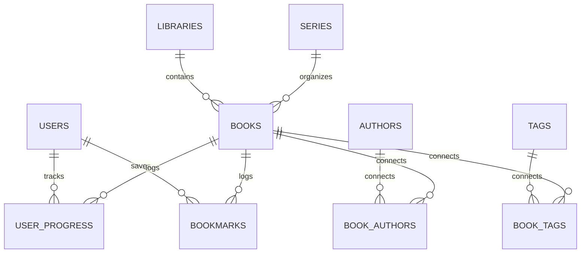
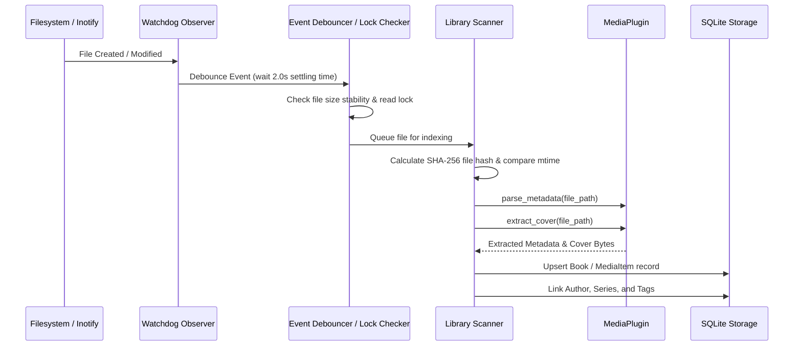
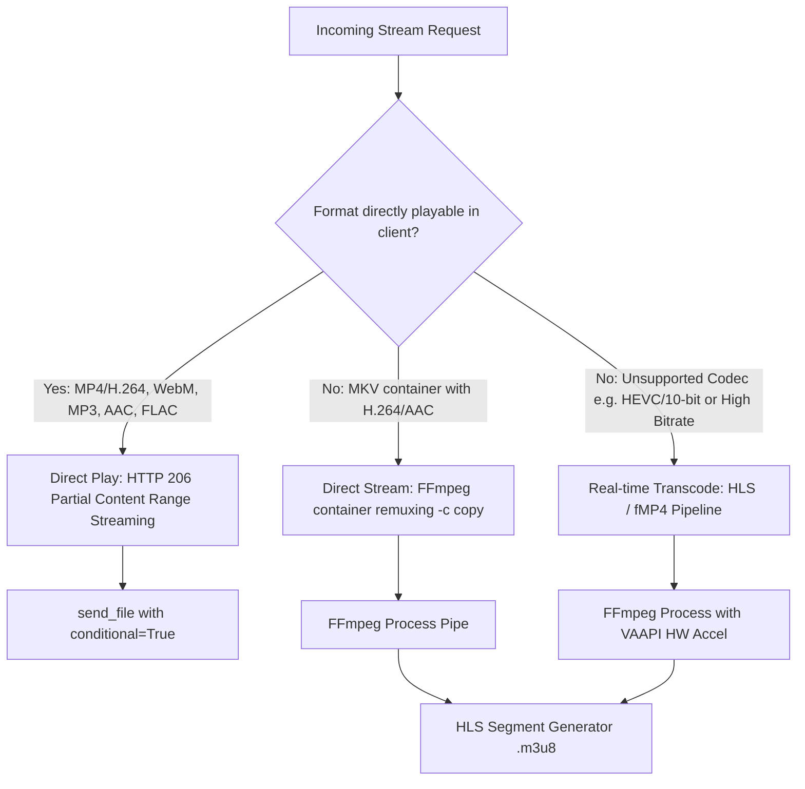
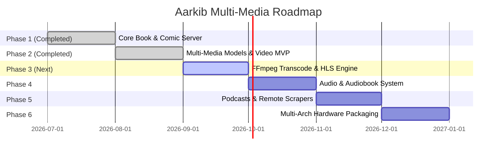

# 🏛️ Aarkib Media Server — Architectural Blueprint & Multi-Media Guideline

**Aarkib** is a lightweight, modern, self-hosted media server built with **Python 3.14+**, **Flask**, **SQLAlchemy**, and **SQLite (WAL mode)**. Originally designed as a high-performance book and comic server featuring OPDS feeds and e-ink optimization, Aarkib is expanding via its modular plugin architecture into a unified personal media hub supporting **Books**, **Comics**, **Video**, **Audio / Audiobooks**, and **Podcasts**.

---

## 1. System Architecture Overview



### Architectural Principles
1. **Lightweight & Self-Contained**: Operates effortlessly on low-powered hardware (Raspberry Pi, NAS appliances, mini PCs) without heavy external brokers (no Celery, Redis, or PostgreSQL required).
2. **Non-Destructive Storage**: Original files (`.epub`, `.cbz`, `.mp4`, `.flac`) are strictly treated as read-only. Extracted covers, thumbnails, e-ink variants, and HLS segments are stored in isolated cache directories.
3. **Standards-First Interoperability**: Implements established open protocols:
   * **OPDS 1.2** (Atom XML) & **OPDS 2.0** (JSON-LD) for universal e-reader integration (KOReader, Moon+ Reader, Thorium).
   * **OPDS Progression 1.0** for reading progress synchronization with strict conflict resolution.
   * **HTTP 206 Partial Content** for native video/audio range streaming and seeking.
4. **Plugin-Driven Multi-Media**: Decoupled metadata extraction, cover parsing, and player routing via an extensible [`MediaPlugin`](file:///home/syafiq/code/aarkib/src/aarkib/plugins/base.py#L15) interface.

---

## 2. Multi-Media Domain Specifications

| Domain | Supported Formats | Metadata Parsers | Playback / Reader Strategy | Implementation Status |
| :--- | :--- | :--- | :--- | :--- |
| **Books** | `epub` (v2 & v3) | `zipfile` + `defusedxml` (OPF, Dublin Core, Calibre, Belongs-to-collection) | In-browser ePub.js (in-memory ArrayBuffer), OPDS catalog download, e-ink optimized variant generation | **Implemented** |
| **Comics / Manga** | `cbz`, `cbr`, `zip` | `zipfile` / archive extractors, `ComicInfo.xml` | In-browser canvas continuous/single-page web reader | **Implemented** |
| **Video** (Movies, TV Shows) | `mp4`, `mkv`, `webm`, `avi`, `mov`, `m4v` | Pure-Python MP4 box parser (`mvhd`/`tkhd`), `ffprobe` fallback, smart TV/Movie regex | Direct HTTP 206 Range streaming (`send_file(..., conditional=True)`), HTML5 video player with episode navigation; on-the-fly HLS transcoding planned | **MVP Implemented** (Transcoding Next) |
| **Audio & Audiobooks** | `mp3`, `m4b`, `flac`, `ogg`, `opus`, `m4a` | `mutagen` (ID3v2, Vorbis Comments, MP4/M4B tags, QuickTime chapters) | Persistent bottom audio player, queueing, chapter mark navigation, variable playback speed ($0.75\times$ to $2.0\times$) | **Planned / Next** |
| **Podcasts** | RSS feeds, local cached `mp3`/`m4a` | `feedparser` RSS poller, episode enclosure extractors | Remote stream proxy or local cache playback, episode bookmarking, auto-poll background worker | **Planned** |

---

## 3. Modular Media Plugin Framework

All media types in Aarkib adhere to the [`MediaPlugin`](file:///home/syafiq/code/aarkib/src/aarkib/plugins/base.py#L15) contract registered in the central [`PluginRegistry`](file:///home/syafiq/code/aarkib/src/aarkib/plugins/base.py#L55).



### 3.1 Extension Points & Responsibilities

1. **`parse_metadata(file_path: Path)`**:
   * Reads structural metadata (title, creators/artists/authors, series/album, season/episode, publication/release date, tags, duration, resolution).
   * Must execute in a worker thread (`ThreadPoolExecutor`) during bulk scans to prevent blocking the web server.
2. **`extract_cover(file_path: Path)`**:
   * Extracts embedded cover art (EPUB cover image, MP4/MKV cover attachment, ID3 APIC frame, FLAC METADATA_BLOCK_PICTURE) or extracts snapshot frames via FFmpeg (`extract_video_cover`).
   * Images are normalized and saved as optimized `.webp` files in `./data/covers/`.
3. **`get_player_url(item_id: int, file_format: str)`**:
   * Directs the Web UI to the appropriate reader or player view (e.g. `/reader/epub/{id}`, `/reader/cbz/{id}`, `/reader/video/{id}`, or `/reader/audio/{id}`).
4. **`register_routes(app: Flask)`**:
   * Allows plugins to mount specialized Flask blueprints (e.g., custom transcoder endpoints, WebVTT subtitle delivery, podcast feed management).

---

## 4. Data Architecture & Database Models

Aarkib uses **SQLAlchemy** over **SQLite** with Write-Ahead Logging (WAL) enabled at database connection time.

### 4.1 SQLite Connection Pragmas (`src/aarkib/__init__.py`)
```python
@event.listens_for(Engine, "connect")
def set_sqlite_pragma(dbapi_connection, connection_record):
    cursor = dbapi_connection.cursor()
    cursor.execute("PRAGMA journal_mode = WAL")
    cursor.execute("PRAGMA synchronous = NORMAL")
    cursor.execute("PRAGMA foreign_keys = ON")
    cursor.execute("PRAGMA busy_timeout = 5000")
    cursor.close()
```

### 4.2 Entity Relational Model



### 4.3 Unified Media Model Strategy

Aarkib uses declarative mixins to allow [`Book`](file:///home/syafiq/code/aarkib/src/aarkib/models/book.py) (acting as the unified catalog media item) to represent all media types without schema bloat:

* [`MediaItemMixin`](file:///home/syafiq/code/aarkib/src/aarkib/models/media.py#L19): Base attributes shared across all formats:
  * `title`, `sort_title`, `media_type` (`book`, `comic`, `video`, `audio`)
  * `original_file_path` (Indexed, unique), `file_format`, `file_size`, `file_hash` (SHA-256)
  * `cover_image_path`, `description`, `publisher`, `language`, `publication_date`, `created_at`, `updated_at`
* [`VideoItemMixin`](file:///home/syafiq/code/aarkib/src/aarkib/models/media.py#L108): Video-specific attributes:
  * `duration` (seconds), `resolution_width`, `resolution_height`, `codec`, `season`, `episode`
* [`AudioTrackMixin`](file:///home/syafiq/code/aarkib/src/aarkib/models/media.py#L98): Audio-specific attributes:
  * `duration`, `bitrate`, `album`, `track_number`, `disc_number`

### 4.4 Indexing & Query Optimization
All heavy query dimensions are explicitly indexed:
* `original_file_path`, `file_hash`, `file_format`, `media_type`
* Foreign keys: `series_id`, `library_id`
* Progress lookup: Unique index on `(user_id, book_id)` in [`UserProgress`](file:///home/syafiq/code/aarkib/src/aarkib/models/progress.py).

---

## 5. Media Ingestion & File Scanner

The scanner subsystem (`services/scanner.py`) discovers, indexes, and monitors media folders:



### 5.1 Scanner Reliability Safeguards
1. **Settling Time & Lock Checks**: Inotify triggers events immediately when a file begins copying or downloading. The scanner applies a settling window (verifying file size is stable and file handle can be opened for reading) before probing.
2. **Fast Incremental Scans**: Checks filesystem `mtime` and file size against stored DB records before computing SHA-256 hashes, avoiding redundant disk I/O on large libraries.
3. **Multi-Folder Discovery**: Supports dynamic library directories via database [`Library`](file:///home/syafiq/code/aarkib/src/aarkib/models/library.py) records and environment variables (`AARKIB_MEDIA_DIR`, `AARKIB_MEDIA_DIR_MOVIES`, `AARKIB_MEDIA_DIR_BOOKS`).

---

## 6. Streaming & FFmpeg Transcoding Architecture

### 6.1 Playback Strategy Matrix



### 6.2 Direct Play (HTTP 206 Partial Content)
For compatible media, Aarkib leverages Flask's native conditional file streaming:
```python
@api_bp.route("/books/<int:book_id>/file", methods=["GET"])
def get_book_file(book_id: int):
    # send_file(..., conditional=True) parses HTTP Range headers
    # returning 206 Partial Content for instant seeking
    return send_file(file_path, mimetype=mimetype, conditional=True)
```

### 6.3 FFmpeg Real-Time HLS Transcoding Pipeline (Specification)

When transcoding is required (e.g. legacy AVI, MPEG-2, incompatible MKV audio streams, or bandwidth constraints):

#### Pipeline Command Specification
```bash
ffmpeg \
  -ss {seek_offset_seconds} \
  -hwaccel vaapi -hwaccel_device /dev/dri/renderD128 -hwaccel_output_format vaapi \
  -i "{input_media_path}" \
  -map 0:v:0 -map 0:a:{audio_track_index} \
  -c:v h264_vaapi -b:v {target_bitrate} -maxrate {max_bitrate} -bufsize {buffer_size} \
  -c:a aac -b:a 192k -ac 2 \
  -f hls \
  -hls_time 6 \
  -hls_list_size 0 \
  -hls_segment_type fmp4 \
  -hls_flags independent_segments+delete_segments \
  -hls_segment_filename "{cache_dir}/segment_%05d.m4s" \
  "{cache_dir}/playlist.m3u8"
```

#### Hardware Acceleration Targeting (Linux Intel & AMD Only)
* Uses Linux standard Direct Rendering Infrastructure (`/dev/dri/renderD128`).
* Encoder: `h264_vaapi` or `hevc_vaapi`.
* CPU Software Fallback: `-c:v libx264 -preset veryfast -crf 23 -threads auto`.

#### Transcode Session Supervisor (`services/transcoder.py`)
To prevent runaway background processes:
1. **Session Registry**: Tracks active client sessions by `session_id`, holding process handle `subprocess.Popen`, timestamp of last segment request, and temporary segment directory.
2. **Heartbeat & Idle Timeout**: A background reaper thread terminates FFmpeg processes whose clients have stopped requesting segments for $>60$ seconds.
3. **Disk Pruning**: Segment cache folders under `data/transcode/` are deleted upon session termination or server restart.

---

## 7. Web Frontend & Reader/Player Architecture

Aarkib employs lightweight, server-rendered Jinja2 templates combined with dedicated modern browser readers and players:

1. **EPUB Web Reader (`/reader/epub/<id>`)**:
   * Uses **ePub.js** powered by in-memory `ArrayBuffer` fetching (avoiding unpacked file requests).
   * Tracks reading progress percentage and synchronized CFIs.
2. **CBZ / Comic Canvas Reader (`/reader/cbz/<id>`)**:
   * Continuous vertical scroll and single-page display modes.
   * Client-side image preloading with keyboard navigation (`Left/Right` arrow keys).
3. **HTML5 Video Player (`/reader/video/<id>`)**:
   * Native HTML5 `<video>` player with custom controls.
   * Automatic playback resume from [`UserProgress.progress_location`](file:///home/syafiq/code/aarkib/src/aarkib/models/progress.py).
   * Episode navigation (Next/Previous buttons automatically discovered via series/season metadata).
4. **Persistent Audio & Audiobook Player (Planned - `/reader/audio/<id>` & global drawer)**:
   * Fixed bottom player bar across library views.
   * Chapter selection dropdown for `.m4b` and multi-track audiobooks.
   * Playback speed multiplier ($0.75\times, 1.0\times, 1.25\times, 1.5\times, 2.0\times$).

---

## 8. Realistic Step-by-Step Execution Roadmap



### Phase 1: Core Foundation & Book/Comic Engine `[COMPLETED]`
- [x] Flask 3.1 application factory with SQLite WAL mode and auto-migrating column inspection.
- [x] OPDS 1.2 (Atom XML) & OPDS 2.0 (JSON-LD) catalog feeds with OPDS Progression 1.0 sync.
- [x] In-browser web readers for EPUB (ePub.js via ArrayBuffer) and CBZ (canvas reader).
- [x] Hardware-tailored e-ink EPUB optimization pipeline (`services/optimizer.py`).
- [x] Multi-directory crawler and Watchdog background file watcher.

### Phase 2: Multi-Media Models & Video MVP `[COMPLETED]`
- [x] Implement [`MediaItemMixin`](file:///home/syafiq/code/aarkib/src/aarkib/models/media.py#L19), [`VideoItemMixin`](file:///home/syafiq/code/aarkib/src/aarkib/models/media.py#L108), and [`AudioTrackMixin`](file:///home/syafiq/code/aarkib/src/aarkib/models/media.py#L98).
- [x] Implement [`VideoMediaPlugin`](file:///home/syafiq/code/aarkib/src/aarkib/plugins/video.py) handling `.mp4`, `.mkv`, `.webm`, `.avi`, `.mov`, `.m4v`.
- [x] Pure-Python MP4 box parser (`read_mp4_metadata`) with `ffprobe` fallback.
- [x] Movie and TV show episode title / season heuristics parser (`parse_video_filename`).
- [x] HTTP 206 Partial Content byte-range video streaming endpoint.
- [x] In-browser HTML5 video player with episode navigation and progress resume (`/reader/video/<id>`).

### Phase 3: FFmpeg Transcoding & Hardware Acceleration `[PLANNED / NEXT]`
- [ ] Build `services/transcoder.py`: Transcode session manager tracking active FFmpeg processes and client heartbeats.
- [ ] Implement HLS packaging endpoint (`/api/stream/<id>/master.m3u8` and `/api/stream/<id>/segment_<n>.m4s`).
- [ ] Add Linux hardware acceleration auto-detection (`/dev/dri/renderD128` for Intel QSV and AMD VAAPI).
- [ ] Implement embedded subtitle extraction to WebVTT (`/api/stream/<id>/subtitles.vtt`).
- [ ] Integrate HLS.js fallback into `reader_video.html` when browser cannot direct-play container or codec.

### Phase 4: Audio & Audiobook Support `[PLANNED]`
- [ ] Implement `AudioMediaPlugin` using `mutagen` for MP3, M4B, FLAC, OGG, OPUS.
- [ ] Extract embedded album/cover artwork and save to WebP cache.
- [ ] Parse M4B QuickTime chapter marks and ID3 chapter frames into structured chapter lists.
- [ ] Build persistent bottom web audio player bar across Aarkib WebUI.
- [ ] Add audiobook playback memory (resume position, playback speed multiplier, sleep timer).

### Phase 5: Podcasts & Remote Metadata Scrapers `[PLANNED]`
- [ ] Create `PodcastMediaPlugin` and SQLite tables for podcast RSS feeds and channel metadata.
- [ ] Background polling worker using `feedparser` to discover new podcast episodes.
- [ ] Implement episode streaming and optional local download caching.
- [ ] Build metadata enrichment scrapers for music (MusicBrainz) and movies/TV (TMDB / TVDb).

### Phase 6: Multi-Arch Production Packaging `[PLANNED]`
- [ ] Update `Dockerfile` to install `ffmpeg`, `libva-drm2`, and VAAPI driver packages for `linux/amd64` and `linux/arm64`.
- [ ] Configure `docker-compose.yml` with `/dev/dri` hardware acceleration passthrough.
- [ ] Write integration test suite verifying transcoding, range streaming, and multi-media scanning.

---

## 9. Deployment Configurations

### A. Bare-Metal via `uv` (Linux x86_64 / arm64)
```bash
# 1. Install system multimedia tools and VAAPI drivers
sudo apt install ffmpeg vainfo libva2 libva-drm2

# 2. Sync project dependencies
uv sync

# 3. Run test suite to verify installation
uv run pytest

# 4. Start Aarkib production server
uv run aarkib
```

### B. Docker Compose (`docker-compose.yml`)
```yaml
services:
  aarkib:
    build:
      context: .
      dockerfile: Dockerfile
    container_name: aarkib
    restart: unless-stopped
    ports:
      - "5000:5000"
    environment:
      - AARKIB_DATA_DIR=/app/data
      - AARKIB_AUTH_REQUIRED=true
      - AARKIB_ALLOW_REGISTRATION=true
      - AARKIB_AUTO_SCAN=true
      - AARKIB_WATCH_LIBRARY=true
      - SECRET_KEY=generate_a_secure_secret_key_here
    volumes:
      - ./data:/app/data
      - /path/to/media/books:/app/data/books:ro
      - /path/to/media/videos:/app/data/videos:ro
      - /path/to/media/audio:/app/data/audio:ro
    devices:
      - /dev/dri:/dev/dri # Hardware acceleration passthrough for Intel & AMD VAAPI
```
