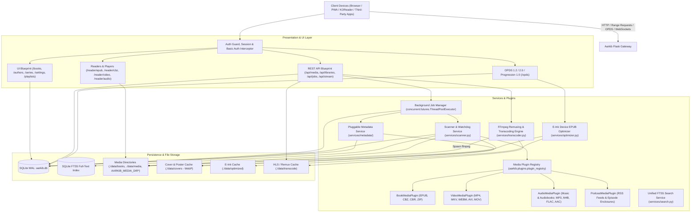
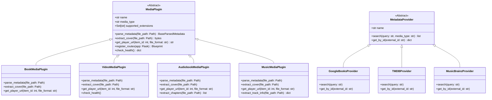
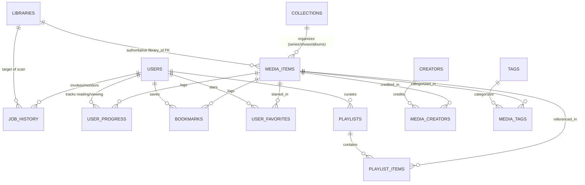
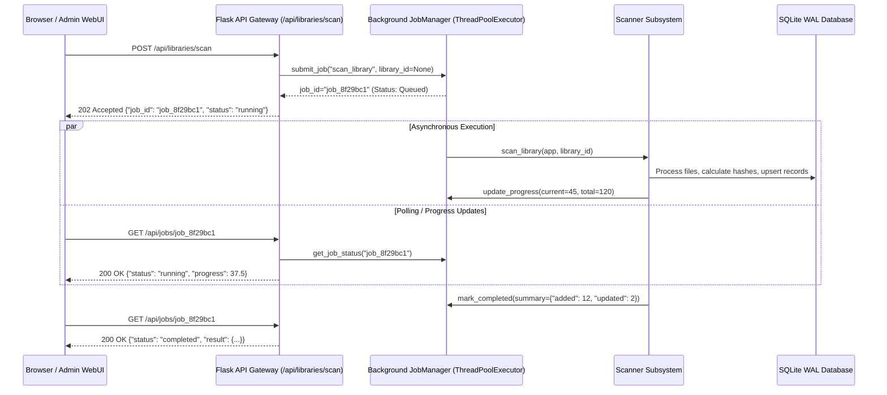
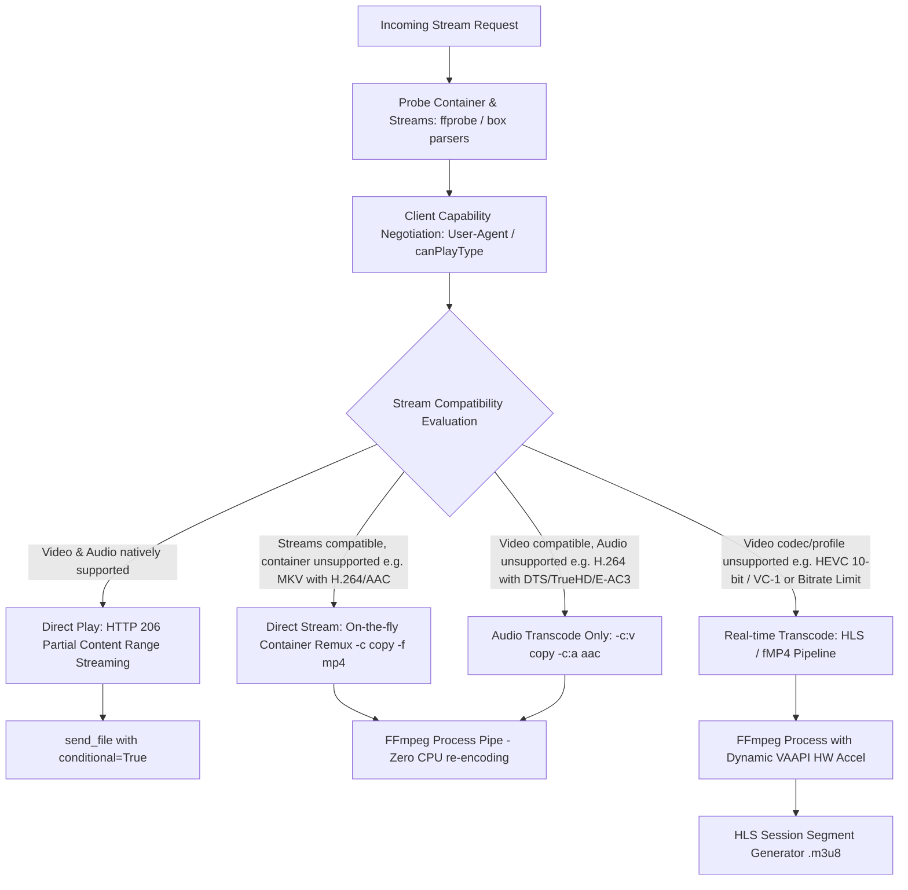
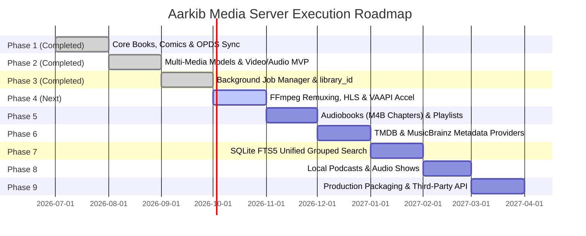

# 🏛️ Aarkib Media Server — Architectural Blueprint & Multi-Media Guideline

**Aarkib** is a lightweight, modern, self-hosted media server built with **Python 3.14+**, **Flask**, **SQLAlchemy**, and **SQLite (WAL mode)**. Originally designed as a high-performance book and comic server featuring OPDS feeds and e-ink optimization, Aarkib is expanding via its modular plugin architecture into a unified personal media hub supporting **Books**, **Comics**, **Video (Movies & TV Shows)**, **Audiobooks**, **Music**, and **Podcasts**.

---

## 1. System Architecture Overview



### Architectural Principles
1. **Lightweight & Self-Contained**: Operates effortlessly on low-powered hardware (Raspberry Pi, NAS appliances, mini PCs) without heavy external brokers (no Celery, Redis, or PostgreSQL required). SQLite in Write-Ahead Logging (WAL) mode enables concurrent reads alongside background writes. However, multiple worker threads require disciplined transaction and session handling: SQLAlchemy sessions must be worker-local rather than shared across threads, write transactions must be kept brief and tightly scoped, and busy timeouts (`PRAGMA busy_timeout = 5000`) prevent locking errors.
2. **Non-Destructive Storage**: Original media files (`.epub`, `.cbz`, `.mp4`, `.flac`, `.m4b`) are strictly read-only. Extracted covers, posters, thumbnails, e-ink variants, and HLS segments are stored in isolated cache directories.
3. **Non-Blocking Ingestion & Job Durability**: Heavy operations (library scanning, online metadata enrichment, thumbnail generation, video transcoding) execute asynchronously via an in-process `JobManager` (Phase 3), keeping HTTP responses instant and non-blocking (`202 Accepted`). While an in-memory thread pool orchestrates active tasks, production durability distinguishes ephemeral execution state (threads, futures) from persisted job history (durable database logs that survive restarts).
4. **Standards-First Interoperability**: Implements established open protocols:
   * **OPDS 1.2** (Atom XML) & **OPDS 2.0** (JSON-LD) for universal e-reader integration (KOReader, Moon+ Reader, Thorium).
   * **OPDS Progression 1.0** for reading progress synchronization with strict conflict resolution.
   * **HTTP 206 Partial Content** for native video/audio range streaming and seeking.
5. **Universal Consumption Model**: A single unified progress schema tracks reading, watching, and listening states with resume positions, percentage completion, and timestamps across all media formats.
6. **Plugin-Driven Multi-Media & Taxonomy**: Decoupled metadata extraction, cover parsing, and player routing via an extensible [`MediaPlugin`](file:///home/syafiq/code/aarkib/src/aarkib/plugins/base.py#L15) interface and swappable [`MetadataProvider`](file:///home/syafiq/code/aarkib/src/aarkib/services/enricher.py) backends. Domain taxonomy is carefully modeled so that distinct domains (such as audiobooks vs. music) are not forced into the same semantics, and `library_id` serves as the authoritative source of truth for library membership.
7. **Local-Only Media Storage & Playback**: Aarkib is strictly a self-hosted personal media server that **only plays media files stored locally on disk** (within configured library folders). External internet connections are restricted **exclusively to fetching metadata and artwork** (book summaries, movie overviews, episode titles, album/artist details, and cover art/posters from providers like Open Library, Google Books, TMDB, and MusicBrainz). The server never proxies remote third-party media streams or downloads external media files.

---

## 2. Multi-Media Domain Specifications

| Domain | Supported Formats | Metadata Parsers & Providers | Playback / Reader Strategy | Key Specialized Attributes | Status |
| :--- | :--- | :--- | :--- | :--- | :--- |
| **Books** | `epub` (v2 & v3), `pdf` | `zipfile` + `defusedxml` (OPF, Dublin Core, Calibre), Google Books, Open Library | In-browser ePub.js (in-memory ArrayBuffer), OPDS catalog download, on-demand e-ink optimization | ISBN, page count, publisher, publication date | **Implemented** |
| **Comics / Manga** | `cbz`, `cbr`, `zip` | `zipfile` / archive extractors, `ComicInfo.xml` | In-browser canvas continuous/single-page web reader with RTL support | Series, issue number, volume number, page count | **Implemented** (Issue/Vol fields planned) |
| **Video** (Movies & TV Shows) | `mp4`, `mkv`, `webm`, `avi`, `mov`, `m4v` | Pure-Python MP4 box parser (`mvhd`/`tkhd`), `ffprobe` fallback, smart TV (`S01E02`) & movie regex, TMDB provider | Direct HTTP 206 Range streaming, HTML5 video player with episode skip; on-the-fly FFmpeg remuxing & HLS transcoding fallback | Duration, resolution (width×height), video codec, season, episode | **MVP Implemented** (Remux & TMDB Next) |
| **Audiobooks** | `m4b`, `mp3`, `m4a`, `flac` | QuickTime atom chapter parser, ID3v2 `CHAP` frames, filename heuristics, Open Library / Google Books | Dedicated audio player, chapter selection dropdown, variable playback speed ($0.75\times$ to $2.0\times$), persistent resume | Narrator, author, chapters list, duration, bitrate, series | **Planned / Next** |
| **Music** | `mp3`, `flac`, `m4a`, `ogg`, `opus`, `wav`, `aac` | Pure-Python ID3v2, FLAC, WAV parsers, MusicBrainz & Cover Art Archive | In-browser audio player, persistent bottom player bar, custom user playlists, track queues | Artist, album artist, album, track number, disc number, duration, bitrate, genre | **Foundation Ready** (Playlists Next) |
| **Podcasts** | Local `mp3`, `m4a` files | Pure-Python ID3v2 / MP4 tags, OPML / folder heuristics, PodcastIndex metadata | Dedicated audio player, episode progression, persistent resume | Show/channel title, episode number, duration, release date | **Planned** |

### 2.1 Media Type Taxonomy: Audiobooks vs. Music Domain Separation

Audio, audiobook, and music require careful domain modeling so that an audiobook is not forced into the same semantics as a music track:

* **Audiobooks (`MediaType.AUDIOBOOK`)**:
  * **Core Domain Concept**: Long-form spoken narrative, either contained in a single monolithic container (`.m4b`) or structured across sequential chapter files in a book directory.
  * **Key Entities & Attributes**: `author`, `narrator` (distinct from author/performer), structured chapter markers (`chapters_json`) with microsecond/second start and end offsets and descriptive titles (parsed from QuickTime chapter atoms or ID3 `CHAP` frames), publication date, series, series index, abridged flag.
  * **Consumption Semantics**: Persistent resume position down to the exact second, book-wide progression percentage across multi-track volumes, variable playback speed ($0.75\times$ to $2.0\times$), sleep timers, and bookmarks.
  * **Catalog Behavior**: Displayed in library views as complete literary works, not as loose tracks or songs.
* **Music (`MediaType.MUSIC`)**:
  * **Core Domain Concept**: Musical compositions organized hierarchically into albums, disc sets, and artist discographies.
  * **Key Entities & Attributes**: `artist`, `album_artist`, `album`, `track_number`, `disc_number`, `release_year`, `genre`, `compilation` (flag), `duration`, `bitrate`.
  * **Consumption Semantics**: Dynamic playback queue, playlist curation, shuffle/repeat, gapless playback, and track scrobbling. Resume state is typically transient or session-scoped rather than a permanent chapter bookmark.
  * **Catalog Behavior**: Browsed by Album, Artist, Genre, or Playlist; never displayed as a single book.
* **Taxonomy Modeling Rule**: Aarkib cleanly bifurcates `MediaType.AUDIOBOOK` and `MediaType.MUSIC`. Audiobooks must never share music track semantics (e.g., treating an author as an artist or chapters as separate standalone songs).

---

## 3. Modular Media Plugin & Provider Framework

All media types in Aarkib adhere to the [`MediaPlugin`](file:///home/syafiq/code/aarkib/src/aarkib/plugins/base.py#L15) contract registered in the central [`PluginRegistry`](file:///home/syafiq/code/aarkib/src/aarkib/plugins/base.py#L55). Online metadata enrichment follows a decoupled `MetadataProvider` interface.



### 3.1 Extension Points & Responsibilities

1. **`parse_metadata(file_path: Path)`**:
   * Reads structural metadata (title, creators/artists/authors, series/album, season/episode, publication/release date, tags, duration, resolution).
   * Executed via `JobManager` in worker threads (`ThreadPoolExecutor`) during bulk scans to prevent blocking web requests.
2. **`extract_cover(file_path: Path)`**:
   * Extracts embedded cover art (EPUB cover image, MP4/MKV cover attachment, ID3 APIC frame, FLAC METADATA_BLOCK_PICTURE) or extracts snapshot frames via FFmpeg (`extract_video_cover`).
   * Images are normalized and saved as optimized `.webp` files in `./data/covers/`.
3. **`get_player_url(item_id: int, file_format: str)`**:
   * Directs the Web UI to the appropriate reader or player view (e.g. `/reader/epub/{id}`, `/reader/cbz/{id}`, `/reader/video/{id}`, or `/reader/audio/{id}`).
4. **`register_routes(app: Flask)`**:
   * Allows plugins to mount specialized Flask blueprints (e.g., custom transcoder endpoints, WebVTT subtitle delivery, podcast feed management).

---

## 4. Data Architecture & Database Models

Aarkib uses **SQLAlchemy** over **SQLite** with Write-Ahead Logging (WAL) enabled at database connection time.

### 4.1 SQLite Connection Pragmas (`src/aarkib/__init__.py`)
```python
@event.listens_for(Engine, "connect")
def set_sqlite_pragma(dbapi_connection, connection_record):
    cursor = dbapi_connection.cursor()
    cursor.execute("PRAGMA journal_mode = WAL")
    cursor.execute("PRAGMA synchronous = NORMAL")
    cursor.execute("PRAGMA foreign_keys = ON")
    cursor.execute("PRAGMA busy_timeout = 5000")
    cursor.close()
```

#### 4.1.1 SQLite Concurrency & Worker Session Discipline
SQLite WAL mode significantly enhances read/write concurrency by allowing concurrent readers to access the database without blocking or being blocked by a write operation. However, SQLite remains fundamentally a **single-writer database engine**. Multiple background worker threads attempting concurrent writes will queue and contend for the database write lock:
* **Worker-Local SQLAlchemy Sessions**: SQLAlchemy sessions must **never** be shared across thread boundaries or leaked from Flask HTTP request contexts into asynchronous background workers. Every worker thread must maintain its own worker-local session (e.g. using `sessionmaker(bind=engine)` within an explicit context manager: `with SessionLocal() as session:`).
* **Disciplined Transaction Scoping**: Keep write transactions brief and tightly scoped. Expensive tasks (file system crawling, hashing, cover image resizing, FFmpeg probing, external API network calls) must run *outside* database transactions. Open the session and transaction only when ready to commit prepared entity batches, commit immediately, and close the session.
* **Busy Timeout & Contention Handling**: The `PRAGMA busy_timeout = 5000` pragma instructs SQLite's engine to wait up to 5,000 milliseconds for an active write lock to release before throwing an `OperationalError: database is locked`. Background jobs should supplement this with exponential backoff and retry handling for transient lock contention.

### 4.2 Relational Schema & Entity Relationships



### 4.3 Unified Media Model Strategy

Aarkib uses declarative mixins on [`MediaItem`](file:///home/syafiq/code/aarkib/src/aarkib/models/media_item.py) to represent all media types without schema bloat:

* **Authoritative `library_id` Relational Binding**:
  * In earlier iterations, library membership was inferred dynamically from filesystem prefixes (e.g., evaluating whether `original_file_path.startswith(library.path)`).
  * In the mature architecture, **`library_id` is strictly authoritative**. Path prefix matching is fragile when libraries share parent roots, use symbolic links, or are mounted across complex Docker volumes.
  * Every media item is explicitly stamped with its foreign key `MediaItem.library_id` upon ingestion. All downstream filtering, REST API queries, permissions, cascade deletes, and scanner reconciliations execute strictly via `WHERE library_id = :id`.
* [`MediaItemMixin`](file:///home/syafiq/code/aarkib/src/aarkib/models/media.py#L19): Base attributes shared across all formats:
  * `title`, `sort_title`, `media_type` (`book`, `comic`, `video`, `audiobook`, `music`, `podcast`)
  * `original_file_path` (Indexed, unique), `file_format`, `file_size`, `file_hash` (SHA-256)
  * `cover_image_path`, `description`, `publisher`, `language`, `publication_date`, `created_at`, `updated_at`
  * `library_id` (Indexed FK to `libraries.id`, authoritative)
* [`VideoItemMixin`](file:///home/syafiq/code/aarkib/src/aarkib/models/media.py#L123): Video-specific attributes:
  * `duration` (seconds), `resolution_width`, `resolution_height`, `codec`, `season`, `episode`
* **Distinct Audio Taxonomy Mixins**:
  * [`AudioTrackMixin`](file:///home/syafiq/code/aarkib/src/aarkib/models/media.py#L115) *(Music)*: `duration`, `bitrate`, `artist`, `album_artist`, `album`, `track_number`, `disc_number`, `release_year`, `genre`, `is_compilation`.
  * `AudiobookItemMixin` *(Audiobooks)*: `duration`, `bitrate`, `author`, `narrator`, `chapters_json` (structured list of chapter titles with start/end offsets), `abridged` (boolean), `series`, `series_index`.
* **Book & Comic Attributes**:
  * `series_index` (Float), `page_count` (Integer)
  * *(Planned Phase 5)*: `issue_number`, `volume_number`

### 4.4 User Favorites & Custom Playlists `[PLANNED PHASE 5]`
* **`UserFavorite`**: Composite table `(user_id, media_item_id, created_at)` allowing users to star/favorite items.
* **`Playlist`**: `(id, user_id, title, description, media_type, is_public, created_at, updated_at)`
* **`PlaylistItem`**: `(id, playlist_id, media_item_id, position, added_at)`

### 4.5 Indexing & SQLite FTS5 Synchronization Strategy `[INDEXES LIVE, FTS5 PLANNED PHASE 7]`

All heavy query dimensions are explicitly indexed in B-trees:
* `original_file_path`, `file_hash`, `file_format`, `media_type`
* Foreign keys: `collection_id`, `library_id` (authoritative)
* Progress lookup: Unique composite index on `(user_id, media_item_id)` in [`UserProgress`](file:///home/syafiq/code/aarkib/src/aarkib/models/progress.py).

#### SQLite FTS5 Synchronization Strategy
For full-text search across titles, creators, series, and descriptions, Aarkib deploys an external-content SQLite FTS5 virtual table:
```sql
CREATE VIRTUAL TABLE media_items_fts USING fts5(
    title,
    creators,
    collection,
    description,
    tags,
    content='media_items',
    content_rowid='id',
    tokenize='porter unicode61'
);
```
Using an external content table (`content='media_items'`) ensures text data is referenced directly from `media_items` without duplicate on-disk storage.

**Mitigating the Bulk Mutation Trigger Pitfall**:
* **The Problem**: Firing standard SQLite `AFTER INSERT / UPDATE / DELETE` triggers on `media_items` for every individual row during bulk library scans causes massive write amplification. Each row mutation triggers multiple synchronous writes into FTS internal shadow b-trees (`_content`, `_idx`, `_docsize`, `_config`), acquiring long-lived locks, fragmenting WAL journal checkpoints, and causing severe ingestion bottlenecks.
* **Disciplined Synchronization Architecture**:
  1. **Bulk Ingestion / Mass Scans**: Triggers are bypassed or temporarily disabled during bulk scans. Mutated `media_item.id` values are collected in memory by the worker thread. Synchronization is executed at explicit transaction boundaries in bounded batches (e.g. 500 items per chunk) or via an explicit post-scan FTS rebuild:
     ```sql
     INSERT INTO media_items_fts(media_items_fts) VALUES('rebuild');
     ```
  2. **Single-Item / Reactive Mutations**: Interactive updates from the WebUI (editing metadata, retagging, manual overrides) are synchronized within the application service layer at the single-item transaction boundary, keeping the index immediately consistent without incurring bulk scan overhead.

---

## 5. Media Ingestion & Asynchronous Job Manager

### 5.1 Scanner Reliability Safeguards
The scanner subsystem (`services/scanner.py`) discovers, indexes, and monitors media folders:
1. **Settling Time & Lock Checks**: Inotify triggers events immediately when a file begins copying or downloading. The scanner applies a settling window (verifying file size is stable and file handle can be opened for reading) before probing.
2. **Fast Incremental Scans**: Checks filesystem `mtime` and file size against stored DB records before computing SHA-256 hashes, avoiding redundant disk I/O on large libraries.
3. **Authoritative `library_id` Ingestion**: The scanner indexes media rooted at configured library directories and stamps each item directly with its foreign key `library_id`. Path-prefix inference is deprecated; missing-file pruning, item updates, and library queries operate strictly by `WHERE library_id = :id`.
4. **Worker-Local Transaction Boundaries**: File metadata parsing and hashing are performed outside database transactions. Items are persisted in chunked batches (e.g. 50-100 items per commit) using worker-local SQLAlchemy sessions, ensuring SQLite write locks are released promptly and avoiding unbounded WAL journal accumulation.

### 5.2 Non-Blocking Background Job Architecture

Long-running tasks (library scans, batch metadata enrichments, thumbnail generation) must never execute synchronously inside HTTP request threads:



#### 5.2.1 Ephemeral Execution State vs. Persisted Job History
Aarkib's JobManager uses `concurrent.futures.ThreadPoolExecutor` to execute tasks asynchronously. However, production deployments must decouple ephemeral worker state from durable history:
* **The Ephemeral In-Memory Layer**: An in-memory dictionary (`_jobs: dict[str, Job]`) tracks runtime primitives: active thread handles, running `Future` references, cancellation flags, and real-time progress callbacks. This in-memory state is transient by nature and disappears when the server restarts.
* **The Durable History Layer (`job_history` Table)**: For production auditability and UI durability, completed, running, and failed jobs are persisted in SQLite:
  ```sql
  CREATE TABLE job_history (
      id VARCHAR(64) PRIMARY KEY,
      job_type VARCHAR(50) NOT NULL,
      library_id INTEGER REFERENCES libraries(id),
      status VARCHAR(20) NOT NULL,
      progress FLOAT DEFAULT 0.0,
      progress_message VARCHAR(255),
      created_at TIMESTAMP NOT NULL,
      started_at TIMESTAMP,
      finished_at TIMESTAMP,
      result_payload TEXT,
      error_message TEXT
  );
  ```
* **Worker-Local Session Discipline**: Background worker threads instantiate their own thread-local `SessionLocal()` instances to update job status checkpoints, leaving HTTP request contexts unaffected.
* **Server Reboot Reconciliation**: On application boot, the JobManager scans `job_history`. Any tasks left in `queued` or `running` state are reconciled to `interrupted` (e.g., "Job aborted due to server restart"), preventing orphaned or indefinitely spinning status indicators.

### 5.3 Job Manager API Endpoints
* `POST /api/libraries/scan` / `POST /api/libraries/<id>/scan`: Spawns async scan task, returns `202 Accepted` with `job_id`.
* `POST /api/libraries/enrich`: Spawns async batch metadata enrichment, returns `202 Accepted`.
* `GET /api/jobs/<job_id>`: Returns job state (`queued`, `running`, `completed`, `failed`), progress percentage, elapsed time, and result payload.

---

## 6. Streaming, Remuxing & Transcoding Architecture

### 6.1 Playback Strategy Matrix

Playback strategy must be determined dynamically by evaluating the **actual media streams** (codecs, profiles, levels, bit depths, and audio channels) against **negotiated client playback capabilities**, rather than relying blindly on container file extensions:



#### 6.1.1 Stream-Level Capability Detection vs. Container Extensions
Container extensions (`.mp4`, `.mkv`, `.webm`, `.mov`) are merely file wrappers and do not guarantee browser compatibility:
* **The Container Extension Fallacy**:
  * An `.mp4` file may wrap high-efficiency HEVC (H.265), AV1, or 10-bit HDR video, or multi-channel DTS / E-AC3 audio. If dispatched to native `<video>` playback via container-only heuristics, playback fails silently or yields audio without video.
  * An `.mkv` file frequently packages standard H.264 video and stereo AAC audio. Assuming MKV always requires heavy transcoding is wasteful; on-the-fly container remuxing (`-c copy`) streams the file instantly with virtually zero CPU overhead.
  * A file may contain a browser-compatible video stream paired with an unsupported audio codec (e.g. 5.1 DTS-HD MA). The engine dispatches an **Audio-Only Transcode** (`-c:v copy -c:a aac`), eliminating video re-encoding overhead while ensuring seamless playback.
* **Capability Detection Pipeline**:
  1. Inspect stream tracks using pure-Python MP4/MKV parsers or `ffprobe` (video codec, profile, level, bit depth; audio codec, channel layout, sample rate).
  2. Inspect client capabilities via HTTP client profiles, query parameters, User-Agent heuristics, or HTML5 `HTMLMediaElement.canPlayType()` probing.
  3. Dispatch the optimal stream path (Direct Play $\to$ Direct Remux $\to$ Audio Transcode $\to$ Full Transcode).

### 6.2 Direct Play (HTTP 206 Partial Content)
For compatible media, Aarkib leverages Flask's native conditional file streaming:
```python
@api_bp.route("/media/<int:item_id>/file", methods=["GET"])
def get_media_file(item_id: int):
    # send_file(..., conditional=True) parses HTTP Range headers
    # returning 206 Partial Content for instant seeking
    return send_file(file_path, mimetype=mimetype, conditional=True)
```

### 6.3 On-The-Fly Container Remuxing (MKV $\to$ MP4)
For MKV files whose video stream (H.264) and audio stream (AAC) are already browser-compatible, avoid re-encoding:
```bash
ffmpeg -i "{input_path}" -c copy -movflags frag_keyframe+empty_moov+default_base_moof -f mp4 pipe:1
```
Streams directly from FFmpeg stdout to the HTTP client with near-zero CPU consumption.

### 6.4 FFmpeg Real-Time HLS Transcoding Pipeline (Specification)
When transcoding is required (e.g. legacy AVI, MPEG-2, incompatible MKV audio streams, or bandwidth constraints):

#### Pipeline Command Specification
```bash
ffmpeg \
  -ss {seek_offset_seconds} \
  -hwaccel vaapi -hwaccel_device {detected_vaapi_device} -hwaccel_output_format vaapi \
  -i "{input_media_path}" \
  -map 0:v:0 -map 0:a:{audio_track_index} \
  -c:v h264_vaapi -b:v {target_bitrate} -maxrate {max_bitrate} -bufsize {buffer_size} \
  -c:a aac -b:a 192k -ac 2 \
  -f hls \
  -hls_time 6 \
  -hls_list_size 0 \
  -hls_segment_type fmp4 \
  -hls_flags independent_segments \
  -hls_segment_filename "{cache_dir}/segment_%05d.m4s" \
  "{cache_dir}/playlist.m3u8"
```

#### HLS Segment Retention vs. Cleanup Conflict: `delete_segments` vs `hls_list_size 0`
* **The Conflict**: In VOD (Video-On-Demand) streaming, clients require unrestricted bidirectional seeking across the entire timeline. This requires `-hls_list_size 0` so that FFmpeg writes an Event/VOD playlist that preserves every segment from timeline start.
* Conversely, `-hls_flags delete_segments` is designed strictly for live sliding-window playlists (e.g. live TV where only the last $N$ segments are kept). When paired with `-hls_list_size 0`, `delete_segments` either behaves as a no-op or causes unpredictable segment deletion that corrupts backwards seeking.
* **Session Pipeline Resolution**:
  * Omit `delete_segments` from the FFmpeg command line.
  * Delegate segment lifecycle and disk cleanup entirely to the **Transcode Session Supervisor**: segments are written to an isolated per-session folder (`./data/transcode/{session_id}/`), and deleted automatically when the session terminates or reaches its idle timeout.

#### Hardware Acceleration: Dynamic VAAPI Device Auto-Detection
* **Avoiding Hardcoded Assumptions**: Hardcoding `/dev/dri/renderD128` causes failures across diverse Linux, NAS, and container deployments:
  * Multi-GPU systems (e.g., integrated Intel iGPU alongside discrete AMD/Nvidia GPU) expose multiple render nodes (`renderD128`, `renderD129`).
  * NAS operating systems (Synology DSM, QNAP, TrueNAS SCALE, Unraid) and custom Docker runtimes frequently map DRI devices under differing group IDs or custom mount paths.
* **Transcoder Detection Algorithm**:
  1. Scan `/dev/dri/by-path/` and `/dev/dri/renderD*` devices.
  2. Verify read/write permissions for the server process / container user.
  3. Execute a lightweight probe (`ffmpeg -hwaccel vaapi -hwaccel_device {node} -f lavfi -i nullsrc -c:v h264_vaapi -f null -` or inspect `vainfo`).
  4. Allow explicit override via `AARKIB_VAAPI_DEVICE` environment variable.
  5. Fall back cleanly to CPU software transcoding (`-c:v libx264 -preset veryfast -crf 23 -threads auto`) if no viable VAAPI node is available.

#### Subtitle Extraction & Conversion to WebVTT
Subtitle formats are heterogeneous; extraction to WebVTT requires format-aware conversion rather than simple stream copying:
* **Plain Text (SRT / SubRip)**: Directly convert to WebVTT (`-c:s webvtt`) for native browser `<track>` elements.
* **Advanced SubStation Alpha (ASS / SSA)**: Frequently used in stylized anime and MKVs. ASS subtitles include embedded styling, font overrides, animations, and coordinate placement (`{\pos(x,y)}`). Simple stream extraction or naive WebVTT conversion drops formatting or produces malformed text. Aarkib provides two approaches:
  1. *WebVTT Sanitization*: Strip styling and position tags during server-side conversion for native `<track>` rendering.
  2. *Client-Side Canvas Rendering*: Deliver the raw ASS track to the browser for pixel-perfect rendering using WebAssembly (`libass` / `subtitles-octopus`), preserving all stylized styling and karaoke effects.
* **Bitmap / Graphic Subtitles (PGS / HDMV PGS from Blu-rays, VobSub `.sub`/`.idx` from DVDs)**: Cannot be extracted as text WebVTT. They must either be burned directly into the video stream during transcoding (`-vf subtitles=...`) or rendered as graphical overlays.

#### Transcode Session Supervisor (`services/transcoder.py`)
1. **Session Registry**: Tracks active client sessions by `session_id`, holding process handle `subprocess.Popen`, timestamp of last segment request, and temporary segment directory (`./data/transcode/{session_id}/`).
2. **Heartbeat & Idle Timeout**: A background reaper thread terminates FFmpeg processes whose clients have stopped requesting segments for $>60$ seconds.
3. **Session-Scoped Disk Pruning**: The entire session folder (`data/transcode/{session_id}/`) is automatically pruned when the session is closed, reaped by timeout, or on server restart.

---

## 7. Pluggable Metadata Enrichment Subsystem

To enrich media beyond books without hardcoding provider logic:

### 7.1 Provider Interface (`services/metadata/base.py`)
```python
class MetadataProvider(ABC):
    name: str

    @abstractmethod
    def search(self, query: str, media_type: str) -> list[MetadataSearchResult]:
        """Search online database for candidate matches."""
        pass

    @abstractmethod
    def fetch_details(self, external_id: str) -> MediaMetadataDetails:
        """Fetch full metadata, description, genres, and high-res artwork URLs."""
        pass
```

### 7.2 Provider Implementations
1. **Books & E-Books**: Google Books API & Open Library API (already implemented).
2. **Movies & TV Shows**: **TMDB (The Movie Database)** API.
   * Auto-match movies by title and year.
   * Auto-match TV episodes by show title, season, and episode number.
   * Downloads official high-res poster (`.webp`), backdrop, synopsis, director, cast, release year.
3. **Music & Audiobooks**: **MusicBrainz API** & Cover Art Archive.
   * Matches artist and album tags to canonical releases.
   * Fetches high-resolution album artwork and genre classifications.

### 7.3 Production Metadata Architecture: Rate Limits, Caching, Retries & Overrides

Integrating third-party APIs (TMDB, MusicBrainz, Google Books, Open Library) introduces critical operational constraints that the enrichment engine must handle defensively:

1. **External API Rate Limiting**:
   * **MusicBrainz**: Strictly mandates a maximum rate of **1 request per second** and requires a unique, identifying User-Agent string. Violating this triggers immediate HTTP 503 errors and IP rate blocks.
   * **TMDB**: Enforces burst rate limits and rolling window quotas.
   * **Architecture**: A token-bucket or queue-throttled dispatcher in `services/metadata/` serializes and spaces outbound HTTP requests per provider, preventing bulk library scanning threads from exhausting provider quotas.
2. **Persistent Response Caching**:
   * API responses, external entity IDs (e.g. TMDB Movie ID, MusicBrainz Release Group MBID), and matched artwork URLs are cached locally in SQLite or on disk with configurable TTL (e.g., 30 days).
   * Cached results prevent redundant network calls when re-scanning existing libraries or querying identical titles.
3. **Resilient Retries with Exponential Backoff**:
   * Outbound provider clients use exponential backoff with randomized jitter to handle transient network blips, socket timeouts, and HTTP 429 (Too Many Requests) or HTTP 503 (Service Unavailable) status responses.
4. **Configurable Provider Priority & Waterfall Fallback**:
   * Different media types chain multiple providers with configurable precedence:
     * **Books & Audiobooks**: Local embedded tags (QuickTime/ID3) $\to$ Open Library API $\to$ Google Books API.
     * **Movies & TV Shows**: Local `.nfo` files $\to$ TMDB API.
     * **Music**: Local ID3/FLAC metadata tags $\to$ MusicBrainz API $\to$ Cover Art Archive.
5. **Manual-Match Overrides & Field Locking**:
   * Automated title and heuristic matching can occasionally produce false positives (e.g. movie remakes, eponymous music albums, multi-edition audiobooks).
   * **UI "Fix Match" Modal**: Enables users to search providers manually, inspect candidates alongside confidence scores, and preview incoming metadata before applying.
   * **Field-Level Locking**: Users can manually edit and lock specific fields (e.g., title, poster, narrator, genre). The ingestion scanner respects a `locked_fields` column on `MediaItem`, guaranteeing that background bulk re-scans will never overwrite user-curated corrections.

---

## 8. Web Frontend & Unified Consumption UX

Aarkib employs lightweight, server-rendered Jinja2 templates combined with dedicated modern browser readers and players:

1. **Unified "Continue" Shelf**:
   * Displays all in-progress media across formats in a single row:
     * 🎬 **Video**: "42m left • S01E02"
     * 🎧 **Audiobook**: "Ch. 5 • 1h 14m left (1.25×)"
     * 📚 **Book / EPUB**: "Page 142 of 380 (37%)"
     * 🎨 **Comic / CBZ**: "Page 24 of 68"
2. **EPUB Web Reader (`/reader/epub/<id>`)**:
   * Uses **ePub.js** powered by in-memory `ArrayBuffer` fetching.
   * Tracks reading progress percentage and synchronized CFIs.
3. **CBZ / Comic Canvas Reader (`/reader/cbz/<id>`)**:
   * Continuous vertical scroll and single-page display modes with RTL navigation.
4. **HTML5 Video Player (`/reader/video/<id>`)**:
   * Native HTML5 `<video>` player with custom controls, playback resume, and episode navigation.
5. **Dedicated Audiobook Player (`/reader/audiobook/<id>`) & Music Player (`/reader/music/<id>`)**:
   * **Audiobook Player**: Chapter selection dropdown with timestamp jumps, persistent resume to the exact second, variable playback speed ($0.75\times, 1.0\times, 1.25\times, 1.5\times, 2.0\times$), sleep timer, and narrator credit display.
   * **Music Player**: Persistent bottom audio player bar, track queues, playlist management, album art modal, and shuffle/repeat controls.

---

## 9. Realistic Step-by-Step Execution Roadmap



### Phase 1: Core Foundation & Book/Comic Engine `[COMPLETED]`
- [x] Flask 3.1 application factory with SQLite WAL mode and auto-migrating column inspection.
- [x] OPDS 1.2 (Atom XML) & OPDS 2.0 (JSON-LD) catalog feeds with OPDS Progression 1.0 sync.
- [x] In-browser web readers for EPUB (ePub.js via ArrayBuffer) and CBZ (canvas reader).
- [x] Hardware-tailored e-ink EPUB optimization pipeline (`services/optimizer.py`).
- [x] Multi-directory crawler and Watchdog background file watcher.

### Phase 2: Multi-Media Models & Video/Audio MVP `[COMPLETED]`
- [x] Implement [`MediaItemMixin`](file:///home/syafiq/code/aarkib/src/aarkib/models/media.py#L19), [`VideoItemMixin`](file:///home/syafiq/code/aarkib/src/aarkib/models/media.py#L108), and [`AudioTrackMixin`](file:///home/syafiq/code/aarkib/src/aarkib/models/media.py#L98).
- [x] Implement [`VideoMediaPlugin`](file:///home/syafiq/code/aarkib/src/aarkib/plugins/video.py) handling `.mp4`, `.mkv`, `.webm`, `.avi`, `.mov`, `.m4v`.
- [x] Pure-Python MP4 box parser (`read_mp4_metadata`) and ID3/FLAC audio parsers.
- [x] Smart TV show episode title / season regex parser (`parse_video_filename`).
- [x] HTTP 206 Partial Content byte-range video streaming endpoint.
- [x] In-browser HTML5 video player with episode navigation and progress resume (`/reader/video/<id>`).
- [x] Dedicated HTML5 audio player interface with album art and scrubber (`/reader/audio/<id>`).

### Phase 3: Background Job Manager & Relational Refinements `[COMPLETED / REFINING]`
- [x] Build `services/job_manager.py`: In-process background job supervisor using `concurrent.futures.ThreadPoolExecutor`.
- [x] Convert `POST /api/libraries/scan` and `POST /api/libraries/<id>/scan` to return `202 Accepted` with `job_id`.
- [x] Create `GET /api/jobs/<job_id>` status and progress endpoint.
- [x] Add non-blocking progress spinner / toast notifications in `library.html` and `settings.html`.
- [x] Establish indexed `library_id` FK on `MediaItem` as authoritative library identity, deprecating filesystem path-prefix heuristics.
- [x] Enforce worker-local SQLAlchemy sessions (`SessionLocal`) across background jobs to prevent concurrency locks in SQLite WAL mode.
- [ ] Implement `job_history` database table to decouple ephemeral execution state from durable job logs surviving server restarts.

### Phase 4: FFmpeg Direct Remuxing, HLS & Hardware Acceleration `[PLANNED]`
- [ ] Build `services/transcoder.py`: Transcode session supervisor tracking active FFmpeg processes, client heartbeats, and session segment directories.
- [ ] Implement stream-level capability detection (probing video codec, profile, bit depth, and audio layout rather than container extension) to choose Direct Play, Direct Remux (`-c copy`), Audio-Only Transcode, or Full Transcode.
- [ ] Dynamically detect Linux VAAPI render nodes (`/dev/dri/renderD*` permissions and capability probe) rather than assuming `/dev/dri/renderD128`, with graceful fallback to CPU software encoding (`libx264`).
- [ ] Implement HLS packaging endpoint (`/api/stream/<id>/master.m3u8` and `/api/stream/<id>/segment_<n>.m4s`) using `-hls_list_size 0` for bidirectional seeking, resolving the `delete_segments` conflict by delegating segment pruning to session directory teardown.
- [ ] Implement format-aware subtitle conversion: sanitize and convert stylized ASS/SSA subtitles to WebVTT, deliver raw ASS for client WebAssembly rendering (`libass`), and support server-side burning for PGS/VobSub bitmap subtitles.
- [ ] Integrate HLS.js fallback into `reader_video.html` for incompatible video/audio streams.

### Phase 5: Dedicated Audiobooks (M4B Chapters) & User Playlists `[PLANNED]`
- [ ] Formalize media taxonomy by splitting `audio` into distinct `audiobook` and `music` types in `MediaType` enum to prevent audiobooks from inheriting song/album semantics.
- [ ] Model `AudiobookItemMixin` with `author`, `narrator`, `chapters_json`, `abridged` flag, series indexing, and microsecond resume position.
- [ ] Model `AudioTrackMixin` for music with `artist`, `album_artist`, `album`, track/disc numbers, compilation flags, and queueing semantics.
- [ ] Parse `.m4b` QuickTime chapter markers and ID3 `CHAP` frames into structured chapter lists.
- [ ] Build dedicated audiobook web player with chapter selection dropdown, variable speed selector ($0.75\times$ to $2.0\times$), sleep timer, and persistent resume.
- [ ] Implement `UserFavorite` table and `Playlist` / `PlaylistItem` models with UI playlist manager and bottom music bar.

### Phase 6: External Metadata Providers (TMDB & MusicBrainz) `[PLANNED]`
- [ ] Create pluggable `MetadataProvider` abstract base class and provider registry in `services/metadata/`.
- [ ] Implement provider rate limiting (strict 1 req/sec for MusicBrainz, burst limits for TMDB) via token-bucket dispatchers.
- [ ] Implement persistent local HTTP response caching (SQLite/disk with TTL) to prevent duplicate lookups on re-scans.
- [ ] Implement resilient retries with exponential backoff and jitter for transient errors and HTTP 429/503 responses.
- [ ] Establish configurable provider priority waterfalls per media type (e.g. Local NFO $\to$ TMDB; Local ID3 $\to$ MusicBrainz $\to$ Cover Art Archive).
- [ ] Implement `TMDBProvider` for Movies & TV Shows and `MusicBrainzProvider` for music albums and tracks.
- [ ] Build UI "Fix Match / Enrich" modal supporting candidate search, match confidence scoring, and field-level locking (`locked_fields`) to prevent automated overwrites.

### Phase 7: SQLite FTS5 Unified Grouped Search `[PLANNED]`
- [ ] Implement SQLite FTS5 external-content virtual table `media_items_fts` (`content='media_items'`).
- [ ] Implement bulk vs. reactive synchronization strategy: defer/bypass per-row triggers during bulk scans in favor of batch/chunked index updates or post-scan rebuilds at transaction boundaries.
- [ ] Update `/api/media?q=` to query FTS5 index with sub-millisecond latency.
- [ ] Categorize search results in WebUI by media type (Movies, TV, Books, Audiobooks, Music, Comics).

### Phase 8: Local Podcasts & Audio Shows `[PLANNED]`
- [ ] Create `PodcastMediaPlugin` to index locally stored podcast audio files (`.mp3`, `.m4a`).
- [ ] Support OPML file import for organizing locally archived shows, seasons, and channels.
- [ ] Parse embedded episode metadata and fetch show metadata/cover art from PodcastIndex.
- [ ] Dedicated audio show player with episode ordering and progress tracking.

### Phase 9: Multi-Arch Production Packaging & Third-Party APIs `[PLANNED]`
- [ ] Update `Dockerfile` to include `ffmpeg`, `libva-drm2`, and VAAPI drivers for `linux/amd64` and `linux/arm64`.
- [ ] Configure `docker-compose.yml` with `/dev/dri` hardware acceleration passthrough.
- [ ] Evaluate lightweight Subsonic / Audiobookshelf API shim for mobile app interoperability (Symfonium, Plappa).

---

## 10. Deployment Configurations

### A. Bare-Metal via `uv` (Linux x86_64 / arm64)
```bash
# 1. Install multimedia tools and VAAPI hardware drivers
sudo apt install ffmpeg vainfo libva2 libva-drm2

# 2. Sync project dependencies
uv sync

# 3. Run test suite to verify installation
uv run pytest

# 4. Start Aarkib production server
uv run aarkib
```

### B. Docker Compose (`docker-compose.yml`)
```yaml
services:
  aarkib:
    build:
      context: .
      dockerfile: Dockerfile
    container_name: aarkib
    restart: unless-stopped
    ports:
      - "5000:5000"
    environment:
      - AARKIB_DATA_DIR=/app/data
      - AARKIB_AUTH_REQUIRED=true
      - AARKIB_ALLOW_REGISTRATION=true
      - AARKIB_AUTO_SCAN=true
      - AARKIB_WATCH_LIBRARY=true
      - SECRET_KEY=generate_a_secure_secret_key_here
    volumes:
      - ./data:/app/data
      - /path/to/media/books:/app/data/books:ro
      - /path/to/media/comics:/app/data/comics:ro
      - /path/to/media/videos:/app/data/videos:ro
      - /path/to/media/audiobooks:/app/data/audiobooks:ro
      - /path/to/media/music:/app/data/music:ro
    devices:
      - /dev/dri:/dev/dri # Hardware acceleration passthrough for Intel & AMD VAAPI
```

> [!NOTE]
> **VAAPI Device Resolution in Containers**: The transcoder dynamically discovers render nodes (e.g. `/dev/dri/renderD128` or `/dev/dri/renderD129`) and verifies UID/GID access permissions. If running on custom NAS kernels (Synology, QNAP, TrueNAS) or systems with multi-GPU configurations, configure `AARKIB_VAAPI_DEVICE=/dev/dri/renderD128` (or the specific node) and ensure the container user has read/write access to the host render group.


