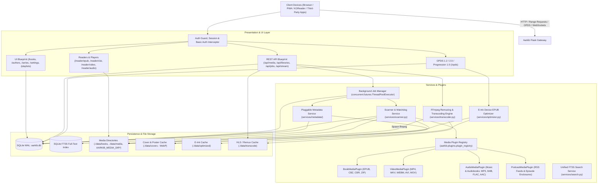
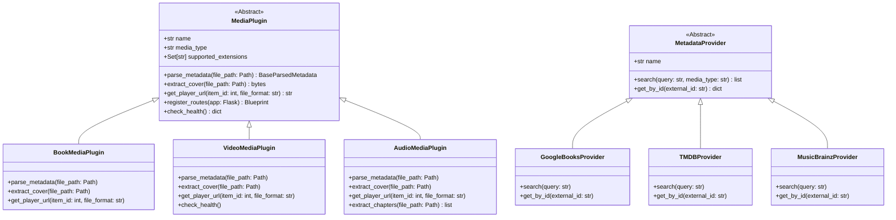
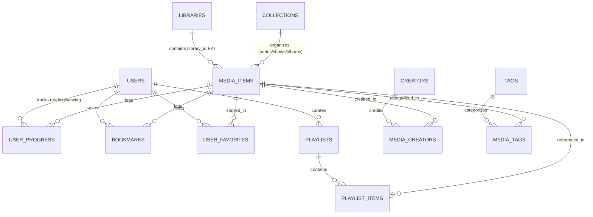
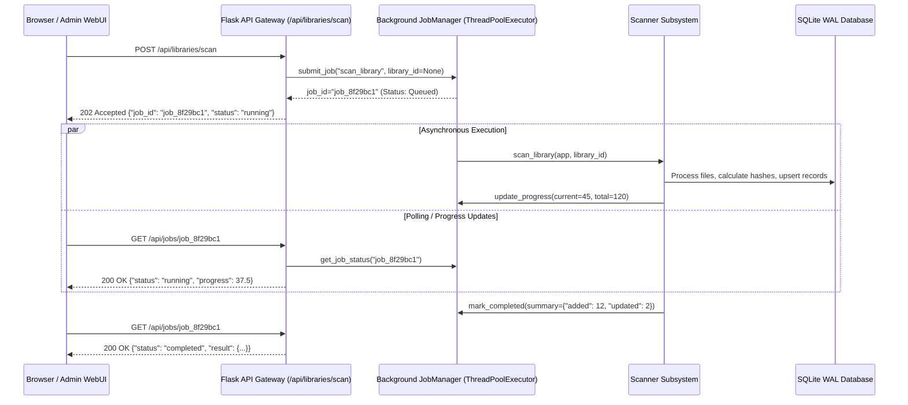
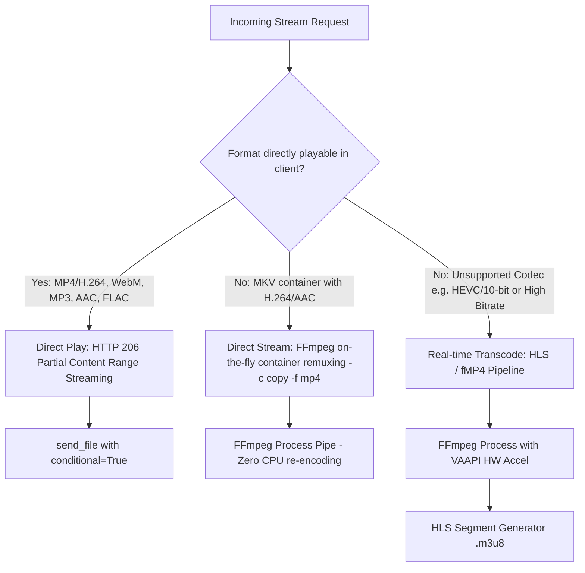
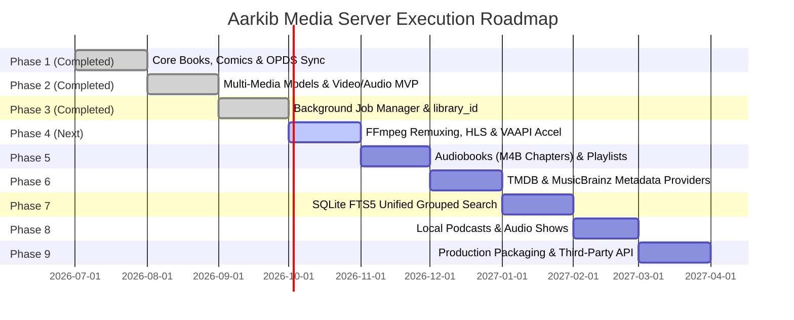

# 🏛️ Aarkib Media Server — Architectural Blueprint & Multi-Media Guideline

**Aarkib** is a lightweight, modern, self-hosted media server built with **Python 3.14+**, **Flask**, **SQLAlchemy**, and **SQLite (WAL mode)**. Originally designed as a high-performance book and comic server featuring OPDS feeds and e-ink optimization, Aarkib is expanding via its modular plugin architecture into a unified personal media hub supporting **Books**, **Comics**, **Video (Movies & TV Shows)**, **Audiobooks**, **Music**, and **Podcasts**.

---

## 1. System Architecture Overview



### Architectural Principles
1. **Lightweight & Self-Contained**: Operates effortlessly on low-powered hardware (Raspberry Pi, NAS appliances, mini PCs) without heavy external brokers (no Celery, Redis, or PostgreSQL required). SQLite in Write-Ahead Logging (WAL) mode handles concurrent reads and background worker writes.
2. **Non-Destructive Storage**: Original media files (`.epub`, `.cbz`, `.mp4`, `.flac`, `.m4b`) are strictly read-only. Extracted covers, posters, thumbnails, e-ink variants, and HLS segments are stored in isolated cache directories.
3. **Non-Blocking Ingestion (Target Architecture)**: Heavy operations (library scanning, online metadata enrichment, thumbnail generation, video transcoding) are designed to execute asynchronously via an in-process `JobManager` (Phase 3), keeping HTTP responses instant and non-blocking (`202 Accepted`).
4. **Standards-First Interoperability**: Implements established open protocols:
   * **OPDS 1.2** (Atom XML) & **OPDS 2.0** (JSON-LD) for universal e-reader integration (KOReader, Moon+ Reader, Thorium).
   * **OPDS Progression 1.0** for reading progress synchronization with strict conflict resolution.
   * **HTTP 206 Partial Content** for native video/audio range streaming and seeking.
5. **Universal Consumption Model**: A single unified progress schema tracks reading, watching, and listening states with resume positions, percentage completion, and timestamps across all media formats.
6. **Plugin-Driven Multi-Media**: Decoupled metadata extraction, cover parsing, and player routing via an extensible [`MediaPlugin`](file:///home/syafiq/code/aarkib/src/aarkib/plugins/base.py#L15) interface and swappable [`MetadataProvider`](file:///home/syafiq/code/aarkib/src/aarkib/services/enricher.py) backends.
7. **Local-Only Media Storage & Playback**: Aarkib is strictly a self-hosted personal media server that **only plays media files stored locally on disk** (within configured library folders). External internet connections are restricted **exclusively to fetching metadata and artwork** (book summaries, movie overviews, episode titles, album/artist details, and cover art/posters from providers like Open Library, Google Books, TMDB, and MusicBrainz). The server never proxies remote third-party media streams or downloads external media files.

---

## 2. Multi-Media Domain Specifications

| Domain | Supported Formats | Metadata Parsers & Providers | Playback / Reader Strategy | Key Specialized Attributes | Status |
| :--- | :--- | :--- | :--- | :--- | :--- |
| **Books** | `epub` (v2 & v3), `pdf` | `zipfile` + `defusedxml` (OPF, Dublin Core, Calibre), Google Books, Open Library | In-browser ePub.js (in-memory ArrayBuffer), OPDS catalog download, on-demand e-ink optimization | ISBN, page count, publisher, publication date | **Implemented** |
| **Comics / Manga** | `cbz`, `cbr`, `zip` | `zipfile` / archive extractors, `ComicInfo.xml` | In-browser canvas continuous/single-page web reader with RTL support | Series, issue number, volume number, page count | **Implemented** (Issue/Vol fields planned) |
| **Video** (Movies & TV Shows) | `mp4`, `mkv`, `webm`, `avi`, `mov`, `m4v` | Pure-Python MP4 box parser (`mvhd`/`tkhd`), `ffprobe` fallback, smart TV (`S01E02`) & movie regex, TMDB provider | Direct HTTP 206 Range streaming, HTML5 video player with episode skip; on-the-fly FFmpeg remuxing & HLS transcoding fallback | Duration, resolution (width×height), video codec, season, episode | **MVP Implemented** (Remux & TMDB Next) |
| **Audiobooks** | `m4b`, `mp3`, `m4a`, `flac` | QuickTime atom chapter parser, ID3v2 `CHAP` frames, filename heuristics, Open Library / Google Books | Dedicated audio player, chapter selection dropdown, variable playback speed ($0.75\times$ to $2.0\times$), persistent resume | Narrator, author, chapters list, duration, bitrate | **Planned / Next** |
| **Music** | `mp3`, `flac`, `m4a`, `ogg`, `opus`, `wav`, `aac` | Pure-Python ID3v2, FLAC, WAV parsers, MusicBrainz & Cover Art Archive | In-browser audio player, persistent bottom player bar, custom user playlists, track queues | Artist, album, track number, disc number, duration, bitrate | **Foundation Ready** (Playlists Next) |
| **Podcasts** | Local `mp3`, `m4a` files | Pure-Python ID3v2 / MP4 tags, OPML / folder heuristics, PodcastIndex metadata | Dedicated audio player, episode progression, persistent resume | Show/channel title, episode number, duration, release date | **Planned** |

---

## 3. Modular Media Plugin & Provider Framework

All media types in Aarkib adhere to the [`MediaPlugin`](file:///home/syafiq/code/aarkib/src/aarkib/plugins/base.py#L15) contract registered in the central [`PluginRegistry`](file:///home/syafiq/code/aarkib/src/aarkib/plugins/base.py#L55). Online metadata enrichment follows a decoupled `MetadataProvider` interface.



### 3.1 Extension Points & Responsibilities

1. **`parse_metadata(file_path: Path)`**:
   * Reads structural metadata (title, creators/artists/authors, series/album, season/episode, publication/release date, tags, duration, resolution).
   * Executed via `JobManager` in worker threads (`ThreadPoolExecutor`) during bulk scans to prevent blocking web requests.
2. **`extract_cover(file_path: Path)`**:
   * Extracts embedded cover art (EPUB cover image, MP4/MKV cover attachment, ID3 APIC frame, FLAC METADATA_BLOCK_PICTURE) or extracts snapshot frames via FFmpeg (`extract_video_cover`).
   * Images are normalized and saved as optimized `.webp` files in `./data/covers/`.
3. **`get_player_url(item_id: int, file_format: str)`**:
   * Directs the Web UI to the appropriate reader or player view (e.g. `/reader/epub/{id}`, `/reader/cbz/{id}`, `/reader/video/{id}`, or `/reader/audio/{id}`).
4. **`register_routes(app: Flask)`**:
   * Allows plugins to mount specialized Flask blueprints (e.g., custom transcoder endpoints, WebVTT subtitle delivery, podcast feed management).

---

## 4. Data Architecture & Database Models

Aarkib uses **SQLAlchemy** over **SQLite** with Write-Ahead Logging (WAL) enabled at database connection time.

### 4.1 SQLite Connection Pragmas (`src/aarkib/__init__.py`)
```python
@event.listens_for(Engine, "connect")
def set_sqlite_pragma(dbapi_connection, connection_record):
    cursor = dbapi_connection.cursor()
    cursor.execute("PRAGMA journal_mode = WAL")
    cursor.execute("PRAGMA synchronous = NORMAL")
    cursor.execute("PRAGMA foreign_keys = ON")
    cursor.execute("PRAGMA busy_timeout = 5000")
    cursor.close()
```

### 4.2 Relational Schema & Entity Relationships



### 4.3 Unified Media Model Strategy

Aarkib uses declarative mixins on [`MediaItem`](file:///home/syafiq/code/aarkib/src/aarkib/models/media_item.py) to represent all media types without schema bloat:

* [`MediaItemMixin`](file:///home/syafiq/code/aarkib/src/aarkib/models/media.py#L19): Base attributes shared across all formats:
  * `title`, `sort_title`, `media_type` (`book`, `comic`, `video`, `audio`)
  * `original_file_path` (Indexed, unique), `file_format`, `file_size`, `file_hash` (SHA-256)
  * `cover_image_path`, `description`, `publisher`, `language`, `publication_date`, `created_at`, `updated_at`
  * `library_id` (Indexed FK to `libraries.id`, with bidirectional relationships)
* [`VideoItemMixin`](file:///home/syafiq/code/aarkib/src/aarkib/models/media.py#L123): Video-specific attributes:
  * `duration` (seconds), `resolution_width`, `resolution_height`, `codec`, `season`, `episode`
* [`AudioTrackMixin`](file:///home/syafiq/code/aarkib/src/aarkib/models/media.py#L115): Audio & Audiobook attributes:
  * `duration`, `bitrate`, `album`, `track_number`, `disc_number`
  * *(Planned Phase 5)*: `narrator`, `chapters_json`
* **Book & Comic Attributes**:
  * `series_index` (Float), `page_count` (Integer)
  * *(Planned Phase 5)*: `issue_number`, `volume_number`

### 4.4 User Favorites & Custom Playlists `[PLANNED PHASE 5]`
* **`UserFavorite`**: Composite table `(user_id, media_item_id, created_at)` allowing users to star/favorite items.
* **`Playlist`**: `(id, user_id, title, description, media_type, is_public, created_at, updated_at)`
* **`PlaylistItem`**: `(id, playlist_id, media_item_id, position, added_at)`

### 4.5 Indexing & SQLite FTS5 Full-Text Search `[INDEXES LIVE, FTS5 PLANNED PHASE 7]`
All heavy query dimensions are explicitly indexed:
* `original_file_path`, `file_hash`, `file_format`, `media_type`
* Foreign keys: `collection_id` (and planned `library_id`)
* Progress lookup: Unique index on `(user_id, media_item_id)` in [`UserProgress`](file:///home/syafiq/code/aarkib/src/aarkib/models/progress.py).
* *(Planned Phase 7)* **SQLite FTS5**: Virtual table `media_items_fts(title, creators, collection, description, tags)` maintained via SQLite triggers for sub-millisecond search across all media libraries.

---

## 5. Media Ingestion & Asynchronous Job Manager

### 5.1 Scanner Reliability Safeguards
The scanner subsystem (`services/scanner.py`) discovers, indexes, and monitors media folders:
1. **Settling Time & Lock Checks**: Inotify triggers events immediately when a file begins copying or downloading. The scanner applies a settling window (verifying file size is stable and file handle can be opened for reading) before probing.
2. **Fast Incremental Scans**: Checks filesystem `mtime` and file size against stored DB records before computing SHA-256 hashes, avoiding redundant disk I/O on large libraries.
3. **Multi-Folder Discovery**: Supports dynamic library directories via database [`Library`](file:///home/syafiq/code/aarkib/src/aarkib/models/library.py) records and environment variables (`AARKIB_MEDIA_DIR`, `AARKIB_MEDIA_DIR_MOVIES`, `AARKIB_MEDIA_DIR_BOOKS`).

### 5.2 Non-Blocking Background Job Architecture

Long-running tasks (library scans, batch metadata enrichments, thumbnail generation) must never execute synchronously inside HTTP request threads:



### 5.3 Job Manager API Endpoints
* `POST /api/libraries/scan` / `POST /api/libraries/<id>/scan`: Spawns async scan task, returns `202 Accepted` with `job_id`.
* `POST /api/libraries/enrich`: Spawns async batch metadata enrichment, returns `202 Accepted`.
* `GET /api/jobs/<job_id>`: Returns job state (`queued`, `running`, `completed`, `failed`), progress percentage, elapsed time, and result payload.

---

## 6. Streaming, Remuxing & Transcoding Architecture

### 6.1 Playback Strategy Matrix



### 6.2 Direct Play (HTTP 206 Partial Content)
For compatible media, Aarkib leverages Flask's native conditional file streaming:
```python
@api_bp.route("/media/<int:item_id>/file", methods=["GET"])
def get_media_file(item_id: int):
    # send_file(..., conditional=True) parses HTTP Range headers
    # returning 206 Partial Content for instant seeking
    return send_file(file_path, mimetype=mimetype, conditional=True)
```

### 6.3 On-The-Fly Container Remuxing (MKV $\to$ MP4)
For MKV files whose video stream (H.264) and audio stream (AAC) are already browser-compatible, avoid re-encoding:
```bash
ffmpeg -i "{input_path}" -c copy -movflags frag_keyframe+empty_moov+default_base_moof -f mp4 pipe:1
```
Streams directly from FFmpeg stdout to the HTTP client with near-zero CPU consumption.

### 6.4 FFmpeg Real-Time HLS Transcoding Pipeline (Specification)
When transcoding is required (e.g. legacy AVI, MPEG-2, incompatible MKV audio streams, or bandwidth constraints):

#### Pipeline Command Specification
```bash
ffmpeg \
  -ss {seek_offset_seconds} \
  -hwaccel vaapi -hwaccel_device /dev/dri/renderD128 -hwaccel_output_format vaapi \
  -i "{input_media_path}" \
  -map 0:v:0 -map 0:a:{audio_track_index} \
  -c:v h264_vaapi -b:v {target_bitrate} -maxrate {max_bitrate} -bufsize {buffer_size} \
  -c:a aac -b:a 192k -ac 2 \
  -f hls \
  -hls_time 6 \
  -hls_list_size 0 \
  -hls_segment_type fmp4 \
  -hls_flags independent_segments+delete_segments \
  -hls_segment_filename "{cache_dir}/segment_%05d.m4s" \
  "{cache_dir}/playlist.m3u8"
```

#### Hardware Acceleration Targeting (Linux Intel & AMD Only)
* Uses Linux standard Direct Rendering Infrastructure (`/dev/dri/renderD128`).
* Encoder: `h264_vaapi` or `hevc_vaapi`.
* CPU Software Fallback: `-c:v libx264 -preset veryfast -crf 23 -threads auto`.

#### Subtitle Extraction to WebVTT
Extract embedded SRT/ASS subtitles to WebVTT (`/api/stream/<id>/subtitles.vtt`) for native browser `<track>` rendering.

#### Transcode Session Supervisor (`services/transcoder.py`)
1. **Session Registry**: Tracks active client sessions by `session_id`, holding process handle `subprocess.Popen`, timestamp of last segment request, and temporary segment directory.
2. **Heartbeat & Idle Timeout**: A background reaper thread terminates FFmpeg processes whose clients have stopped requesting segments for $>60$ seconds.
3. **Disk Pruning**: Segment cache folders under `data/transcode/` are deleted upon session termination or server restart.

---

## 7. Pluggable Metadata Enrichment Subsystem

To enrich media beyond books without hardcoding provider logic:

### 7.1 Provider Interface (`services/metadata/base.py`)
```python
class MetadataProvider(ABC):
    name: str

    @abstractmethod
    def search(self, query: str, media_type: str) -> list[MetadataSearchResult]:
        """Search online database for candidate matches."""
        pass

    @abstractmethod
    def fetch_details(self, external_id: str) -> MediaMetadataDetails:
        """Fetch full metadata, description, genres, and high-res artwork URLs."""
        pass
```

### 7.2 Provider Implementations
1. **Books & E-Books**: Google Books API & Open Library API (already implemented).
2. **Movies & TV Shows**: **TMDB (The Movie Database)** API.
   * Auto-match movies by title and year.
   * Auto-match TV episodes by show title, season, and episode number.
   * Downloads official high-res poster (`.webp`), backdrop, synopsis, director, cast, release year.
3. **Music & Audiobooks**: **MusicBrainz API** & Cover Art Archive.
   * Matches artist and album tags to canonical releases.
   * Fetches high-resolution album artwork and genre classifications.

---

## 8. Web Frontend & Unified Consumption UX

Aarkib employs lightweight, server-rendered Jinja2 templates combined with dedicated modern browser readers and players:

1. **Unified "Continue" Shelf**:
   * Displays all in-progress media across formats in a single row:
     * 🎬 **Video**: "42m left • S01E02"
     * 🎧 **Audiobook**: "Ch. 5 • 1h 14m left (1.25×)"
     * 📚 **Book / EPUB**: "Page 142 of 380 (37%)"
     * 🎨 **Comic / CBZ**: "Page 24 of 68"
2. **EPUB Web Reader (`/reader/epub/<id>`)**:
   * Uses **ePub.js** powered by in-memory `ArrayBuffer` fetching.
   * Tracks reading progress percentage and synchronized CFIs.
3. **CBZ / Comic Canvas Reader (`/reader/cbz/<id>`)**:
   * Continuous vertical scroll and single-page display modes with RTL navigation.
4. **HTML5 Video Player (`/reader/video/<id>`)**:
   * Native HTML5 `<video>` player with custom controls, playback resume, and episode navigation.
5. **Dedicated Audiobook & Music Player (`/reader/audio/<id>`)**:
   * Chapter selection dropdown for `.m4b` and multi-track audiobooks.
   * Playback speed multiplier ($0.75\times, 1.0\times, 1.25\times, 1.5\times, 2.0\times$).
   * User playlist management and track queueing.

---

## 9. Realistic Step-by-Step Execution Roadmap



### Phase 1: Core Foundation & Book/Comic Engine `[COMPLETED]`
- [x] Flask 3.1 application factory with SQLite WAL mode and auto-migrating column inspection.
- [x] OPDS 1.2 (Atom XML) & OPDS 2.0 (JSON-LD) catalog feeds with OPDS Progression 1.0 sync.
- [x] In-browser web readers for EPUB (ePub.js via ArrayBuffer) and CBZ (canvas reader).
- [x] Hardware-tailored e-ink EPUB optimization pipeline (`services/optimizer.py`).
- [x] Multi-directory crawler and Watchdog background file watcher.

### Phase 2: Multi-Media Models & Video/Audio MVP `[COMPLETED]`
- [x] Implement [`MediaItemMixin`](file:///home/syafiq/code/aarkib/src/aarkib/models/media.py#L19), [`VideoItemMixin`](file:///home/syafiq/code/aarkib/src/aarkib/models/media.py#L108), and [`AudioTrackMixin`](file:///home/syafiq/code/aarkib/src/aarkib/models/media.py#L98).
- [x] Implement [`VideoMediaPlugin`](file:///home/syafiq/code/aarkib/src/aarkib/plugins/video.py) handling `.mp4`, `.mkv`, `.webm`, `.avi`, `.mov`, `.m4v`.
- [x] Pure-Python MP4 box parser (`read_mp4_metadata`) and ID3/FLAC audio parsers.
- [x] Smart TV show episode title / season regex parser (`parse_video_filename`).
- [x] HTTP 206 Partial Content byte-range video streaming endpoint.
- [x] In-browser HTML5 video player with episode navigation and progress resume (`/reader/video/<id>`).
- [x] Dedicated HTML5 audio player interface with album art and scrubber (`/reader/audio/<id>`).

### Phase 3: Background Job Manager & Relational Refinements `[COMPLETED]`
- [x] Build `services/job_manager.py`: In-process background job supervisor using `concurrent.futures.ThreadPoolExecutor`.
- [x] Convert `POST /api/libraries/scan` and `POST /api/libraries/<id>/scan` to return `202 Accepted` with `job_id`.
- [x] Create `GET /api/jobs/<job_id>` status and progress endpoint.
- [x] Add non-blocking progress spinner / toast notifications in `library.html` and `settings.html`.
- [x] Add indexed `library_id` FK on `MediaItem` to replace string path-prefix matching.

### Phase 4: FFmpeg Direct Remuxing, HLS & Hardware Acceleration `[PLANNED]`
- [ ] Build `services/transcoder.py`: Transcode session supervisor tracking active FFmpeg processes and client heartbeats.
- [ ] Implement on-the-fly MKV $\to$ MP4 container remuxing (`-c copy`) for zero-CPU video streaming.
- [ ] Implement HLS packaging endpoint (`/api/stream/<id>/master.m3u8` and `/api/stream/<id>/segment_<n>.m4s`).
- [ ] Auto-detect Linux VAAPI hardware acceleration (`/dev/dri/renderD128` for Intel QuickSync / AMD VAAPI).
- [ ] Extract embedded subtitle tracks to WebVTT (`/api/stream/<id>/subtitles.vtt`).
- [ ] Integrate HLS.js fallback into `reader_video.html` for incompatible video/audio streams.

### Phase 5: Dedicated Audiobooks (M4B Chapters) & User Playlists `[PLANNED]`
- [ ] Add `audiobook` and `music` distinct types to `MediaType` enum and library filters.
- [ ] Add `narrator` attribute to audio metadata mixin and detail views.
- [ ] Parse `.m4b` QuickTime chapter markers and ID3 `CHAP` frames into structured chapter lists.
- [ ] Build chapter selection dropdown and variable speed selector in `player_audio.html`.
- [ ] Implement `UserFavorite` table and `Playlist` / `PlaylistItem` models with UI playlist manager.

### Phase 6: External Metadata Providers (TMDB & MusicBrainz) `[PLANNED]`
- [ ] Create pluggable `MetadataProvider` abstract base class and provider registry in `services/metadata/`.
- [ ] Implement `TMDBProvider` for Movies & TV Shows (auto-fetch posters, backdrops, episode plot, cast).
- [ ] Implement `MusicBrainzProvider` for music albums and track metadata.
- [ ] Update UI detail view with interactive "Enrich Metadata" modal supporting TMDB and MusicBrainz.

### Phase 7: SQLite FTS5 Unified Grouped Search `[PLANNED]`
- [ ] Implement SQLite FTS5 virtual table `media_items_fts` with automatic sync triggers.
- [ ] Update `/api/media?q=` to query FTS5 index with sub-millisecond latency.
- [ ] Categorize search results in WebUI by media type (Movies, TV, Books, Audiobooks, Music, Comics).

### Phase 8: Local Podcasts & Audio Shows `[PLANNED]`
- [ ] Create `PodcastMediaPlugin` to index locally stored podcast audio files (`.mp3`, `.m4a`).
- [ ] Support OPML file import for organizing locally archived shows, seasons, and channels.
- [ ] Parse embedded episode metadata and fetch show metadata/cover art from PodcastIndex.
- [ ] Dedicated audio show player with episode ordering and progress tracking.

### Phase 9: Multi-Arch Production Packaging & Third-Party APIs `[PLANNED]`
- [ ] Update `Dockerfile` to include `ffmpeg`, `libva-drm2`, and VAAPI drivers for `linux/amd64` and `linux/arm64`.
- [ ] Configure `docker-compose.yml` with `/dev/dri` hardware acceleration passthrough.
- [ ] Evaluate lightweight Subsonic / Audiobookshelf API shim for mobile app interoperability (Symfonium, Plappa).

---

## 10. Deployment Configurations

### A. Bare-Metal via `uv` (Linux x86_64 / arm64)
```bash
# 1. Install multimedia tools and VAAPI hardware drivers
sudo apt install ffmpeg vainfo libva2 libva-drm2

# 2. Sync project dependencies
uv sync

# 3. Run test suite to verify installation
uv run pytest

# 4. Start Aarkib production server
uv run aarkib
```

### B. Docker Compose (`docker-compose.yml`)
```yaml
services:
  aarkib:
    build:
      context: .
      dockerfile: Dockerfile
    container_name: aarkib
    restart: unless-stopped
    ports:
      - "5000:5000"
    environment:
      - AARKIB_DATA_DIR=/app/data
      - AARKIB_AUTH_REQUIRED=true
      - AARKIB_ALLOW_REGISTRATION=true
      - AARKIB_AUTO_SCAN=true
      - AARKIB_WATCH_LIBRARY=true
      - SECRET_KEY=generate_a_secure_secret_key_here
    volumes:
      - ./data:/app/data
      - /path/to/media/books:/app/data/books:ro
      - /path/to/media/comics:/app/data/comics:ro
      - /path/to/media/videos:/app/data/videos:ro
      - /path/to/media/audiobooks:/app/data/audiobooks:ro
      - /path/to/media/music:/app/data/music:ro
    devices:
      - /dev/dri:/dev/dri # Hardware acceleration passthrough for Intel & AMD VAAPI
```

