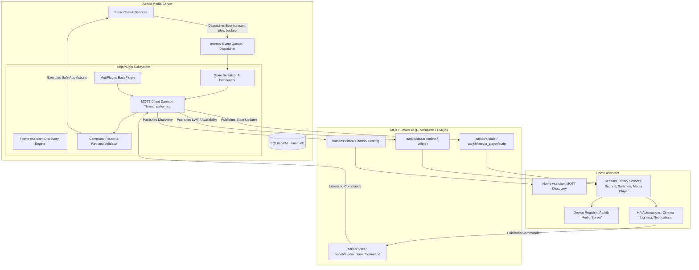
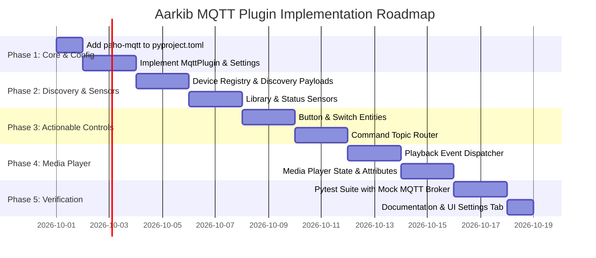

# 📡 MQTT & Home Assistant Integration Architectural Plan (`mqtt_plan.md`)

This specification outlines the architecture, data models, MQTT topic hierarchy, Home Assistant auto-discovery schema, exposed entities, and control surfaces for an **Aarkib MQTT Integration Plugin** (`MqttPlugin`).

---

## 🏛️ 1. Executive Summary & Design Principles

The **Aarkib MQTT Plugin** bridges Aarkib with **Home Assistant** (and external MQTT brokers) to enable seamless smart-home automations, real-time media status monitoring, and remote operational control.



### Core Invariants & Architectural Rules
1. **Zero-Configuration Auto-Discovery**: Adheres to the standard [Home Assistant MQTT Discovery](https://www.home-assistant.io/integrations/mqtt/#mqtt-discovery) protocol (`homeassistant/<component>/<node_id>/<object_id>/config`). Home Assistant automatically registers the server and entities upon startup without YAML configuration.
2. **Unified Device Registry**: All entities attach to a single canonical Home Assistant Device (`Aarkib Media Server`), complete with hardware identifiers, firmware version, and direct WebUI hyperlinks.
3. **Non-Blocking SQLite Concurrency**: The MQTT background client runs on a dedicated daemon thread. Publishing and command handling use an in-memory queue; **no database write locks are ever held during network I/O or MQTT socket communications**.
4. **Last Will and Testament (LWT)**: Publishes `aarkib/status` with payload `offline` upon unexpected network interruption or power loss, and `online` upon connection, ensuring Home Assistant entities reliably reflect availability.
5. **Read-Only Media Safety**: Remote commands triggered via MQTT (such as library rescans or cache cleaning) never delete, alter, or re-encode physical media files.

---

## 🔌 2. Plugin Architecture & Lifecycle

### 2.1 Plugin Class & Registration
- **Location**: `src/aarkib/plugins/mqtt.py`
- **Class**: `MqttPlugin(BasePlugin)`
- **Plugin Type**: `"integration"`
- **Config Keys**:
  - `MQTT_ENABLED`: (`bool`, default `False`) Master toggle.
  - `MQTT_BROKER_HOST`: (`str`, default `"localhost"`) Broker hostname or IP.
  - `MQTT_BROKER_PORT`: (`int`, default `1883`) Broker port (e.g. 1883 for TCP, 8883 for TLS).
  - `MQTT_USERNAME`: (`str`, default `""`) Optional authentication username.
  - `MQTT_PASSWORD`: (`str`, secret, default `""`) Optional authentication password.
  - `MQTT_TOPIC_PREFIX`: (`str`, default `"aarkib"`) Base topic namespace.
  - `MQTT_DISCOVERY_PREFIX`: (`str`, default `"homeassistant"`) Home Assistant discovery prefix.
  - `MQTT_CLIENT_ID`: (`str`, default `"aarkib_server"`) MQTT client identifier.
  - `MQTT_TLS_ENABLED`: (`bool`, default `False`) Enable TLS/SSL connection.
  - `MQTT_TLS_CA_CERTS`: (`str`, default `""`) Path to custom CA certificate if self-signed.
  - `MQTT_STATE_DEBOUNCE_MS`: (`int`, default `500`) Minimum interval between rapid progress state publishes.

### 2.2 Threading & Background Worker Model
- Employs `paho-mqtt` in a dedicated background worker loop (`client.loop_start()`).
- Communicates with Aarkib's core via an internal `EventDispatcher` (`src/aarkib/services/events.py` or within `mqtt.py`):
  - Service functions (e.g., `scanner.py`, `transcoder.py`, `progress_service.py`, `backup.py`) emit lightweight dataclass events:
    - `ScanStartedEvent`, `ScanProgressEvent`, `ScanFinishedEvent`
    - `PlaybackStartedEvent`, `PlaybackProgressEvent`, `PlaybackStoppedEvent`
    - `BackupStartedEvent`, `BackupFinishedEvent`
    - `MediaItemAddedEvent`
  - The MQTT worker consumes events from a thread-safe `queue.Queue` and formats them into JSON payloads without blocking HTTP request workers.

---

## 📊 3. Entities Exposed to Home Assistant

All entities are grouped under the device **`Aarkib Media Server`** via the Home Assistant Device Registry:
- **Identifiers**: `["aarkib_<server_uuid>"]`
- **Name**: `"Aarkib Media Server"`
- **Manufacturer**: `"Aarkib"`
- **Model**: `"Aarkib Self-Hosted Server"`
- **SW Version**: Current Aarkib version (e.g. `"1.0.0"`)
- **Configuration URL**: Server base WebUI URL (`http://<ip>:<port>`)

### 3.1 Binary Sensors (`binary_sensor`)

| Entity ID | Display Name | HA Device Class | State / Payload | Description |
| :--- | :--- | :--- | :--- | :--- |
| `binary_sensor.aarkib_status` | Server Status | `connectivity` | `ON` (online) / `OFF` (offline) | Connected status via LWT and birth message. |
| `binary_sensor.aarkib_scanner_active` | Library Scanner | `running` | `ON` (crawling) / `OFF` (idle) | Indicates whether a library crawl or file indexing is currently executing. |
| `binary_sensor.aarkib_backup_active` | Database Backup | `running` | `ON` (backing up) / `OFF` (idle) | Indicates hot SQLite snapshot packaging is active. |
| `binary_sensor.aarkib_transcoder_active` | Transcoder Running | `running` | `ON` (active sessions) / `OFF` (idle) | Active when FFmpeg video or audio remux/transcoding sessions are active. |
| `binary_sensor.aarkib_watcher_active` | Filesystem Watcher | `running` | `ON` (monitoring) / `OFF` (stopped) | Real-time directory inotify watcher status. |

### 3.2 Diagnostic & Library Sensors (`sensor`)

| Entity ID | Display Name | Unit / Device Class | State & Attributes | Description |
| :--- | :--- | :--- | :--- | :--- |
| `sensor.aarkib_total_media` | Total Media Items | `items` | Count of all catalog items | Aggregated collection size. |
| `sensor.aarkib_books_count` | Books | `books` | Count of EPUB, PDF, CBZ books | Total books in library. |
| `sensor.aarkib_comics_count` | Comics & Manga | `comics` | Count of CBZ, CBR, ZIP issues | Total comics cataloged. |
| `sensor.aarkib_audio_count` | Audio Tracks | `tracks` | Count of MP3, FLAC, M4B, AAC | Total music & audiobooks. |
| `sensor.aarkib_video_count` | Video Items | `videos` | Count of MP4, MKV, WEBM movies/episodes | Total video files. |
| `sensor.aarkib_podcasts_count` | Podcasts & Episodes | `episodes` | Count of podcast episodes | RSS audio podcast tracks. |
| `sensor.aarkib_creators_count` | Total Creators | `creators` | Count of distinct authors/artists | Total unique contributors. |
| `sensor.aarkib_collections_count` | Collections & Series | `collections` | Count of series, albums, and shows | Total collection groupings. |
| `sensor.aarkib_storage_size` | Media Storage Size | `GB` (`data_size`) | Total size of scanned media files | Physical footprint on disk. |
| `sensor.aarkib_scanner_progress` | Scanner Progress | `%` | `0` to `100`, attributes: `current_folder`, `current_file` | Real-time crawl progress. |
| `sensor.aarkib_active_sessions` | Active Playback Sessions | `sessions` | Count of active streams/readers | Total concurrent users streaming or reading. |
| `sensor.aarkib_latest_backup` | Latest Backup Timestamp | `timestamp` | ISO-8601 timestamp, attributes: `size_mb`, `filename` | Date and time of last successful backup. |
| `sensor.aarkib_last_added_item` | Last Added Media | N/A | Title of most recently indexed item | Detailed attributes: `item_id`, `media_type`, `creators`, `added_at`, `cover_url`. |

### 3.3 Media Player (`media_player`)

The integration exposes an aggregated **`media_player.aarkib_server`** entity (or dynamically discovers individual player entities per active Web Reader/Player session: `media_player.aarkib_<user>`):

- **Supported Features**:
  - `SUPPORT_PLAY`
  - `SUPPORT_PAUSE`
  - `SUPPORT_STOP`
  - `SUPPORT_SEEK`
  - `SUPPORT_BROWSE_MEDIA`
- **State Values**:
  - `idle`: No active streaming or reading.
  - `playing`: Active video/audio streaming or active page reading.
  - `paused`: Video/audio stream paused.
  - `off`: Server offline.
- **Attributes Published**:
  - `media_title`: Title of the active book, comic, audio track, or video.
  - `media_artist`: Creator, author, or podcast show name.
  - `media_series`: Collection, book series, or show name.
  - `media_content_type`: `book`, `comic`, `video`, `music`, `podcast`.
  - `media_duration`: Total duration in seconds (or total page count for books/comics).
  - `media_position`: Current playback position in seconds (or current page number / CFI).
  - `media_position_updated_at`: ISO timestamp for accurate client-side extrapolation.
  - `entity_picture`: Absolute cover artwork URL (`http://<server>/api/media/<id>/cover`).
  - `media_id`: Aarkib `MediaItem.id`.
  - `media_format`: File container format (`epub`, `mkv`, `mp4`, `flac`, `mp3`).

---

## 🎮 4. Control Capabilities (What Home Assistant Can Control)

Home Assistant can issue commands back to Aarkib via dedicated command topics. All commands are validated, sanitized, and dispatched asynchronously.

### 4.1 Buttons (`button`)

Home Assistant exposes instantaneous trigger buttons:

| Entity ID | Display Name | Command Topic | Payload | Action in Aarkib |
| :--- | :--- | :--- | :--- | :--- |
| `button.aarkib_scan_libraries` | Scan Libraries Now | `aarkib/command/scan` | `PRESS` or `{}` | Spawns a background library crawl job via `JobManager`. |
| `button.aarkib_create_backup` | Create Backup Now | `aarkib/command/backup` | `PRESS` or `{}` | Triggers `backup_service.create_backup()` hot SQLite snapshot. |
| `button.aarkib_clean_cache` | Clean Transcode Cache | `aarkib/command/clean_cache` | `PRESS` or `{}` | Sweeps expired HLS transcode sessions and orphan temp files. |

### 4.2 Configuration Switches (`switch`)

Switches allow Home Assistant automations or dashboards to toggle persistent dynamic settings:

| Entity ID | Display Name | State Topic | Command Topic | Action in Aarkib |
| :--- | :--- | :--- | :--- | :--- |
| `switch.aarkib_realtime_watcher` | Real-Time Folder Watcher | `aarkib/switch/watcher/state` | `aarkib/switch/watcher/set` | Enables or disables inotify filesystem watcher (`WATCH_LIBRARY`). |
| `switch.aarkib_auto_enrichment` | Auto Metadata Enrichment | `aarkib/switch/enrich/state` | `aarkib/switch/enrich/set` | Enables or disables automated online metadata lookups on scan (`AUTO_ENRICH`). |
| `switch.aarkib_eink_optimizer` | E-Ink Device Optimizer | `aarkib/switch/optimizer/state` | `aarkib/switch/optimizer/set` | Enables or disables hardware E-Ink EPUB transformations (`ENABLE_EINK_OPTIMIZER`). |

### 4.3 Media Player Controls (`media_player`)

Home Assistant can control active playback sessions through standard MQTT command topics:

| Command | Command Topic | Sample Payload | Execution in Aarkib |
| :--- | :--- | :--- | :--- |
| **Play / Resume** | `aarkib/media_player/command` | `{"command": "play"}` | Resumes playback on active web reader / streaming session via Server-Sent Events (SSE). |
| **Pause** | `aarkib/media_player/command` | `{"command": "pause"}` | Sends pause signal to active browser player. |
| **Stop** | `aarkib/media_player/command` | `{"command": "stop"}` | Terminates active HLS transcoding session and halts reader session. |
| **Seek** | `aarkib/media_player/command` | `{"command": "seek", "position": 124.5}` | Updates playback position in `UserProgress` and signals reader. |
| **Play Media by ID** | `aarkib/media_player/command` | `{"command": "play_media", "media_id": 42}` | Pre-generates stream/playback descriptor and broadcasts load command. |

---

## 🗂️ 5. Complete MQTT Topic Hierarchy

```text
aarkib/
├── status                                       # LWT: 'online' | 'offline'
├── state                                        # Server summary JSON (version, uptime, total_media)
├── scanner/
│   ├── state                                    # 'idle' | 'scanning'
│   └── progress                                 # JSON { "percentage": 45, "current_folder": "/books" }
├── backup/
│   ├── state                                    # 'idle' | 'backing_up'
│   └── latest                                   # JSON { "timestamp": "...", "size_mb": 14.2 }
├── transcoder/
│   ├── state                                    # 'idle' | 'active'
│   └── sessions                                 # JSON array of active transcoding sessions
├── metrics/
│   ├── counts                                   # JSON { "books": 120, "comics": 45, "audio": 350, "video": 80 }
│   └── storage                                  # JSON { "total_bytes": 1048576000, "total_gb": 0.98 }
├── media_player/
│   ├── state                                    # 'idle' | 'playing' | 'paused'
│   ├── attributes                               # Full JSON metadata payload for Home Assistant
│   └── command                                  # Inbound commands from Home Assistant (play, pause, stop, seek)
├── switch/
│   ├── watcher/
│   │   ├── state                                # 'ON' | 'OFF'
│   │   └── set                                  # Inbound command: 'ON' | 'OFF'
│   ├── enrich/
│   │   ├── state                                # 'ON' | 'OFF'
│   │   └── set                                  # Inbound command: 'ON' | 'OFF'
│   └── optimizer/
│       ├── state                                # 'ON' | 'OFF'
│       └── set                                  # Inbound command: 'ON' | 'OFF'
└── command/
    ├── scan                                     # Trigger library scan: 'PRESS'
    ├── backup                                   # Trigger backup: 'PRESS'
    └── clean_cache                              # Trigger cache wipe: 'PRESS'
```

---

## 🪄 6. Home Assistant Auto-Discovery Payloads

Upon connecting, `MqttPlugin` publishes retained configuration payloads to `homeassistant/<component>/aarkib/<object_id>/config`.

### 6.1 Sample Discovery: Total Media Items Sensor
- **Topic**: `homeassistant/sensor/aarkib/total_media/config`
- **Payload**:
```json
{
  "name": "Total Media Items",
  "unique_id": "aarkib_total_media",
  "state_topic": "aarkib/metrics/counts",
  "value_template": "{{ value_json.total }}",
  "unit_of_measurement": "items",
  "icon": "mdi:bookshelf",
  "availability_topic": "aarkib/status",
  "payload_available": "online",
  "payload_not_available": "offline",
  "device": {
    "identifiers": ["aarkib_server"],
    "name": "Aarkib Media Server",
    "manufacturer": "Aarkib",
    "model": "Media & Book Server",
    "sw_version": "1.0.0",
    "configuration_url": "http://192.168.1.50:8080"
  }
}
```

### 6.2 Sample Discovery: Scan Library Button
- **Topic**: `homeassistant/button/aarkib/scan_libraries/config`
- **Payload**:
```json
{
  "name": "Scan Media Libraries",
  "unique_id": "aarkib_button_scan",
  "command_topic": "aarkib/command/scan",
  "payload_press": "PRESS",
  "icon": "mdi:folder-sync",
  "availability_topic": "aarkib/status",
  "device": {
    "identifiers": ["aarkib_server"]
  }
}
```

### 6.3 Sample Discovery: Media Player Entity
- **Topic**: `homeassistant/media_player/aarkib/server/config`
- **Payload**:
```json
{
  "name": "Aarkib Media Player",
  "unique_id": "aarkib_media_player_server",
  "state_topic": "aarkib/media_player/state",
  "json_attributes_topic": "aarkib/media_player/attributes",
  "command_topic": "aarkib/media_player/command",
  "availability_topic": "aarkib/status",
  "device": {
    "identifiers": ["aarkib_server"]
  }
}
```

---

## 💡 7. Home Assistant Automation Scenarios

Integrating Aarkib with Home Assistant unlocks automations across the home:

1. **Cinema Mode Lighting**:
   - **Trigger**: `media_player.aarkib_server` changes state to `playing` with attribute `media_content_type: video`.
   - **Action**: Smoothly dim living room lights to 10%, close smart blinds.
   - **Recovery**: Brighten lights to 50% when paused, and 100% when stopped.

2. **Ambient E-Reader Lighting**:
   - **Trigger**: `media_player.aarkib_server` changes state to `playing` with attribute `media_content_type: book`.
   - **Action**: Set desk or bedside lamp color temperature to warm (2700K) at 60% brightness.

3. **Media Acquisition Sync (Sonarr / Radarr / Readarr)**:
   - **Trigger**: Download manager finishes downloading a new book or media file.
   - **Action**: Home Assistant presses `button.aarkib_scan_libraries` via MQTT to trigger immediate, seamless indexing in Aarkib.

4. **New Episode / Book Arrival Notifications**:
   - **Trigger**: `sensor.aarkib_last_added_item` state changes.
   - **Action**: Send a rich push notification to the Home Assistant mobile app with the book/podcast cover art and title:
     *"New book added to Aarkib: Dune by Frank Herbert"*.

---

## 🚀 8. Implementation Phases & Roadmap



### Phase 1: Dependency & Foundations
- Add `paho-mqtt` (`>=2.1.0`) to `pyproject.toml` via `uv add paho-mqtt` (pure-Python, pre-compiled wheels for all architectures).
- Add managed settings to [`settings_service.py`](file:///home/syafiq/code/aarkib/src/aarkib/services/settings_service.py).
- Implement [`MqttPlugin`](file:///home/syafiq/code/aarkib/src/aarkib/plugins/base.py) with connection state machine, automatic reconnection, and LWT.

### Phase 2: Discovery Engine & Passive Sensors
- Build discovery generator for all binary sensors and diagnostic sensors.
- Emit periodic statistics (every 30s or on-demand after scans/backups).

### Phase 3: Actionable Commands (Buttons & Switches)
- Subscribe to command topics (`aarkib/command/#`, `aarkib/switch/#`).
- Safely route button presses to `job_manager.submit_job(scan_library_task)` and `backup_service.create_backup()`.
- Synchronize switch toggles with `settings_service.set_setting()`.

### Phase 4: Playback Synchronization & Media Player
- Hook into [`update_progress`](file:///home/syafiq/code/aarkib/src/aarkib/services/progress_service.py) and [`transcoder.py`](file:///home/syafiq/code/aarkib/src/aarkib/services/transcoder.py) session life-cycles.
- Debounce and publish real-time playback metadata to `aarkib/media_player/attributes`.

### Phase 5: Testing & Verification
- Unit test discovery JSON structures against official Home Assistant MQTT specifications.
- Mock MQTT broker test cases verifying non-blocking database behavior during network timeouts.
- Update `ARCHITECTURE.md` and WebUI plugin settings tab.
