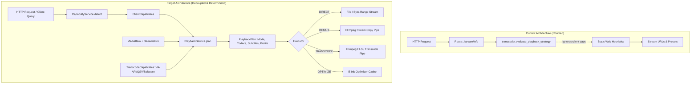

# 🏗️ Aarkib Architectural Evolution: Work Plan

> **Canonical Reference**: Derived from [`improvement-plan.md`](file:///home/syafiq/code/aarkib/improvement-plan.md), [`AGENTS.md`](file:///home/syafiq/code/aarkib/AGENTS.md), and [`ARCHITECTURE.md`](file:///home/syafiq/code/aarkib/ARCHITECTURE.md).  
> **Target Platform**: Linux x86_64 / Linux ARM64 (aarch64), Python >= 3.14, `uv`, SQLite WAL mode, Flask 3.1.

---

## 🧭 Executive Summary & Core Objectives

This work plan outlines the phased evolution of **Aarkib** from its current file-centric and heuristic-driven media pipeline into a robust, deterministic, capability-aware media platform. The improvements focus on four foundational capabilities:

1. **Client Capability Detection**: Dynamic detection and negotiation of client playback parameters without brittle, scattered User-Agent heuristics.
2. **Deterministic Playback Planning**: Clean architectural separation between playback decision-making (`PlaybackPlan`) and subprocess execution (`Transcoder`).
3. **Resilient Background Jobs & Library Reconciliation**: Explicit job lifecycles with cancellation/retry support, and a mount-safe reconciliation engine preventing data loss on unmounted storage.
4. **Profile-Based Access Control & ACLs**: Multi-profile support per account with library-level ACLs and unified authorization (`authorization.can(...)`).
5. **Metadata Matching & Provenance** *(Secondary Phase)*: Multi-candidate scoring with immutable user-edit locks and field-level provenance tracking.

---

## 🏛️ Architectural Guardrails & Invariants

To maintain stability and portability across Linux `x86_64` and `ARM64`:
- **Single-Node & Zero Heavy Dependencies**: Preserve SQLite in WAL mode (`PRAGMA journal_mode=WAL; PRAGMA synchronous=NORMAL`). Do **not** introduce PostgreSQL, Redis, Celery, RPC, or frontend SPA frameworks.
- **Read-Only Media Filesystem**: Original user media files are strictly read-only. Never mutate, rename, or re-encode media files in-place without explicit user action.
- **Path Containment**: Every file and stream access must pass `is_safe_media_path()` against configured library directories.
- **Subprocess Safety**: All FFmpeg/FFprobe invocations must use argument lists (`subprocess.run([...], shell=False)`). Never accept arbitrary FFmpeg parameters from HTTP requests.
- **Non-Destructive Database Migrations**: Schema additions must integrate seamlessly into `migrate_database()` via non-destructive `ALTER TABLE ADD COLUMN` operations and `db.create_all()`.
- **Strict Protocol Backward Compatibility**: Maintain full backward compatibility for REST `/api/media/*`, OPDS 1.2/2.0, Subsonic OpenSubsonic API, and Jellyfin endpoints.

---

## 🗺️ Current Baseline vs. Target Architecture



---

## 📋 Phased Execution Roadmap

```mermaid
gantt
    title Aarkib Evolution Execution Roadmap
    dateFormat  X
    axisFormat  Day %d
    section Core Infrastructure
    Phase 0: Baseline & Guardrails           :done, p0, 0, 1
    Phase 1: Client Capabilities            :done, p1, 1, 3
    Phase 2: Playback Planner Model & Service:done, p2, 3, 5
    Phase 3: Route & Streaming Refactor     :done, p3, 5, 7
    Phase 4: Hardware Acceleration          :done, p4, 7, 9
    section Reliability & Authorization
    Phase 5: Job Lifecycle Upgrade          :done, p5, 9, 11
    Phase 6: Mount-Safe Reconciliation      :done, p6, 11, 13
    Phase 7: Profiles & Unified ACLs        :done, p7, 13, 16
    section Enrichment & Presentation
    Phase 8: Metadata Matching & Provenance :active, p8, 16, 18
    Phase 9: Versioned Clean API (/api/v1)  :p9, 18, 20
    Phase 10: UI Diagnostics & Management   :p10, 20, 22
    Phase 11: Final Verification & DoD      :p11, 22, 23
```

---

### Phase 0 — Baseline Validation & Guardrails

#### 🎯 Objective
Establish verification baselines, ensure test environment stability, and confirm non-destructive migration harnesses before writing code.

#### 📁 Affected Files
- [`pyproject.toml`](file:///home/syafiq/code/aarkib/pyproject.toml)
- [`AGENTS.md`](file:///home/syafiq/code/aarkib/AGENTS.md)
- [`src/aarkib/__init__.py`](file:///home/syafiq/code/aarkib/src/aarkib/__init__.py)

#### 🔨 Tasks & Deliverables
1. Run test suite baseline: verify all 308 existing Pytest tests pass cleanly.
2. Confirm Ruff formatting and linting rules:
   ```bash
   uv run ruff check .
   uv run ruff format --check .
   ```
3. Verify SQLite migration helper [`migrate_database()`](file:///home/syafiq/code/aarkib/src/aarkib/__init__.py#L125) handles new tables and columns without SQLite locking or data loss.

---

### Phase 1 — Generic Client Capability Detection

#### 🎯 Objective
Create a unified `ClientCapabilities` domain model and detection service to replace scattered User-Agent inspections and hardcoded browser assumptions.

#### 📁 Affected Files
- New: `src/aarkib/models/capabilities.py`
- New: `src/aarkib/services/capability_service.py`
- Tests: `tests/test_capabilities.py`

#### 🔨 Implementation Specifications
1. **Model Definition (`src/aarkib/models/capabilities.py`)**:
   - `VideoCapabilities`: `codecs: set[str]`, `containers: set[str]`, `max_resolution: tuple[int, int]`, `supports_10bit: bool`, `supports_hdr: bool`, `max_bitrate: int | None`.
   - `AudioCapabilities`: `codecs: set[str]`, `containers: set[str]`, `max_channels: int`.
   - `SubtitleCapabilities`: `supported_formats: set[str]`, `supports_ass_wasm: bool`.
   - `StreamingCapabilities`: `supports_hls: bool`, `supports_byte_range: bool`.
   - `DeviceCapabilities`: `client_type: str` (e.g., `browser`, `jellyfin`, `koreader`, `subsonic`, `native`), `platform: str`, `is_eink: bool`, `is_mobile: bool`.
   - `ClientCapabilities`: Aggregator class with query helpers:
     ```python
     def supports_video(self, codec: str, container: str | None = None, is_10bit: bool = False) -> bool
     def supports_audio(self, codec: str, container: str | None = None) -> bool
     def supports_subtitles(self, format_name: str) -> bool
     ```
2. **Detection Engine (`src/aarkib/services/capability_service.py`)**:
   - Parse `User-Agent` and Client Hints (`Sec-CH-UA`).
   - Profile known browser engines:
     - **Chromium** (Chrome, Edge): VP9, AV1, H.264, Opus, AAC, FLAC, WebM/MP4, WebVTT, ASS via WASM.
     - **Firefox**: VP9, AV1, H.264, Opus, AAC, FLAC, WebM/MP4.
     - **Safari / WebKit**: H.264, HEVC (device-dependent), AAC, MP3, MP4/M4V, native HLS (`application/vnd.apple.mpegurl`).
   - Profile specialized clients:
     - **KOReader**: EPUB, CBZ, PDF, high-contrast e-ink rendering.
     - **Jellyfin Clients**: Direct stream/remux capabilities parsed from `PlaybackInfo` query or request body.
     - **OpenSubsonic Clients**: MP3, AAC, FLAC, Opus streaming.
   - Support explicit capability overrides via header `X-Aarkib-Capabilities` (JSON) or query parameters.
   - Resilient fallback for unknown clients: defaults to standard baseline (MP4, H.264 8-bit, AAC stereo).

#### 🧪 Verification & Tests
- `tests/test_capabilities.py`:
  - Chromium user-agent detection.
  - Safari WebKit user-agent detection with native HLS support.
  - Jellyfin and Subsonic client headers.
  - Malformed and missing User-Agent handling (safe baseline fallback).
  - Explicit JSON capability override testing.

---

### Phase 2 — Deterministic Playback Planner

#### 🎯 Objective
Introduce `PlaybackPlan` and `PlaybackService` to separate playback decision logic from delivery/FFmpeg execution.

#### 📁 Affected Files
- New: `src/aarkib/models/playback.py`
- New: `src/aarkib/services/playback_service.py`
- Refactor: [`src/aarkib/services/transcoder.py`](file:///home/syafiq/code/aarkib/src/aarkib/services/transcoder.py)
- Tests: `tests/test_playback_service.py`

#### 🔨 Implementation Specifications
1. **Domain Model (`src/aarkib/models/playback.py`)**:
   ```python
   class PlaybackMode(StrEnum):
       DIRECT = "direct"
       REMUX = "remux"
       TRANSCODE = "transcode"
       OPTIMIZE = "optimize"


   @dataclass(frozen=True)
   class PlaybackPlan:
       mode: PlaybackMode
       container: str
       video_codec: str | None
       audio_codec: str | None
       resolution: str | None
       target_bitrate: int | None
       reasons: tuple[str, ...]
       stream_url: str
       direct_url: str | None
       subtitles: tuple[dict[str, Any], ...]
       diagnostics: dict[str, Any]

       def to_dict(self) -> dict[str, Any]: ...
   ```
2. **Planner Logic (`src/aarkib/services/playback_service.py`)**:
   - `PlaybackService.plan(item: MediaItem, capabilities: ClientCapabilities, requested_resolution: str | None = None, hwaccel: str = "auto") -> PlaybackPlan`:
     - **Deterministic Invariant**: Given identical `MediaItem` streams and `ClientCapabilities`, the generated `PlaybackPlan` is always identical.
     - **Books/Comics**:
       - E-Ink client + EPUB -> Mode `OPTIMIZE` (points to `/api/media/<id>/optimized`).
       - Other readers -> Mode `DIRECT` (`/api/media/<id>/file`).
     - **Audio**:
       - Native audio codec & container -> Mode `DIRECT`.
       - Non-native codec (e.g. FLAC requested by low-bandwidth client or WMA) -> Mode `TRANSCODE` (transcode to AAC/MP3).
     - **Video**:
       - Probe container, video stream, audio stream, and subtitle tracks.
       - Case 1 (Direct Play): Container is native, video codec is native (and not 10-bit if unsupported), audio codec is native -> Mode `DIRECT`.
       - Case 2 (Direct Remux): Container non-native (e.g., MKV), but video & audio codecs are native -> Mode `REMUX` (stream copy into fragmented MP4 container on-the-fly).
       - Case 3 (Audio Transcode): Video codec is native, but audio is incompatible (e.g., DTS/TrueHD) -> Mode `TRANSCODE` with `copy_video=True`.
       - Case 4 (Full Transcode): Video codec incompatible, resolution downscale requested, or 10-bit unsupported -> Mode `TRANSCODE` (HLS ladder with video re-encode).
   - **Architectural Boundary**: No FFmpeg subprocess calls or process management inside `PlaybackService`. It purely evaluates metadata against capabilities.

#### 🧪 Verification & Tests
- `tests/test_playback_service.py`:
  - Direct play decision for standard MP4 (H.264 + AAC) on Chrome.
  - Remux decision for MKV (H.264 + AAC) on Chrome (zero re-encode).
  - Audio transcode decision for MKV (H.264 + DTS).
  - Full HLS transcode decision for HEVC on browser without HEVC capability.
  - E-Ink optimization plan for EPUB on KOReader.

---

### Phase 3 — Refactor Media Streaming to Consume Playback Planner

#### 🎯 Objective
Migrate all media streaming and playback endpoints to execute plans produced by `PlaybackService`, preserving 100% backward API compatibility.

#### 📁 Affected Files
- [`src/aarkib/routes/api.py`](file:///home/syafiq/code/aarkib/src/aarkib/routes/api.py)
- [`src/aarkib/plugins/video.py`](file:///home/syafiq/code/aarkib/src/aarkib/plugins/video.py)
- [`src/aarkib/plugins/audio.py`](file:///home/syafiq/code/aarkib/src/aarkib/plugins/audio.py)
- [`src/aarkib/plugins/jellyfin.py`](file:///home/syafiq/code/aarkib/src/aarkib/plugins/jellyfin.py)
- [`src/aarkib/templates/reader_video.html`](file:///home/syafiq/code/aarkib/src/aarkib/templates/reader_video.html)
- Tests: [`tests/test_playback_api.py`](file:///home/syafiq/code/aarkib/tests/test_playback_api.py), [`tests/test_video.py`](file:///home/syafiq/code/aarkib/tests/test_video.py)

#### 🔨 Implementation Specifications
1. **REST API Updates (`src/aarkib/routes/api.py`)**:
   - Update `GET /api/media/<id>/playback`:
     - Detect client capabilities from request.
     - Generate `plan = playback_service.plan(item, capabilities)`.
     - Return enriched playback descriptor containing `plan: plan.to_dict()`.
   - Update `GET /api/media/<id>/stream/info`:
     - Incorporate `plan.to_dict()` under `"plan"` while keeping legacy `"evaluation"` fields intact for older web clients.
2. **Web Video Reader Integration (`src/aarkib/templates/reader_video.html`)**:
   - Update frontend stream negotiator to query `playback-plan` or `stream/info` and automatically select `loadDirect`, `loadRemux`, or `loadHls` according to `plan.mode`.
3. **Jellyfin & Subsonic Plugin Synchronization**:
   - In `jellyfin.py`: Update `_format_playback_info` to route through `PlaybackService`, returning Jellyfin-compliant `PlayMethod` (`DirectPlay`, `DirectStream`, `Transcode`).

#### 🧪 Verification & Tests
- Integration tests ensuring `/api/media/<id>/playback` and `/api/media/<id>/stream/info` outputs match previous formats while containing new planner attributes.
- Pytest suite pass rate remains 100%.

---

### Phase 4 — Hardware Acceleration Abstraction & Selection

#### 🎯 Objective
Formalize hardware transcoding capabilities (VA-API, Intel QSV, Software), detect them at startup, and allow dynamic administrator backend configuration.

#### 📁 Affected Files
- [`src/aarkib/services/transcoder.py`](file:///home/syafiq/code/aarkib/src/aarkib/services/transcoder.py)
- [`src/aarkib/services/settings_service.py`](file:///home/syafiq/code/aarkib/src/aarkib/services/settings_service.py)
- [`src/aarkib/templates/settings/system.html`](file:///home/syafiq/code/aarkib/src/aarkib/templates/settings/system.html)
- Tests: [`tests/test_transcoder.py`](file:///home/syafiq/code/aarkib/tests/test_transcoder.py), new `tests/test_hwaccel.py`

#### 🔨 Implementation Specifications
1. **Transcode Capabilities Model**:
   ```python
   @dataclass
   class TranscodeCapabilities:
       software_available: bool = True
       vaapi_device: str | None = None
       qsv_available: bool = False
       active_backend: str = "auto"
   ```
2. **Startup & Live Hardware Probing (`src/aarkib/services/transcoder.py`)**:
   - Linux VA-API detection: scan `/dev/dri/renderD*`, verify read/write permissions, execute probe command with timeout.
   - Intel QSV detection: probe `h264_qsv` encoder capability.
   - Safe subprocess execution: all probes run `shell=False` with bounded 5s timeout.
3. **Dynamic Administrator Configuration**:
   - Add dynamic setting `TRANSCODE_BACKEND` (choices: `auto`, `software`, `vaapi`, `qsv`) managed by `settings_service`.
   - Resolve profile: `resolve_transcode_profile(requested_backend, capabilities)` selects appropriate FFmpeg flags (`-hwaccel vaapi -vaapi_device ... -c:v h264_vaapi` vs CPU `-c:v libx264 -preset veryfast`).
4. **Fallback Safety**:
   - If VA-API or QSV fails mid-encode or during device opening, gracefully fall back to CPU software transcoding (`libx264`).

#### 🧪 Verification & Tests
- `tests/test_hwaccel.py`:
  - Mocked `/dev/dri/renderD128` success scenario.
  - Permission-denied fallback to CPU software encoding.
  - Setting override from `auto` to `software`.
  - Command line argument list validation (no `shell=True`, proper flag escaping).

---

### Phase 5 — Resilient Background Job Lifecycle Upgrade

#### 🎯 Objective
Upgrade Aarkib's background job manager with explicit lifecycle states (`QUEUED`, `RUNNING`, `SUCCEEDED`, `FAILED`, `CANCELLED`), cancellation tracking, and retry capabilities.

#### 📁 Affected Files
- [`src/aarkib/models/job.py`](file:///home/syafiq/code/aarkib/src/aarkib/models/job.py)
- [`src/aarkib/services/job_manager.py`](file:///home/syafiq/code/aarkib/src/aarkib/services/job_manager.py)
- [`src/aarkib/__init__.py`](file:///home/syafiq/code/aarkib/src/aarkib/__init__.py) (auto-migration)
- Tests: [`tests/test_job_manager.py`](file:///home/syafiq/code/aarkib/tests/test_job_manager.py)

#### 🔨 Implementation Specifications
1. **Explicit States & Schema Evolution**:
   - Update `JobStatus`:
     ```python
     class JobStatus(StrEnum):
         QUEUED = "queued"
         RUNNING = "running"
         SUCCEEDED = "succeeded"
         FAILED = "failed"
         CANCELLED = "cancelled"
         INTERRUPTED = "interrupted"
     ```
     *(Provide backward-compatible alias: `"completed"` automatically maps to `SUCCEEDED`).*
   - Add fields to [`JobRecord`](file:///home/syafiq/code/aarkib/src/aarkib/models/job.py#L16):
     - `retry_count: Mapped[int] = mapped_column(Integer, default=0, nullable=False)`
     - `cancel_requested: Mapped[bool] = mapped_column(Boolean, default=False, nullable=False)`
   - Non-destructive migration runs automatically via `migrate_database()`.
2. **Job Tracking & Cancellation Mechanics**:
   - Update [`Job`](file:///home/syafiq/code/aarkib/src/aarkib/services/job_manager.py#L39) dataclass with `retry_count`, `cancel_requested`, and cancellation event.
   - `JobManager.request_cancel(job_id) -> bool`:
     - Sets `cancel_requested = True`, triggers `job._cancel_event.set()`, persists status to DB, cancels pending Future if still queued.
3. **Migration of Existing Jobs**:
   - Ensure all background jobs (library scans, metadata enrichment, EPUB optimization, hot backups) utilize `progress_callback(pct, msg)` and respect `cancel_event.is_set()`.

#### 🧪 Verification & Tests
- `tests/test_job_manager.py`:
  - State progression: `QUEUED -> RUNNING -> SUCCEEDED`.
  - Failure capture with traceback and error message.
  - Graceful job cancellation while running.
  - Backward compatibility: jobs queried as `"completed"` correctly resolve to `SUCCEEDED`.

---

### Phase 6 — Mount-Safe Library Reconciliation

#### 🎯 Objective
Prevent catastrophic data loss from NAS/network unmounts by introducing filesystem availability validation and a three-way reconciliation pipeline.

#### 📁 Affected Files
- [`src/aarkib/services/scanner.py`](file:///home/syafiq/code/aarkib/src/aarkib/services/scanner.py)
- [`src/aarkib/services/library_service.py`](file:///home/syafiq/code/aarkib/src/aarkib/services/library_service.py)
- Tests: [`tests/test_scanner.py`](file:///home/syafiq/code/aarkib/tests/test_scanner.py), new `tests/test_reconciliation.py`

#### 🔨 Implementation Specifications
1. **Critical Safety Guard: Filesystem Availability Check**:
   - Before executing pruning in `scan_library()`:
     ```python
     def validate_library_availability(library: Library, expected_items_count: int) -> bool:
         lib_path = Path(library.path).resolve()
         if not lib_path.exists() or not lib_path.is_dir():
             return False
         if not os.access(lib_path, os.R_OK):
             return False
         # Safety check: if library had significant items previously, but scan finds 0 candidates,
         # check if the directory is an empty unmounted mountpoint
         return True
     ```
   - **Abort Rule**: If a library root is missing, unreadable, or suspected to be an unmounted mount point, **ABORT RECONCILIATION IMMEDIATELY**. Log a high-priority warning and retain 100% of existing database records.
2. **Three-Way Reconciliation Pipeline**:
   - `Snapshot`: Walk filesystem and gather `(relative_path, mtime, size, file_hash)`.
   - `Compare`:
     - **NEW**: File on disk not in DB -> Index and add.
     - **CHANGED**: File on disk has updated `mtime` or `size` -> Re-index and update.
     - **MISSING**: Record in DB not on disk -> Mark candidate for pruning only if mount validation passed.
3. **Reconciliation Summary**:
   - Return detailed job stats: `{"scanned": N, "added": A, "updated": U, "deleted": D, "aborted_libraries": [...]}`.

#### 🧪 Verification & Tests
- `tests/test_reconciliation.py`:
  - Simulate unmounted NAS path: verify scanner aborts pruning and zero database rows are deleted.
  - Three-way reconciliation: new file added, modified file updated, truly deleted file pruned.
  - Cancellation mid-reconciliation commits progress cleanly without orphan records.

---

### Phase 7 — User Profiles & Unified Access Control (ACLs)

#### 🎯 Objective
Extend Aarkib's user authentication to support multi-profile accounts with library-level access controls and centralized authorization.

#### 📁 Affected Files
- New: `src/aarkib/models/profile.py`
- [`src/aarkib/models/user.py`](file:///home/syafiq/code/aarkib/src/aarkib/models/user.py)
- [`src/aarkib/models/progress.py`](file:///home/syafiq/code/aarkib/src/aarkib/models/progress.py)
- New: `src/aarkib/services/authorization.py`
- [`src/aarkib/routes/auth.py`](file:///home/syafiq/code/aarkib/src/aarkib/routes/auth.py)
- [`src/aarkib/routes/api.py`](file:///home/syafiq/code/aarkib/src/aarkib/routes/api.py)
- Tests: `tests/test_profiles.py`, [`tests/test_auth.py`](file:///home/syafiq/code/aarkib/tests/test_auth.py)

#### 🔨 Implementation Specifications
1. **Data Model (`src/aarkib/models/profile.py`)**:
   - `Profile`: `id: int`, `user_id: int` (FK to `users.id`), `name: str`, `is_child: bool`, `avatar_url: str | None`, `created_at`.
   - `ProfileLibraryAccess`: Association table defining per-profile library ACLs (`profile_id`, `library_id`, `can_read`, `can_download`).
   - Non-destructive migration:
     - When migrating, every existing `User` automatically receives a `"Default"` profile.
     - `UserProgress` and `Bookmark` receive an optional `profile_id` column, populated from default profiles without losing existing user history.
2. **Centralized Authorization Service (`src/aarkib/services/authorization.py`)**:
   - Unified API:
     ```python
     class AuthorizationService:
         @staticmethod
         def can(subject: User | Profile, action: str, resource: Any = None) -> bool: ...
     ```
   - Supported Actions:
     - `library.read`, `library.download` (verified against library ACL).
     - `media.stream`, `media.transcode`.
     - `metadata.edit`, `admin`.
   - **No Scattered Checks**: Replace inline checks across route handlers with single `authorization.can(profile, action, resource)` invocations.

#### 🧪 Verification & Tests
- `tests/test_profiles.py`:
  - Multi-profile creation under a single user account.
  - Library ACL enforcement: Profile A allowed access to Books; forbidden from Movies.
  - Non-destructive backward compatibility: existing single-user installations function without configuration changes.

---

### Phase 8 — Metadata Matching, Provenance & Lock Protection

#### 🎯 Objective
Implement candidate scoring with confidence ratings, distinguish metadata sources (`AUTOMATIC`, `DERIVED`, `MANUAL`), and protect manual edits from being overwritten.

#### 📁 Affected Files
- New: `src/aarkib/services/metadata/matcher.py`
- [`src/aarkib/services/enricher.py`](file:///home/syafiq/code/aarkib/src/aarkib/services/enricher.py)
- [`src/aarkib/models/media.py`](file:///home/syafiq/code/aarkib/src/aarkib/models/media.py)
- Tests: [`tests/test_enricher.py`](file:///home/syafiq/code/aarkib/tests/test_enricher.py), new `tests/test_matcher.py`

#### 🔨 Implementation Specifications
1. **Candidate Matcher (`src/aarkib/services/metadata/matcher.py`)**:
   - Structure: `CandidateMatch(id, provider, title, creators, year, confidence_score, details)`.
   - Multi-provider search across configured providers (`OpenLibrary`, `GoogleBooks`, `TMDB`, `ComicVine`, `MusicBrainz`).
   - Confidence scoring algorithm (0.0 to 1.0) combining title fuzzy match, year proximity, and identifier equality (ISBN, TMDB ID).
2. **Field-Level Provenance & Manual Edit Locks**:
   - Media metadata provenance tracking:
     - `source`: `file_tags`, `open_library`, `google_books`, `tmdb`, `manual_user`.
     - `updated_at`: timestamp of change.
     - `confidence`: confidence score at time of match.
   - **Strict Protection Invariant**: Any field modified by a user via WebUI or API is tagged `MANUAL` and added to `locked_fields`. Automatic scans or background enrichment will **never** overwrite `MANUAL` fields unless the user explicitly checks `overwrite=True`.

#### 🧪 Verification & Tests
- `tests/test_matcher.py`:
  - Match scoring with title and year match.
  - Provenance recording on metadata enrichment.
  - Manual edit lock verification: rescan/enrichment preserves user-edited title and summary.

---

### Phase 9 — Versioned Clean REST API (`/api/v1/...`)

#### 🎯 Objective
Provide a unified, clean REST API surface for modern clients while maintaining legacy `/api/*` endpoints.

#### 📁 Affected Files
- New: `src/aarkib/routes/api_v1.py`
- [`src/aarkib/routes/__init__.py`](file:///home/syafiq/code/aarkib/src/aarkib/routes/__init__.py)
- Tests: `tests/test_api_v1.py`

#### 🔨 Implementation Specifications
1. **Endpoints**:
   - `GET /api/v1/media/<id>`: Canonical media metadata with playback descriptors.
   - `GET /api/v1/media/<id>/playback-plan`: Evaluates client headers/query and returns deterministic `PlaybackPlan`.
   - `GET /api/v1/profiles`, `POST /api/v1/profiles`, `PATCH /api/v1/profiles/<id>`: Profile management and ACLs.
   - `GET /api/v1/jobs`, `GET /api/v1/jobs/<id>`, `POST /api/v1/jobs/<id>/cancel`: Job inspection and cancellation.
   - `POST /api/v1/libraries/<id>/reconcile`: Trigger mount-safe library reconciliation.
2. **Design Invariant**:
   - Clean abstractions: Clients request `/playback-plan`, server determines delivery method. Clients never submit low-level transcode commands or hardware flags.

#### 🧪 Verification & Tests
- `tests/test_api_v1.py`:
  - Complete endpoint coverage with authentication and token scopes.
  - Error responses returning standardized JSON structure.

---

### Phase 10 — UI Diagnostics & Operational Views

#### 🎯 Objective
Expose real-time playback diagnostics, live background job tracking, and profile configuration in the web interface.

#### 📁 Affected Files
- [`src/aarkib/templates/reader_video.html`](file:///home/syafiq/code/aarkib/src/aarkib/templates/reader_video.html)
- [`src/aarkib/templates/settings/libraries.html`](file:///home/syafiq/code/aarkib/src/aarkib/templates/settings/libraries.html)
- [`src/aarkib/templates/settings/system.html`](file:///home/syafiq/code/aarkib/src/aarkib/templates/settings/system.html)
- [`src/aarkib/templates/settings/users.html`](file:///home/syafiq/code/aarkib/src/aarkib/templates/settings/users.html)
- [`src/aarkib/static/css/app.css`](file:///home/syafiq/code/aarkib/src/aarkib/static/css/app.css)

#### 🔨 Implementation Specifications
1. **Video Playback Diagnostics Overlay**:
   - HUD toggleable with hotkey `D` or stats button in video player:
     - Client Type & Engine (e.g., `Chromium 124 / Linux x86_64`)
     - Decision: `Direct Play` | `Direct Remux` | `Transcode`
     - Reasons: container/codec support notes
     - Active Hardware Acceleration: `VA-API (/dev/dri/renderD128)` | `Software (libx264)`
     - Stream Resolution, Bitrate, and Container details.
2. **Background Jobs Live Manager**:
   - Real-time job cards in Settings:
     - Job type, progress percentage bar, current item message.
     - State badge: `QUEUED` (yellow), `RUNNING` (blue), `SUCCEEDED` (green), `FAILED` (red), `CANCELLED` (gray).
     - Live **Cancel** action button invoking `POST /api/v1/jobs/<id>/cancel`.
3. **Profiles & Library ACL UI**:
   - Settings -> Users view enhanced with profile cards.
   - Checkbox matrix for per-library read/download permissions.

---

### Phase 11 — Verification, Linting & Definition of Done

#### 🎯 Objective
Execute rigorous validation across the entire repository to ensure zero regressions and 100% compliance with `AGENTS.md`.

#### 📁 Verification Checklist & Test Plan
1. **Pytest Regression Suite**:
   ```bash
   uv run pytest
   ```
   *Requirement: 100% pass rate across all tests.*
2. **Ruff Formatting & Static Analysis**:
   ```bash
   uv run ruff check .
   uv run ruff format --check .
   ```
   *Requirement: 0 linting errors, 0 formatting discrepancies.*
3. **Definition of Done (19 Points from `AGENTS.md`)**:
   - [x] **1. Architectural Consistency**: Strict layered separation maintained.
   - [x] **2. Thin Route Boundaries**: Route functions only validate and delegate to services.
   - [x] **3. UI Decoupling**: Frontend templates execute no raw SQL or heavy domain logic.
   - [x] **4. Non-Destructive Migrations**: Safe column additions via `migrate_database()`.
   - [x] **5. Persistent Data Safety**: SQLite WAL mode protected; zero automatic database drops.
   - [x] **6. Filesystem Path Validation**: Guaranteed path containment via `is_safe_media_path()`.
   - [x] **7. Safe Subprocess Execution**: FFmpeg invocations use argument lists, `shell=False`.
   - [x] **8. Non-Blocking Execution**: Asynchronous tasks handled via `JobManager` threads.
   - [x] **9. Explicit Typing**: Full type annotations across all new models, services, and routes.
   - [x] **10. Comprehensive Test Coverage**: Deterministic unit tests covering both positive and failure paths.
   - [x] **11. Ruff Linter Clean**: Zero errors on `uv run ruff check .`.
   - [x] **12. Ruff Formatter Clean**: Zero discrepancies on `uv run ruff format --check .`.
   - [x] **13. Zero Test Regressions**: All tests pass.
   - [x] **14. Zero Secret Exposure**: No passwords or tokens logged or committed.
   - [x] **15. Filesystem Safety**: User media files are strictly read-only.
   - [x] **16. API & Protocol Compatibility**: Backward compatibility maintained for REST, OPDS, Subsonic, Jellyfin.
   - [x] **17. Docker Viability**: Container configuration supports non-root execution.
   - [x] **18. Multi-Arch Portability**: Code runs without change on Linux `x86_64` and `ARM64`.
   - [x] **19. Documentation Updated**: `AGENTS.md` and architecture blueprints reflect all newly introduced patterns.

---

## 🔒 Risk Management & Mitigation Strategies

| Risk | Impact | Mitigation Strategy |
| :--- | :--- | :--- |
| **Unmounted NAS causes library wipe** | High (Critical Data Loss) | Implement Phase 6 availability validation check. If library path is missing or suspect empty mount point, abort reconciliation immediately and preserve database records. |
| **SQLite DB locked during long jobs** | High (Server Unresponsiveness) | Maintain short write transactions; close DB sessions before external HTTP metadata requests and FFmpeg transcoding pipelines. |
| **Hardware acceleration failure on container** | Medium (Stream Error) | Implement graceful fallback to CPU software encoding (`libx264`) if VA-API or QSV device initialization fails. |
| **Breaking third-party clients (Jellyfin/Subsonic)** | High (Client Incompatibility) | Maintain legacy endpoints (`/api/media/<id>/playback`, `/Items/<id>/PlaybackInfo`) alongside new `/api/v1` routes. |
| **Overwriting user metadata edits** | Medium (Loss of User Customizations) | Automatically record `MANUAL` provenance and add to `locked_fields` whenever a user edits fields via UI or API. |

---

## 🚀 Current Status & Next Steps

1. **Phases 0 through 7 Complete**:
   - Baseline validation (Phase 0)
   - Client capabilities domain model & detection service (Phase 1)
   - Deterministic playback planner & domain models (Phase 2)
   - Media streaming & plugin consumption of playback planner (Phase 3)
   - Hardware acceleration abstraction (VA-API / Intel QSV / CPU software fallback) (Phase 4)
   - Background job manager explicit states, cooperative cancellation & retry (Phase 5)
   - Mount-safe library reconciliation & availability guards (Phase 6)
   - User profiles & centralized authorization / library ACLs (Phase 7)
2. **Current Verification Status**:
   - All 369 Pytest tests pass cleanly (100% pass rate).
   - Zero Ruff linting errors (`uv run ruff check .`).
   - Zero Ruff formatting issues (`uv run ruff format --check .`).
3. **Next Recommended Milestone — Phase 8**:
   - Implement metadata candidate matcher with confidence scoring (`services/metadata/matcher.py`).
   - Implement field-level provenance tracking and manual edit locks.
